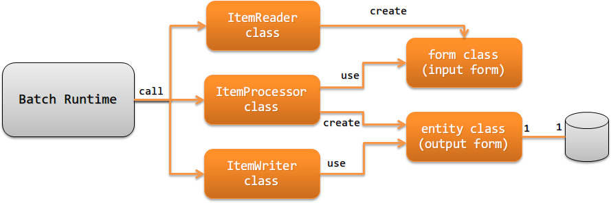

应用的职责配置
================================
说明创建遵循Jakarta Batch的Batch应用时应实现的类及其职责。

.. _jsr352-batchlet_design:

Batchlet步骤的情况
--------------------------------------------------
说明Batchlet步骤情况下应实现的类及其职责。

  

Batchlet (Batchlet class)
  在Batchlet中执行业务逻辑，返回表示步骤处理结果的字符串 [#batchlet_status]_ 。

  例如，下载互联网上的文件，或执行仅通过单个SQL即可完成的处理 [#insert_select]_ 等。

.. _jsr352-chunk_design:

Chunk步骤的情况
--------------------------------------------------
说明Chunk步骤情况下应实现的类及其职责。

ItemReader (ItemReader class)
  实现从数据源(文件或数据库等)读取处理对象数据的处理。
  将读取的数据转换为Form后返回。

  ItemReader是Jakarta Batch规定的接口。
  因此，实现方法等详情请参考 `Jakarta Batch Specification(外部网站，英文) <https://jakarta.ee/specifications/batch/>`_ 。

ItemProcessor (ItemProcessor class)
  根据ItemReader读取的数据执行业务逻辑，生成输出对象数据。

  输出对象为数据库时，将业务逻辑执行后的数据转换为Entity。
  输出对象为数据库以外时，将业务逻辑执行后的数据转换为输出用Form。

  ItemProcessor是Jakarta Batch规定的接口。
  因此，实现方法等详情请参考 `Jakarta Batch Specification(外部网站，英文) <https://jakarta.ee/specifications/batch/>`_ 。

  .. tip::
    如果ItemReader读取的数据是从外部获取的数据，请在执行业务逻辑前进行输入值检查。
    关于输入值检查，请参考 :ref:`输入值的检查 <validation>` 。

ItemWriter (ItemWriter class)
  实现将ItemProcessor转换的Entity(Form)输出到数据库或文件等的处理。

  ItemWriter是Jakarta Batch规定的接口。
  因此，实现方法等详情请参考 `Jakarta Batch Specification(外部网站，英文) <https://jakarta.ee/specifications/batch/>`_ 。

Form (form class)
  保持ItemReader读取的数据的类。另外，在输出对象为数据库以外时，保持输出数据的类。

  保持从外部接收的文件等不可信值的Form，其属性类型应全部为String。
  理由请参考 :ref:`Bean Validation <bean_validation-form_property>` 。
  但是，二进制项目请定义为字节数组。

Entity (entity class)
  与表格1对1对应的类。具有与列对应的属性。

.. [#batchlet_status] Batchlet返回的字符串(Batchlet的结束状态)的详情请参考 `Jakarta Batch Specification(外部网站，英文) <https://jakarta.ee/specifications/batch/>`_ 。
.. [#insert_select] 例如，指仅通过 ``insert～select`` 即可完成处理的SQL执行等。
