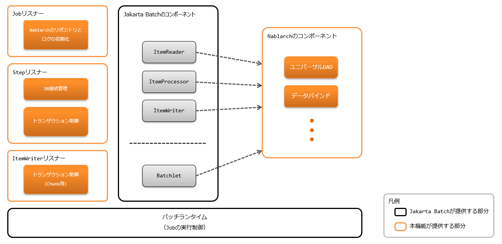
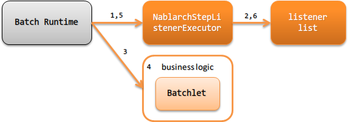
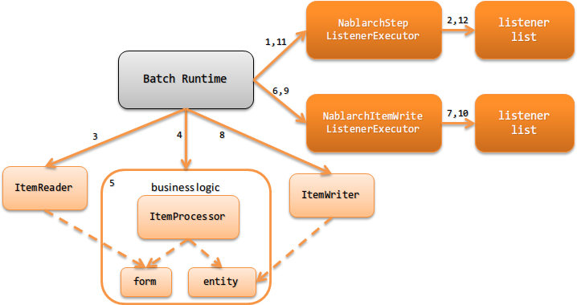

.. _jsr352_architecture:

架构概述
==============================
.. contents:: 目录
  :depth: 3
  :local:


Batch应用的构成
--------------------------------------------------
执行 |jsr352| 遵循的Batch应用需要 |jsr352| 的实现。
实现主要从以下2个中选择，但鉴于文档丰富且可从Maven Central获取库的便捷性，推荐使用 `jBeret(外部网站，英文) <https://jberet.gitbooks.io/jberet-user-guide/content/>`_ 。

* `jBeret(外部网站，英文) <https://jberet.gitbooks.io/jberet-user-guide/content/>`_
* `兼容实现的jBatch(外部网站，英文) <https://github.com/WASdev/standards.jsr352.jbatch>`_

以下显示构成。



.. important::

  使用JobContext及StepContext的临时区域( ``TransientUserData`` )等同于在全局区域保持值，应用侧不得使用。

  另外，关于StepContext的临时区域， :java:extdoc:`StepScoped<nablarch.fw.batch.ee.cdi.StepScoped>` 用于在步骤内共享值，
  因此应用侧无法使用StepContext的临时区域。

.. tip::

  :ref:`jsr352_batch`\的架构遵循\ |jsr352|\规定的构成，
  因此与Nablarch应用框架的\ :ref:`nablarch_architecture`\中记载的
  使用handler的架构不同。

  在 :ref:`jsr352_batch`\ 中，handler执行的横断处理（日志输出和事务控制等）
  通过使用 |jsr352|\规定的监听器来实现。

  但是，监听器是在既定时机启动的，与直接对输入输出进行处理的方式不同，
  因此监听器无法像handler那样进行输入值的过滤处理或转换处理等。


.. _jsr352-batch_type:

Batch的类型
--------------------------------------------------
|jsr352| 中，Batch的实现方法有 `Batchlet` 和 `Chunk` 2种。
应使用哪种类型，请参考以下内容并根据Batch进行判断。

.. _jsr352-batch_type_batchlet:

Batchlet
  面向任务的情况时实现Batchlet类型的Batch。

  例如，从外部系统获取文件或通过单个SQL即可完成的处理等。

.. _jsr352-batch_type_chunk:

Chunk
  从文件或数据库等输入数据源读取记录并执行业务处理时，实现Chunk类型的Batch。

Batch应用的处理流程
--------------------------------------------------

.. _jsr352-batch_flow_batchlet:

Batchlet
~~~~~~~~~~~~~~~~~~~~~~~~~~~~~~~~~~~~~~~~~~~~~~~~~~
Batchlet类型Batch应用的处理流程如下所示。



1. 从Jakarta Batch的Batch Runtime作为Batchlet步骤执行前的回调处理调用 :java:extdoc:`NablarchStepListenerExecutor <nablarch.fw.batch.ee.listener.step.NablarchStepListenerExecutor>` 。
2. 依次执行Batchlet步骤执行前的监听器。
3. 从Jakarta Batch的Batch Runtime执行 `Batchlet` 。
4. `Batchlet` 中执行业务逻辑。(Batchlet的职责配置请参考 :ref:`Batchlet的职责配置 <jsr352-batchlet_design>` )
5. 从Jakarta Batch的Batch Runtime作为Batchlet步骤执行后的回调处理调用 :java:extdoc:`NablarchStepListenerExecutor <nablarch.fw.batch.ee.listener.step.NablarchStepListenerExecutor>` 。
6. 依次执行Batchlet步骤执行后的监听器。(与No2逆序执行)

.. _jsr352-batch_flow_chunk:

Chunk
~~~~~~~~~~~~~~~~~~~~~~~~~~~~~~~~~~~~~~~~~~~~~~~~~~
Chunk类型Batch应用的处理流程如下所示。



1. 从Jakarta Batch的Batch Runtime作为Chunk步骤执行前的回调处理调用 :java:extdoc:`NablarchStepListenerExecutor <nablarch.fw.batch.ee.listener.step.NablarchStepListenerExecutor>` 。

2. 依次执行Chunk步骤执行前的监听器。

3. 从Jakarta Batch的Batch Runtime执行Chunk步骤的 `ItemReader` 。 |br|
   `ItemReader` 中，从输入数据源读取数据。

4. 从Jakarta Batch的Batch Runtime执行Chunk步骤的 `ItemProcessor` 。 |br|

5. `ItemProcessor` 使用 `Form` 或 `Entity` 执行业务逻辑。 |br|
   ※此时不执行对数据库的数据写入或更新。

6. 从Jakarta Batch的Batch Runtime作为 `ItemWriter` 执行前的回调处理调用 :java:extdoc:`NablarchItemWriteListenerExecutor <nablarch.fw.batch.ee.listener.chunk.NablarchItemWriteListenerExecutor>` 。

7. 依次执行 `ItemWriter` 执行前的监听器。

8. 从Jakarta Batch的Batch Runtime执行Chunk步骤的 `ItemWriter` 。 |br|
   `ItemWriter` 中，执行向表格的注册(更新、删除)或文件输出处理等结果反映处理。

9. 从Jakarta Batch的Batch Runtime作为 `ItemWriter` 执行后的回调处理调用 :java:extdoc:`NablarchItemWriteListenerExecutor <nablarch.fw.batch.ee.listener.chunk.NablarchItemWriteListenerExecutor>` 。

10. 依次执行 `ItemWriter` 执行后的监听器。(与No7逆序执行)

11. 从Jakarta Batch的Batch Runtime作为Chunk步骤执行后的回调处理调用 :java:extdoc:`NablarchStepListenerExecutor <nablarch.fw.batch.ee.listener.step.NablarchStepListenerExecutor>` 。

12. 依次执行Chunk步骤执行后的监听器。(与No2逆序执行)

※No3到No10在输入数据源的数据结束前重复执行。

关于Chunk步骤的职责配置，请参考 :ref:`Chunk的职责配置 <jsr352-chunk_design>`

.. _jsr352-batch_error_flow:

异常(含错误)发生时的处理流程
~~~~~~~~~~~~~~~~~~~~~~~~~~~~~~~~~~~~~~~~~~~~~~~~~~
Batch执行中发生异常时，Nablarch的方针是不捕捉异常，而是由Jakarta Batch的实现侧进行异常处理。
这是遵循Jakarta Batch的Batch应用特有的行为，请注意与其他基盘( :ref:`Web应用 <web_application>` 或 :ref:`nablarch_batch` 等)的行为不同。

.. tip:: 

  遵循Jakarta Batch的Batch应用采用此架构的理由如下。

  遵循Jakarta Batch的Batch应用是在Jakarta Batch上使用Nablarch的组件，执行控制本身由Jakarta Batch实现进行。
  因此，无法由Nablarch捕捉所有异常进行处理，为防止异常控制分散在Nablarch和Jakarta Batch导致设计等复杂化，采用了此方针。
  
异常发生时Batch的状态
```````````````````````````````````````````````
如上所述，异常发生时的控制全部由Jakarta Batch的实现进行。
因此，异常发生时Batch的状态(batch status或exit status)请参考 |jsr352| 的规范。
另外，根据异常种类的重试或是否继续等也遵循Job定义的动作。Job定义的详情请参考 |jsr352| 的规范。

异常发生后Java进程返回的返回代码请参考 :ref:`jsr352-failure_monitoring` 。

日志输出
``````````````````````````````````````````````````
Jakarta Batch的实现捕获的异常信息由Jakarta Batch的实现输出日志。
日志的设置(格式或输出目标等设置)请参考Jakarta Batch实现使用的日志框架的手册等进行。

另外，如果希望将应用显式输出的错误日志等输出到与Jakarta Batch相同的日志文件，
可使用 :ref:`log_adaptor` 统一Jakarta Batch的实现与日志框架来应对。

.. _jsr352-listener:

Batch应用中使用的监听器
--------------------------------------------------
|jsr352| 遵循的Batch应用中，使用 |jsr352| 规范规定的监听器来实现相当于Nablarch handler的功能。

标准提供以下监听器。

Job级别监听器
  在Job启动及结束前被回调的监听器

  * :java:extdoc:`输出Job启动、结束日志的监听器 <nablarch.fw.batch.ee.listener.job.JobProgressLogListener>`
  * :java:extdoc:`防止同一Job多重启动的监听器 <nablarch.fw.batch.ee.listener.job.DuplicateJobRunningCheckListener>`

Step级别监听器
  在Step执行前及执行后被回调的监听器

  * :java:extdoc:`输出Step开始、结束日志的监听器 <nablarch.fw.batch.ee.listener.step.StepProgressLogListener>`
  * :java:extdoc:`连接数据库的监听器 <nablarch.fw.batch.ee.listener.step.DbConnectionManagementListener>`
  * :java:extdoc:`控制事务的监听器 <nablarch.fw.batch.ee.listener.step.StepTransactionManagementListener>`

ItemWriter级别监听器
  在 `ItemWriter` 执行前及执行后被回调的监听器

  * :java:extdoc:`输出Chunk进度日志的监听器(已弃用) <nablarch.fw.batch.ee.listener.chunk.ChunkProgressLogListener>`
    (请使用 :ref:`jsr352-progress_log` 输出进度日志)
    
  * :java:extdoc:`控制事务的监听器 <nablarch.fw.batch.ee.listener.chunk.ItemWriteTransactionManagementListener>`

.. tip::
  |jsr352| 规范规定的监听器，在设置多个时不能保证执行顺序。
  因此，Nablarch通过以下应对，使监听器可按指定顺序执行。

  * 各级别的监听器只设置保证监听器执行顺序的监听器
  * 保证监听器执行顺序的监听器从 :ref:`repository` 获取监听器列表，按定义顺序执行监听器。

  实际监听器的定义方法请参考 :ref:`jsr352-listener_definition` 。

最小监听器构成
--------------------------------------------------
以下显示最小监听器构成。如果此构成无法满足项目需求，请通过添加监听器等方式应对。

.. list-table:: Job级别的最小监听器构成
  :header-rows: 1
  :class: white-space-normal
  :widths: 5 35 30 30

  * - No.
    - 监听器
    - Job启动前的处理
    - Job结束前的处理

  * - 1
    - :java:extdoc:`输出Job启动、结束日志的监听器 <nablarch.fw.batch.ee.listener.job.JobProgressLogListener>`
    - 将启动的Job名称输出到日志。
    - 将Job名称和Batch状态输出到日志。

.. list-table:: Step级别的最小监听器构成
  :header-rows: 1
  :class: white-space-normal
  :widths: 5 35 30 30

  * - No.
    - 监听器
    - Step执行前的处理
    - Step执行后的处理

  * - 1
    - :java:extdoc:`输出Step开始、结束日志的监听器 <nablarch.fw.batch.ee.listener.step.StepProgressLogListener>`
    - 将执行的Step名称输出到日志。
    - 将Step名称和Step状态输出到日志。

  * - 2
    - :java:extdoc:`连接数据库的监听器 <nablarch.fw.batch.ee.listener.step.DbConnectionManagementListener>`
    - 获取DB连接。
    - 释放DB连接。

  * - 3
    - :java:extdoc:`控制事务的监听器 <nablarch.fw.batch.ee.listener.step.StepTransactionManagementListener>`
    - 开始事务。
    - 结束事务(commit or rollback)。

.. list-table:: `ItemWriter` 级别的最小监听器构成
  :header-rows: 1
  :class: white-space-normal
  :widths: 5 35 30 30

  * - No.
    - 监听器
    - `ItemWriter` 执行前的处理
    - `ItemWriter` 执行后的处理

  * - 1
    - :java:extdoc:`控制事务的监听器 <nablarch.fw.batch.ee.listener.chunk.ItemWriteTransactionManagementListener>` [#chunk_tran]_
    - 
    - 结束事务(commit or rollback)。

.. [#chunk_tran] `ItemWriter` 级别监听器进行的事务控制，是对Step级别开始的事务进行的。

.. _jsr352-listener_definition:

监听器的指定方法
--------------------------------------------------
说明对各级别定义监听器列表的方法。

定义监听器列表需要以下步骤。

1. 在 |jsr352| 规定的表示Job定义的xml文件中，设置保证监听器执行顺序的监听器。
2. 在组件配置文件中设置监听器列表。

Job定义文件的设置
  .. code-block:: xml

    <job id="chunk-integration-test" xmlns="https://jakarta.ee/xml/ns/jakartaee" version="2.0">
      <listeners>
        <!-- Job级别的监听器 -->
        <listener ref="nablarchJobListenerExecutor" />
      </listeners>

      <step id="myStep">
        <listeners>
          <!-- Step级别的监听器 -->
          <listener ref="nablarchStepListenerExecutor" />
          <!-- ItemWriter级别的监听器 -->
          <listener ref="nablarchItemWriteListenerExecutor" />
        </listeners>

        <chunk item-count="10">
          <reader ref="stringReader">
            <properties>
              <property name="max" value="25" />
            </properties>
          </reader>
          <processor ref="createEntityProcessor" />
          <writer ref="batchOutputWriter" />
        </chunk>
      </step>
    </job>

组件配置文件的设置
  .. code-block:: xml

      <!-- 默认的Job级别监听器列表 -->
      <list name="jobListeners">
        <component class="nablarch.fw.batch.ee.listener.job.JobProgressLogListener" />
        <component class="nablarch.fw.batch.ee.listener.job.DuplicateJobRunningCheckListener">
          <property name="duplicateProcessChecker" ref="duplicateProcessChecker" />
        </component>
      </list>

      <!-- 默认的Step级别监听器列表 -->
      <list name="stepListeners">
        <component class="nablarch.fw.batch.ee.listener.step.StepProgressLogListener" />
        <component class="nablarch.fw.batch.ee.listener.step.DbConnectionManagementListener">
          <property name="dbConnectionManagementHandler">
            <component class="nablarch.common.handler.DbConnectionManagementHandler" />
          </property>
        </component>
        <component class="nablarch.fw.batch.ee.listener.step.StepTransactionManagementListener" />
      </list>

      <!-- 默认的ItemWriter级别监听器列表 -->
      <list name="itemWriteListeners">
        <component 
            class="nablarch.fw.batch.ee.listener.chunk.ChunkProgressLogListener" />
        <component 
            class="nablarch.fw.batch.ee.listener.chunk.ItemWriteTransactionManagementListener" />
      </list>

      <!-- 覆盖默认的Job级别监听器列表 -->
      <list name="sample-job.jobListeners">
        <component class="nablarch.fw.batch.ee.listener.job.JobProgressLogListener" />
      </list>

      <!-- 覆盖默认的Step级别监听器列表 -->
      <!-- 本设置在执行「sample-step」步骤时适用 -->
      <list name="sample-job.sample-step.stepListeners">
        <component class="nablarch.fw.batch.ee.listener.step.StepProgressLogListener" />
      </list>
      
要点
  * 默认的Job级别监听器列表的组件名应为 ``jobListeners`` 。
  * 默认的Step级别监听器列表的组件名应为 ``stepListeners`` 。
  * 默认的ItemWriter级别监听器列表的组件名应为 ``itemWriteListeners`` 。
  * 覆盖默认监听器列表定义时，组件名应为「Job名称 + "." + 覆盖对象的组件名」。 |br|
    例如，在「sample-job」中覆盖Job级别定义时，组件名应定义为 ``sample-job.jobListeners`` 作为监听器列表。
  * 在特定Step中覆盖默认监听器列表定义时，组件名应为「Job名称 + "." + Step名称 + "." + 覆盖对象的组件名」。 |br|
    例如，在「sample-job」中定义的「sample-step」中，覆盖默认的Step级别监听器列表定义时，组件名应定义为 ``sample-job.sample-step.stepListeners`` 作为监听器列表。
  * 可在特定Step中覆盖的监听器列表仅限Step级别和ItemWriter级别的监听器列表。
    
.. |jsr352| raw:: html

  <a href="https://jakarta.ee/specifications/batch/" target="_blank">Jakarta Batch(外部网站，英文)</a>

.. |br| raw:: html

  <br />
