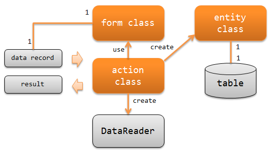

.. _nablarch_batch-application_design:

应用的职责配置
================================
说明在开发 Nablarch Batch应用时应实现的类及其职责。

**类及其职责**

Action类(action class)
  Action类有两项职责

  * 使用 :java:extdoc:`DataReader<nablarch.fw.DataReader>` 读取输入的数据。
  * :java:extdoc:`DataReader<nablarch.fw.DataReader>` 根据读取的数据记录执行业务逻辑，
    并返回 :java:extdoc:`Result<nablarch.fw.Result>` 。

  例如：对于读取文件的Batch，业务逻辑要做下记处理。

  - 通过数据记录生成Form类，并执行数据校验。
  - 通过Form类生成Entity类，插入到数据库中。
  - 返回 :java:extdoc:`Success<nablarch.fw.Result.Success>` 作为处理结果。

Form类(表单类)
  用于映射来自 :java:extdoc:`DataReader<nablarch.fw.DataReader>`
  读取的数据记录的类。

  具备用于数据记录验证的注解配置以及相关性验证的逻辑。
  根据来自外部的输入数据，有时可能会形成层次结构（即Form包含其他Form）。

  Form类的所有属性都定义为 `String`
    将属性定义为 `String` 的理由请参考 :ref:`Bean Validation <bean_validation-form_property>` 。
    但是，二进制字段请定义为字节数组。

  .. tip::
   对于来自外部的文件等不可信的输入数据，
   需进行验证并创建表单类。
   而对于来自数据库等可信的输入数据可以不使用Form类，
   直接将数据记录映射为Entity类也是可以的。

Entity类(实体类)
  用于映射来自与数据表中的记录的类。属性定义与表字段类型一致。
