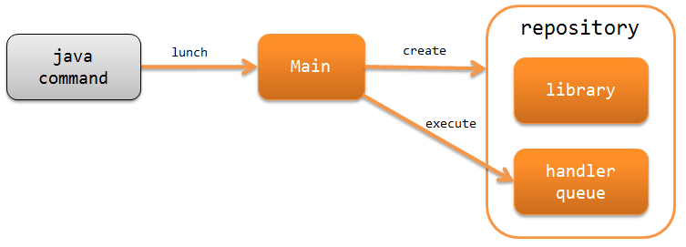
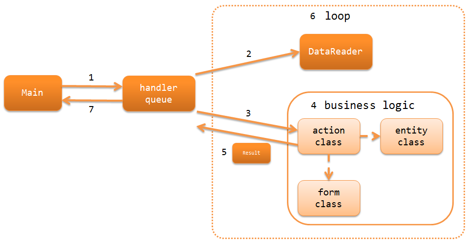

架构概要
==============================

.. contents:: 目录
  :depth: 3
  :local:

Nablarch Batch应用提供了以下功能：
针对存储在数据库或文件中的每一条数据记录，重复执行处理操作，
以构建Batch流程。

Nablarch Barch应用分为了以下两种。

.. _nablarch_batch-each_time_batch:

每次启动型Batch
 定期启动进程，执行每日或每月等周期性的Batch任务。

.. _nablarch_batch-resident_batch:

驻留型Batch
 进程启动之后，以一定的间隔执行Batch处理。
 例如：用于定期对在线处理中生成的请求数据进行批量处理的情况。

.. important::
 驻留型Batch在多线程处理时，因为其他的线程被阻塞住，等待最慢的线程执行完毕，
 可能会发生请求数据的读入存在延迟的情况。

 因此，从头开发的项目不建议使用驻留型Batch，以避免发生上面的问题。
 推荐使用 :ref:`db_messaging`

 此外，如果是已经使用了驻留型Batch的项目，虽然驻留型Batch本身仍然是可用的，
 如果存在发生上述问题的可能（或者已经发生的情况下），应该考虑将项目迁移到 :ref:`db_messaging`。

.. _nablarch_batch-structure:

Nablarch Batch应用的构成
------------------------------------------------------
Nablarch Batch应用
Nablarch 批处理应用程序作为独立应用程序，
通过 java 命令直接启动运行。
以下是 Nablarch 批处理应用程序的构成示意图。

:ref:`main` (Main)
 Nablarch Batch应用的起始Main Class。
 通过Java命令直接启动，初始化系统仓库和日志服务，
 并执行handler队列。

.. _nablarch_batch-resolve_action:

基于请求路径指定Action与请求ID
------------------------------------------------------
Nablarch Batch应用使用命令行参数(-requestPath)
来指定执行的Action与请求参数。

.. code-block:: properties

 # 格式
 -requestPath=Action的类名/请求ID

 # 示例
 -requestPath=com.sample.SampleBatchAction/BATCH0001

请求ID可以被作为各个Batch进程的标识符。
在同时启动多个执行相同业务Action的处理时，该请求ID将作为标识符使用。

.. _nablarch_batch-process_flow:

Nablarch Batch应用的处理流程
------------------------------------------------------
Nablarch Batch应用从读取数据开始到返回处理结果的流程如下所示。

1. :ref:`通用启动启动器(Main) <main>` 执行handler队列。
2. :java:extdoc:`数据读取器(DataReader)<nablarch.fw.DataReader>` 读取输入的数据，が入力データを読み込み、
   逐条提供数据记录。
3. 由配置在handler队列中的
   :java:extdoc:`分发handler(DispatchHandler) <nablarch.fw.handler.DispatchHandler>`
   根据命令行参数(-requestPath)指定的请求路径确定应该执行的Action类(action class)，
   并追加到队列末尾。
4. Action类(action class)使用表单类(form class)或实体类(entity class)，
   对每条数据记录执行相应的业务逻辑(business logic)。
5. Action类(action class)返回代表处理结果的 :java:extdoc:`Result <nablarch.fw.Result>` 。
6. 在处理对象数据被全部处理之前循环执行2～5。
7. 使用handler队列handler队列中设定的
   :java:extdoc:`状态码→进程退出代码映射handler(StatusCodeConvertHandler) <nablarch.fw.handler.StatusCodeConvertHandler>`
   将处理结果的状态码转换为进程退出代码，
   并将其作为Batch的处理结果返回。

.. _nablarch_batch-handler:

Nablarch Batch应用使用的handler
------------------------------------------------------
Nablarch提供了若干构建Batch应用所需的handler。
根据项目需求构建handler队列。(根据需求，可能需要创建项目需要的自定义handler)

各个handler的详细信息请参考下面的链接。

进行请求与响应转换的handler
  * :ref:`status_code_convert_handler`
  * :ref:`data_read_handler`

进行Batch的执行控制的handler
  * :ref:`duplicate_process_check_handler`
  * :ref:`request_path_java_package_mapping`
  * :ref:`multi_thread_execution_handler`
  * :ref:`loop_handler`
  * :ref:`dbless_loop_handler`
  * :ref:`retry_handler`
  * :ref:`process_resident_handler`
  * :ref:`process_stop_handler`

数据库相关的handler
  * :ref:`database_connection_management_handler`
  * :ref:`transaction_management_handler`

错误处理相关的handler
  * :ref:`global_error_handler`

其他
  * :ref:`thread_context_handler`
  * :ref:`thread_context_clear_handler`
  * :ref:`ServiceAvailabilityCheckHandler`
  * :ref:`file_record_writer_dispose_handler`

每次启动型Batch的最低限度handler配置
~~~~~~~~~~~~~~~~~~~~~~~~~~~~~~~~~~~~~~~~~~~~~~~~~~
构建每次启动型Batch时最低限度的handler队列如下所示，
在这基础之上，根据项目需求追加Nablarch标准handler或自定义的handler。

访问数据库时是以下的配置。

.. list-table:: 每次启动型Batch（存在数据库访问）的最低限度handler配置
   :header-rows: 1
   :class: white-space-normal
   :widths: 4,22,12,22,22,22

   * - No.
     - handler
     - 线程
     - 前处理
     - 后处理
     - 异常处理

   * - 1
     - :ref:`status_code_convert_handler`
     - 主线程
     -
     - 将状态码转换为进程终止代码。
     -

   * - 2
     - :ref:`global_error_handler`
     - 主线程
     -
     -
     - 输出执行时发生的异常或错误的日志。

   * - 3
     - :ref:`database_connection_management_handler`
       (初始化处理/终止处理用)
     - 主线程
     - 获取数据库连接。
     - 释放数据库连接。
     -

   * - 4
     - :ref:`transaction_management_handler`
       (初始化处理/终止处理用)
     - 主线程
     - 开启事务。
     - 提交事务。
     - 回滚事务。

   * - 5
     - :ref:`request_path_java_package_mapping`
     - 主线程
     - 根据命令行参数决定调用的Action。
     -
     -

   * - 6
     - :ref:`multi_thread_execution_handler`
     - 主线程
     - 创建子线程，并行处理后续handler。
     - 直到所有线程全部正常结束前保持阻塞。
     - 等待当前线程处理完成，并将异常再次抛出。

   * - 7
     - :ref:`database_connection_management_handler`
       (业务处理用)
     - 子线程
     - 获取数据库连接。
     - 释放数据库连接。
     -

   * - 8
     - :ref:`loop_handler`
     - 子线程
     - 开启业务事务。
     - 根据commit间隔提交业务事务。
       此外，如果数据读取器上仍有待处理的数据，则继续循环。
     - 回滚业务事务。

   * - 9
     - :ref:`data_read_handler`
     - 子线程
     - 使用数据读取器读取一条记录，并作为参数传递给后续的handler。
       此外分配 :ref:`执行时ID<log-execution_id>` 。
     -
     - 将读取的数据输出日志之后，再将原始异常抛出。

没有访问数据库时，不需要访问数据库相关的handler，并且循环控制handler也不需要控制事务启动，因此变成了下面的配置。

.. list-table:: 每次启动型Batch（无数据库访问）的最低限度handler配置
   :header-rows: 1
   :class: white-space-normal
   :widths: 4,22,12,22,22,22

   * - No.
     - handler
     - 线程
     - 前处理
     - 后处理
     - 异常处理

   * - 1
     - :ref:`status_code_convert_handler`
     - 主线程
     -
     - 将状态码转换为进程终止代码。
     -

   * - 2
     - :ref:`global_error_handler`
     - 主线程
     -
     -
     - 输出执行时发生的异常或错误的日志。

   * - 3
     - :ref:`request_path_java_package_mapping`
     - 主线程
     - 根据命令行参数决定调用的Action。
     -
     -

   * - 4
     - :ref:`multi_thread_execution_handler`
     - 主线程
     - 创建子线程，并行处理后续handler。
     - 直到所有线程全部正常结束前保持阻塞。
     - 等待当前线程处理完成，并将异常再次抛出。

   * - 5
     - :ref:`dbless_loop_handler`
     - 子线程
     -
     - 如果数据读取器上仍有待处理的数据，则继续循环。
     -

   * - 6
     - :ref:`data_read_handler`
     - 子线程
     - 使用数据读取器读取一条记录，并作为参数传递给后续的handler。
       此外分配 :ref:`执行时ID<log-execution_id>` 。
     -
     - 将读取的数据输出日志之后，再将原始异常抛出。

驻留型Batch的最低限度handler配置
~~~~~~~~~~~~~~~~~~~~~~~~~~~~~~~~~~~~~~~~~~~~~~~~~~
构建驻留型BatchBatch时最低限度的handler队列如下所示，
在这基础之上，根据项目需求追加Nablarch标准handler或自定义的handler。

驻留型Batch的最低限度handler配置除了需要在主线程中追加一下的handler意外，其他的与每次启动型Batch相同。

* :ref:`thread_context_handler` ( 为 :ref:`process_stop_handler` 所必需)
* :ref:`thread_context_clear_handler` 
* :ref:`retry_handler`
* :ref:`process_resident_handler`
* :ref:`process_stop_handler`

.. list-table:: 驻留型Batch的最低限度handler配置
   :header-rows: 1
   :class: white-space-normal
   :widths: 4,22,12,22,22,22

   * - No.
     - handler
     - 线程
     - 前处理
     - 后处理
     - 异常处理

   * - 1
     - :ref:`status_code_convert_handler`
     - 主线程
     -
     - 将状态码转换为进程终止代码。
     -
     
   * - 2
     - :ref:`thread_context_clear_handler`
     - 主线程
     -
     - 删除所有 :ref:`thread_context_handler` 在线程中存储的值。
     -

   * - 3
     - :ref:`global_error_handler`
     - 主线程
     -
     -
     - 输出执行时发生的异常或错误的日志。

   * - 4
     - :ref:`thread_context_handler`
     - 主线程
     - 使用命令行参数初始化线程上下文中的请求ID、用户ID等变量。
     -
     -

   * - 5
     - :ref:`retry_handler`
     - 主线程
     -
     -
     - 捕获可重试的运行时异常，若尚未达到重试上限，则重新执行后续handler。

   * - 6
     - :ref:`process_resident_handler`
     - 主线程
     - データ監視間隔ごとに後続のハンドラを繰り返し実行する。
     - ループを継続する。
     - ログ出力を行い、実行時例外が送出された場合はリトライ可能例外にラップして送出する。
       エラーが送出された場合はそのまま再送出する。

   * - 7
     - :ref:`process_stop_handler`
     - 主线程
     - リクエストテーブル上の処理停止フラグがオンであった場合は、後続ハンドラの処理は行なわずにプロセス停止例外(
       :java:extdoc:`ProcessStop <nablarch.fw.handler.ProcessStopHandler.ProcessStop>`
       )を送出する。
     -
     -

   * - 8
     - :ref:`database_connection_management_handler`
       (初期処理/終了処理用)
     - 主线程
     - DB接続を取得する。
     - DB接続を解放する。
     -

   * - 9
     - :ref:`transaction_management_handler`
       (初期処理/終了処理用)
     - 主线程
     - トランザクションを開始する。
     - トランザクションをコミットする。
     - トランザクションをロールバックする。

   * - 10
     - :ref:`request_path_java_package_mapping`
     - 主线程
     - 根据命令行参数决定调用的Action。
     -
     -

   * - 11
     - :ref:`multi_thread_execution_handler`
     - 主线程
     - サブスレッドを作成し、後続ハンドラの処理を並行実行する。
     - 全スレッドの正常終了まで待機する。
     - 処理中のスレッドが完了するまで待機し起因例外を再送出する。

   * - 12
     - :ref:`database_connection_management_handler`
       (業務処理用)
     - 子线程
     - DB接続を取得する。
     - DB接続を解放する。
     -

   * - 13
     - :ref:`loop_handler`
     - 子线程
     - 業務トランザクションを開始する。
     - コミット間隔毎に業務トランザクションをコミットする。
       また、データリーダ上に処理対象データが残っていればループを継続する。
     - 業務トランザクションをロールバックする。

   * - 14
     - :ref:`data_read_handler`
     - 子线程
     - データリーダを使用してレコードを1件読み込み、後続ハンドラの引数として渡す。
       また :ref:`実行時ID<log-execution_id>` を採番する。
     -
     - 読み込んだレコードをログ出力した後、元例外を再送出する。

.. _nablarch_batch-data_reader:

Nablarch Batch应用で使用するデータリーダ
------------------------------------------------------
Nablarchでは、バッチアプリケーションを構築するために必要なデータリーダを標準で幾つか提供している。
各データリーダの詳細は、リンク先を参照すること。

* :java:extdoc:`DatabaseRecordReader (データベース読み込み) <nablarch.fw.reader.DatabaseRecordReader>`
* :java:extdoc:`FileDataReader (ファイル読み込み)<nablarch.fw.reader.FileDataReader>`
* :java:extdoc:`ValidatableFileDataReader (バリデージョン機能付きファイル読み込み)<nablarch.fw.reader.ValidatableFileDataReader>`
* :java:extdoc:`ResumeDataReader (レジューム機能付き読み込み)<nablarch.fw.reader.ResumeDataReader>`

.. tip::
 上記のデータリーダでプロジェクトの要件を満たせない場合は、
 :java:extdoc:`DataReader <nablarch.fw.DataReader>` インタフェースを実装したクラスを
 プロジェクトで作成して対応する。

.. important::
 標準で提供している :java:extdoc:`FileDataReader (ファイル読み込み)<nablarch.fw.reader.FileDataReader>` 、 :java:extdoc:`ValidatableFileDataReader (バリデージョン機能付きファイル読み込み)<nablarch.fw.reader.ValidatableFileDataReader>` では、データへのアクセスに :ref:`data_format` を使用している。データへのアクセスに :ref:`data_bind` を使用する場合は、これらのデータリーダを使用しないこと。

.. _nablarch_batch-action:

Nablarch Batch应用で使用するアクション
---------------------------------------------------------------------------------
Nablarchでは、バッチアプリケーションを構築するために必要なAction类を標準で幾つか提供している。
各Action类の詳細は、リンク先を参照すること。

* :java:extdoc:`BatchAction (汎用的なバッチアクションのテンプレートクラス)<nablarch.fw.action.BatchAction>`
* :java:extdoc:`FileBatchAction (ファイル入力のバッチアクションのテンプレートクラス)<nablarch.fw.action.FileBatchAction>`
* :java:extdoc:`NoInputDataBatchAction (入力データを使用しないバッチアクションのテンプレートクラス)<nablarch.fw.action.NoInputDataBatchAction>`
* :java:extdoc:`AsyncMessageSendAction (応答不要メッセージ送信用のAction类)<nablarch.fw.messaging.action.AsyncMessageSendAction>`

.. important::
 標準で提供している :java:extdoc:`FileBatchAction (ファイル入力のバッチアクションのテンプレートクラス)<nablarch.fw.action.FileBatchAction>` では、データへのアクセスに :ref:`data_format` を使用している。データへのアクセスに :ref:`data_bind` を使用する場合は、他のAction类を使用すること。
