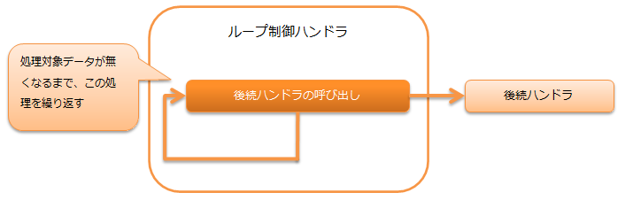

.. _dbless_loop_handler:

循环控制handler
==================================================
.. contents:: 目录
  :depth: 3
  :local:

本handler在数据读取器上存在处理对象数据期间，重复执行后续handler的处理。

.. important::

  在连接数据库的Batch应用中，由于需要事务管理，因此不使用本handler，而应该使用 :ref:`loop_handler` 。

本handler执行以下处理。

handler类名
--------------------------------------------------
* :java:extdoc:`nablarch.fw.handler.DbLessLoopHandler`

模块列表
--------------------------------------------------

.. code-block:: xml

  <dependency>
    <groupId>com.nablarch.framework</groupId>
    <artifactId>nablarch-fw-standalone</artifactId>
  </dependency>

约束
------------------------------
无。
