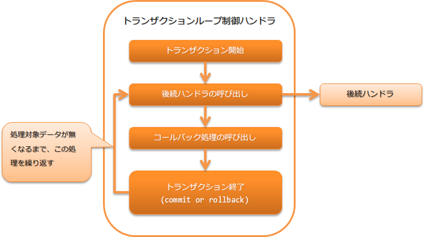

.. _loop_handler:

事务循环控制handler
==================================================
.. contents:: 目录
  :depth: 3
  :local:

本handler在数据读取器上存在处理对象数据期间，重复执行后续handler的处理。执行时控制事务，每隔一定的重复次数commit事务。
通过增大事务的commit间隔，可以提高Batch的吞吐量。

* 事务的开始
* 事务的结束(commit或回滚)
* 事务结束时的回调

处理流程如下。

handler类名
--------------------------------------------------
* :java:extdoc:`nablarch.fw.handler.LoopHandler`

模块列表
--------------------------------------------------

.. code-block:: xml

  <dependency>
    <groupId>com.nablarch.framework</groupId>
    <artifactId>nablarch-fw-standalone</artifactId>
  </dependency>

  <dependency>
    <groupId>com.nablarch.framework</groupId>
    <artifactId>nablarch-core-transaction</artifactId>
  </dependency>

  <!-- 仅在控制对数据库的事务时 -->
  <dependency>
    <groupId>com.nablarch.framework</groupId>
    <artifactId>nablarch-core-jdbc</artifactId>
  </dependency>

约束
------------------------------
必须在 :ref:`database_connection_management_handler` 之后设置
  在控制对数据库的事务时，需要在线程上存在事务管理对象的数据库连接。

设置事务控制对象
--------------------------------------------------
此handler使用通过 :java:extdoc:`transactionFactory <nablarch.fw.handler.LoopHandler.setTransactionFactory(nablarch.core.transaction.TransactionFactory)>`
属性中设置的工厂类(:java:extdoc:`TransactionFactory <nablarch.core.transaction.TransactionFactory>` 的实现类)获取事务控制对象并在线程上管理。

在线程上管理时，设置用于识别事务的名称。
默认使用 ``transaction``，但使用任意名称时，需要在 :java:extdoc:`transactionName <nablarch.fw.handler.LoopHandler.setTransactionName(java.lang.String)>` 属性中设置。

.. tip::

  在对 :ref:`database_connection_management_handler` 设置的数据库进行事务控制时，
  需要在 :java:extdoc:`transactionName <nablarch.fw.handler.LoopHandler.setTransactionName(java.lang.String)>` 属性中设置与
  :java:extdoc:`DbConnectionManagementHandler#connectionName <nablarch.common.handler.DbConnectionManagementHandler.setConnectionName(java.lang.String)>` 设置的值相同的值。

  另外，如果未在 :java:extdoc:`DbConnectionManagementHandler#connectionName <nablarch.common.handler.DbConnectionManagementHandler.setConnectionName(java.lang.String)>` 中设置值，
  则可以省略对 :java:extdoc:`transactionName <nablarch.fw.handler.LoopHandler.setTransactionName(java.lang.String)>` 的设置。

参考以下配置文件示例，设置此handler。

.. code-block:: xml

  <!-- 事务控制handler -->
  <component class="nablarch.fw.handler.LoopHandler">
    <property name="transactionFactory" ref="databaseTransactionFactory" />
    <property name="transactionName" value="name" />
  </component>

  <!-- 在控制对数据库的事务时，设置JdbcTransactionFactory -->
  <component name="databaseTransactionFactory"
      class="nablarch.core.db.transaction.JdbcTransactionFactory">
    <!-- 其他属性设置省略 -->
  </component>

.. _loop_handler-commit_interval:

指定commit间隔
--------------------------------------------------
Batch的commit间隔在 :java:extdoc:`commitInterval <nablarch.fw.handler.LoopHandler.setCommitInterval(int)>` 属性中设置。
如概述所述，通过调整commit间隔，可以提高Batch的吞吐量。

以下为设置示例。

.. code-block:: xml

  <component class="nablarch.fw.handler.LoopHandler">
    <!-- 将commit间隔设定为1000 -->
    <property name="commitInterval" value="1000" />
  </component>

.. _loop_handler-callback:

事务结束时执行任意处理
--------------------------------------------------
此handler在后续handler的处理执行后进行回调处理。

被回调的处理是在此handler后续设置的handler中，实现 :java:extdoc:`TransactionEventCallback <nablarch.fw.TransactionEventCallback>` 的handler。
如果有多个handler实现 :java:extdoc:`TransactionEventCallback <nablarch.fw.TransactionEventCallback>`，则从设置在前面的handler开始依次执行回调处理。

后续handler正常结束处理时的回调处理，在与后续handler的主处理相同的事务中执行。
在回调处理中进行的处理，将在下次commit时机一并commit。

在后续handler中发生异常及错误，回滚事务时，在回滚后执行回调处理。
因此，回调处理会在新的事务中执行，回调正常结束时也能commit。

.. important::

  请注意：在多个handler实现回调处理的情况下，如果在回调处理中发生错误或异常，
  则不对剩余的handler执行回调处理。

以下为示例。

创建执行回调处理的handler
  如以下实现示例，创建实现 :java:extdoc:`TransactionEventCallback <nablarch.fw.TransactionEventCallback>` 的handler。

  在 :java:extdoc:`transactionNormalEnd <nablarch.fw.TransactionEventCallback.transactionNormalEnd(TData,nablarch.fw.ExecutionContext)>` 中实现事务commit时的回调处理，
  在 :java:extdoc:`transactionAbnormalEnd <nablarch.fw.TransactionEventCallback.transactionAbnormalEnd(java.lang.Throwable,TData,nablarch.fw.ExecutionContext)>` 中实现事务回滚时的回调处理。

  .. code-block:: java

    public static class SampleHandler
        implements Handler<Object, Object>, TransactionEventCallback<Object> {

      @Override
      public Object handle(Object o, ExecutionContext context) {
        // 实现handler的处理
        return context.handleNext(o);
      }

      @Override
      public void transactionNormalEnd(Object o, ExecutionContext ctx) {
        // 实现后续handler正常结束时的回调处理
      }

      @Override
      public void transactionAbnormalEnd(Throwable e, Object o, ExecutionContext ctx) {
        // 实现事务回滚时的回调处理
      }
    }

构建handler队列
  如下所示，在此handler的后续handler中设置实现回调处理的handler。

  .. code-block:: xml

    <list name="handlerQueue">
      <!-- 事务控制handler -->
      <component class="nablarch.fw.handler.LoopHandler">
        <!-- 属性设置省略 -->
      </component>

      <!-- 实现回调处理的handler -->
      <component class="sample.SampleHandler" />
    </list>
