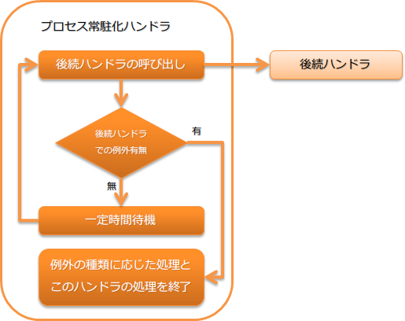

.. _process_resident_handler:

进程常驻handler
==================================================
.. contents:: 目录
  :depth: 3
  :local:

每隔一定间隔重复执行后续handler队列内容的handler。
本handler用于所谓的驻留型Batch，定期监视特定数据源上的输入数据并执行Batch。

本handler执行以下处理。

* 每隔一定间隔(数据监视间隔)调用后续handler。
* 在后续handler中发生异常时，判断是否继续此handler等。
  详细内容请参考 :ref:`process_resident_handler-exception`。

处理流程如下。

handler类名
--------------------------------------------------
* :java:extdoc:`nablarch.fw.handler.ProcessResidentHandler`

模块列表
--------------------------------------------------
.. code-block:: xml

  <dependency>
    <groupId>com.nablarch.framework</groupId>
    <artifactId>nablarch-fw-standalone</artifactId>
  </dependency>

约束
------------------------------
本handler必须在重试handler之后设置
  当本handler捕获非受检异常时，用可重试异常(:java:extdoc:`RetryableException <nablarch.fw.handler.retry.RetryableException>`)包装后重新抛出，
  将进程的继续控制委托给 :ref:`retry_handler`。
  因此，此handler必须在重试handler之后设置。

设置数据监视间隔
--------------------------------------------------
数据监视间隔在 :java:extdoc:`dataWatchInterval <nablarch.fw.handler.ProcessResidentHandler.setDataWatchInterval(int)>` 属性中以毫秒为单位设置。
省略设置时的默认值为1000毫秒(1秒)。

以下为示例。

.. code-block:: xml

  <component name="settingsProcessResidentHandler"
      class="nablarch.fw.handler.ProcessResidentHandler">

    <!-- 在数据监视间隔中设置5秒(5000) -->
    <property name="dataWatchInterval" value="5000" />
    <!-- 其他属性省略 -->
  </component>

.. _process_resident_handler-normal_end:

进程常驻handler的结束方法
--------------------------------------------------
当抛出表示进程正常结束的异常时，此handler停止调用后续handler并结束处理。
默认情况下，当抛出 :ref:`process_stop_handler` 抛出的表示处理停止的异常(:java:extdoc:`ProcessStop <nablarch.fw.handler.ProcessStopHandler.ProcessStop>` (包括子类))时，此handler结束处理。

若要更改表示进程正常结束的异常，请在 :java:extdoc:`normalEndExceptions <nablarch.fw.handler.ProcessResidentHandler.setNormalEndExceptions(java.util.List)>` 属性中设置异常类列表。
另外，设置异常列表时会覆盖默认设置，因此必须记得设置 :java:extdoc:`ProcessStop <nablarch.fw.handler.ProcessStopHandler.ProcessStop>`。

以下为示例。

.. code-block:: xml

  <component name="settingsProcessResidentHandler"
      class="nablarch.fw.handler.ProcessResidentHandler">

    <!-- 表示进程正常结束的异常列表 -->
    <property name="normalEndExceptions">
      <list>
        <!-- Nablarch默认的表示进程停止的异常类 -->
        <value>nablarch.fw.handler.ProcessStopHandler$ProcessStop</value>
        <!-- 项目自定义的表示进程停止的异常类(子类也作为对象) -->
        <value>sample.CustomProcessStop</value>
      </list>
    </property>

    <!-- 其他属性省略 -->
  </component>

.. _process_resident_handler-exception:

后续handler中发生的异常处理
--------------------------------------------------
在此handler中，根据后续handler中发生的异常类型，选择是继续处理还是结束处理。

以下为每种异常的处理内容。

服务不可用异常(:java:extdoc:`ServiceUnavailable <nablarch.fw.results.ServiceUnavailable>` )
  在服务不可用异常的情况下，等待数据监视间隔设置的时间后，再次执行后续handler。

可重试异常
  在可重试异常(:java:extdoc:`RetryUtil#isRetryable() <nablarch.fw.handler.retry.RetryUtil.isRetryable(java.lang.Throwable)>` 返回true)的情况下，
  直接重新抛出捕获的异常。

使进程异常结束的异常
  在表示使进程异常结束的异常的情况下，直接重新抛出捕获的异常。

  使进程异常结束的异常在 :java:extdoc:`abnormalEndExceptions <nablarch.fw.handler.ProcessResidentHandler.setAbnormalEndExceptions(java.util.List)>` 
  属性中设置。
  默认情况下，:java:extdoc:`ProcessAbnormalEnd <nablarch.fw.launcher.ProcessAbnormalEnd>` (包括子类)是异常结束对象类。

使进程正常结束的异常
  将从后续handler返回的结果对象作为此handler的返回值结束处理。

  关于使进程正常结束的异常，请参考 :ref:`process_resident_handler-normal_end`。

上述以外的异常
  将异常信息记录到日志中，用可重试异常(:java:extdoc:`RetryableException <nablarch.fw.handler.retry.RetryableException>`)包装后重新抛出。

