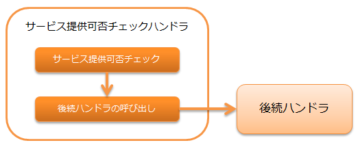

.. _`ServiceAvailabilityCheckHandler`:

服务可用性检查handler
=======================================

.. contents:: 目录
  :depth: 3
  :local:

本handler执行 :ref:`ServiceAvailabilityCheckHandler-request_checking`。

服务可用性检查使用库的 :ref:`service_availability` 功能进行。
因此，要使用本handler，
必须将实现了 :java:extdoc:`ServiceAvailability <nablarch.common.availability.ServiceAvailability>` 的类设置到本handler中。

本handler执行以下处理。

* 服务可用性检查

处理流程如下。

handler类名
--------------------------------------------------
* :java:extdoc:`nablarch.common.availability.ServiceAvailabilityCheckHandler`

模块列表
--------------------------------------------------
.. code-block:: xml

  <dependency>
    <groupId>com.nablarch.framework</groupId>
    <artifactId>nablarch-common-auth</artifactId>
  </dependency>

约束
------------------------------
必须配置在 :ref:`thread_context_handler` 之后
  本handler基于线程上下文中设置的请求ID进行服务可用性检查，
  因此必须将本handler配置在 :ref:`thread_context_handler` 之后。

必须配置在 :ref:`forwarding_handler` 之后
  当执行内部转发时，如果希望基于转发目标的请求ID（ :ref:`内部请求ID <internal_request_id>` ）进行服务可用性检查，
  必须将本handler配置在 :ref:`forwarding_handler` 之后。
  同时，需要在 :ref:`thread_context_handler` 的 ``attributes`` 中添加 :java:extdoc:`InternalRequestIdAttribute <nablarch.common.handler.threadcontext.InternalRequestIdAttribute>`。

.. _ServiceAvailabilityCheckHandler-request_checking:

对请求的服务可用性检查
--------------------------------------------------------------
从 :java:extdoc:`ThreadContext <nablarch.core.ThreadContext>` 获取请求ID，并检查服务可用性。
有关检查的详细信息，请参考 :ref:`service_availability`。

OK(服务可用)的情况
 调用后续handler。

NG(服务不可用)的情况
 抛出 :java:extdoc:`ServiceUnavailable <nablarch.fw.results.ServiceUnavailable>` (503) 异常。

如果希望将检查对象的请求ID修改为转发目标的请求ID，
请在 :java:extdoc:`ServiceAvailabilityCheckHandler.setUsesInternalRequestId <nablarch.common.availability.ServiceAvailabilityCheckHandler.setUsesInternalRequestId(boolean)>`
中指定true。默认值为false。

