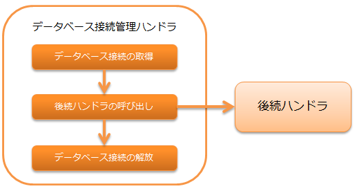

.. _database_connection_management_handler:

数据库连接管理handler
==================================================

.. contents:: 目录
  :depth: 3
  :local:

用于在后续handler和库中使用的数据库连接，在线程上进行管理的handler。

有关数据库访问的详细信息，请参考 :ref:`database`。

.. important::

  使用此handler时，必须与 :ref:`transaction_management_handler` 一起设置。
  如果未设置事务控制handler，则不会执行事务控制，后续对数据库的所有更改都将被丢弃。

本handler执行以下处理。

* 获取数据库连接
* 释放数据库连接

处理流程如下。

handler类名
--------------------------------------------------
* :java:extdoc:`nablarch.common.handler.DbConnectionManagementHandler`

模块列表
--------------------------------------------------
.. code-block:: xml

  <dependency>
    <groupId>com.nablarch.framework</groupId>
    <artifactId>nablarch-core-jdbc</artifactId>
  </dependency>
  <dependency>
    <groupId>com.nablarch.framework</groupId>
    <artifactId>nablarch-common-jdbc</artifactId>
  </dependency>

约束
------------------------------
无。

设置数据库连接目标
--------------------------------------------------
本handler使用通过 :java:extdoc:`connectionFactory <nablarch.common.handler.DbConnectionManagementHandler.setConnectionFactory(nablarch.core.db.connection.ConnectionFactory)>`
属性中设置的工厂类( :java:extdoc:`ConnectionFactory <nablarch.core.db.connection.ConnectionFactory>` 实现类)来获取数据库连接。

请参考以下配置文件示例，在 :java:extdoc:`connectionFactory <nablarch.common.handler.DbConnectionManagementHandler.setConnectionFactory(nablarch.core.db.connection.ConnectionFactory)>`
属性中设置工厂类。

.. code-block:: xml

  <!-- 数据库连接管理handler -->
  <component class="nablarch.common.handler.DbConnectionManagementHandler">
    <property name="connectionFactory" ref="connectionFactory" />
  </component>

  <!-- 获取数据库连接对象的工厂类的设置 -->
  <component name="connectionFactory"
      class="nablarch.core.db.connection.BasicDbConnectionFactoryForDataSource">
    <!-- 省略其他属性设置 -->
  </component>

.. important::

  有关获取数据库连接对象的工厂类的详细信息，请参考 :ref:`database-connect`。

在应用中使用多个数据库连接（事务）
----------------------------------------------------------------------------------------------------
在一个应用中可能需要多个数据库连接。
这种情况下，可以通过在handler队列上设置多个此handler来应对。

此handler在管理线程上的数据库连接对象时，使用数据库连接名进行管理。
但注意，数据库连接名在线程内必须是唯一的。

数据库连接名在此handler的 :java:extdoc:`connectionName <nablarch.common.handler.DbConnectionManagementHandler.setConnectionName(java.lang.String)>` 属性中设置。
如果省略在 :java:extdoc:`connectionName <nablarch.common.handler.DbConnectionManagementHandler.setConnectionName(java.lang.String)>` 中的设置，则该连接将成为默认数据库连接，可以简便使用。
因此，最好将最常用的数据库连接设为默认，并为其他数据库连接指定任意名称。

以下是数据库连接名的设置示例。

.. code-block:: xml

  <!-- 省略获取数据库连接的工厂的设置 -->

  <!-- 设置默认数据库连接 -->
  <component class="nablarch.common.handler.DbConnectionManagementHandler">
    <property name="connectionFactory" ref="connectionFactory" />
  </component>

  <!-- 以userAccessLog名称注册数据库连接 -->
  <component class="nablarch.common.handler.DbConnectionManagementHandler">
    <property name="connectionFactory" ref="userAccessLogConnectionFactory" />
    <property name="connectionName" value="userAccessLog" />
  </component>

以下是上述handler设置情况下，从应用访问数据库的示例。
有关数据库访问组件的详细使用方法，请参考 :ref:`database`。

使用默认数据库连接
  调用 :java:extdoc:`DbConnection#getConnection <nablarch.core.db.connection.DbConnectionContext.getConnection()>` 时无需指定参数。
  如果不指定参数，将自动返回默认数据库连接。

  .. code-block:: java

    AppDbConnection connection = DbConnectionContext.getConnection();

使用userAccessLog数据库连接
  使用 :java:extdoc:`DbConnection#getConnection(String) <nablarch.core.db.connection.DbConnectionContext.getConnection(java.lang.String)>`，在参数中指定数据库连接名。
  数据库连接名必须与在 :java:extdoc:`connectionName <nablarch.common.handler.DbConnectionManagementHandler.setConnectionName(java.lang.String)>` 属性中设置的值一致。

  .. code-block:: java

    AppDbConnection connection = DbConnectionContext.getConnection("userAccessLog");
