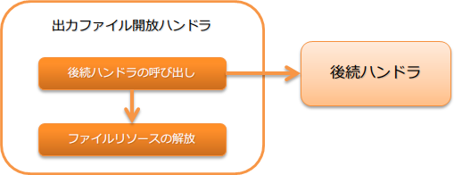

.. _file_record_writer_dispose_handler:

输出文件释放handler
========================================

.. contents:: 目录
  :depth: 3
  :local:

用于关闭(释放资源)在业务操作或handler中打开的输出文件的handler。

.. important::

  此handler的释放对象是使用 :java:extdoc:`FileRecordWriterHolder <nablarch.common.io.FileRecordWriterHolder>` 打开的输出文件。
  对于使用其他API(例如，`java.io`包)打开的资源，需要单独进行关闭处理。

处理流程如下。

handler类名
--------------------------------------------------
* :java:extdoc:`nablarch.common.io.FileRecordWriterDisposeHandler`

模块列表
--------------------------------------------------
.. code-block:: xml

  <!-- 通用数据模板 -->
  <dependency>
    <groupId>com.nablarch.framework</groupId>
    <artifactId>nablarch-core-dataformat</artifactId>
  </dependency>

约束
------------------------------
无。

关于在handler队列中的设置
--------------------------------------------------
只需将此handler设置在handler队列上，即可自动关闭在后续handler或业务操作中打开的输出文件。
因此，必须将此handler设置在所有输出文件的handler之前。

