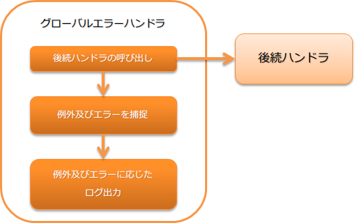

.. _global_error_handler:

全局错误handler
========================================
.. contents:: 目录
  :depth: 3
  :local:

用于捕获后续handler中发生的未捕获异常和错误，并输出日志和返回结果的handler。

本handler执行以下处理。

handler类名
--------------------------------------------------
* :java:extdoc:`nablarch.fw.handler.GlobalErrorHandler`

模块列表
--------------------------------------------------
.. code-block:: xml

  <dependency>
    <groupId>com.nablarch.framework</groupId>
    <artifactId>nablarch-fw</artifactId>
  </dependency>

约束
--------------------------------------------------

尽可能配置在handler队列的开头
  此handler用于处理未捕获异常，因此除非有特殊理由，否则应尽可能配置在handler队列的开头。
  
  如果在此handler之前的handler中发生异常，则由Web应用服务器或JVM进行异常处理。

  如果希望在捕获异常时将线程上下文信息输出到日志中，请将其配置在 :ref:`thread_context_clear_handler` 之后。

根据异常和错误的处理内容
--------------------------------------------------
此handler根据捕获的异常和错误内容，执行以下处理并生成结果。

根据异常的处理内容
  .. list-table::
    :header-rows: 1
    :class: white-space-normal
    :widths: 25 75

    * - 异常类
      - 处理内容

    * - :java:extdoc:`ServiceError <nablarch.fw.results.ServiceError>` 
      
        (包括子类)

      - 调用 :java:extdoc:`ServiceError#writeLog <nablarch.fw.results.ServiceError.writeLog(nablarch.fw.ExecutionContext)>` 并输出日志。

        日志级别根据 :java:extdoc:`ServiceError <nablarch.fw.results.ServiceError>` 的实现类而有所不同。

        日志输出后，将 :java:extdoc:`ServiceError <nablarch.fw.results.ServiceError>` 作为handler的处理结果返回。

    * - :java:extdoc:`Result.Error <nablarch.fw.Result.Error>`

        (包括子类)

      - 输出FATAL级别的日志。

        日志输出后，将 :java:extdoc:`Result.Error <nablarch.fw.Result.Error>` 作为handler的处理结果返回。

    * - 上述以外的异常类

      - 输出FATAL级别的日志。
        
        日志输出后，生成以捕获的异常为原因的 :java:extdoc:`InternalError <nablarch.fw.results.InternalError>`，并将其作为handler的处理结果返回。

根据错误的处理内容
  .. list-table::
    :header-rows: 1
    :class: white-space-normal
    :widths: 25 75

    * - 错误类
      - 处理内容

    * - :java:extdoc:`ThreadDeath <java.lang.ThreadDeath>`

        (包括子类)

      - 输出INFO级别的日志。

        日志输出后，重新抛出捕获的错误。

    * - :java:extdoc:`StackOverflowError <java.lang.StackOverflowError>`

        (包括子类)

      - 输出FATAL级别的日志。
        
        日志输出后，生成以捕获的错误为原因的 :java:extdoc:`InternalError <nablarch.fw.results.InternalError>`，并将其作为handler的处理结果返回。

    * - :java:extdoc:`OutOfMemoryError <java.lang.OutOfMemoryError>`

        (包括子类)

      - 输出FATAL级别的日志。

        由于FATAL级别的日志输出可能会失败(可能再次发生 `OutOfMemoryError`)，
        因此在日志输出前向标准错误输出输出发生了 `OutOfMemoryError` 的信息。

        日志输出后，生成以捕获的错误为原因的 :java:extdoc:`InternalError <nablarch.fw.results.InternalError>`，并将其作为handler的处理结果返回。

    * - :java:extdoc:`VirtualMachineError <java.lang.VirtualMachineError>`

        (包括子类)

      - 输出FATAL级别的日志。

        日志输出后，重新抛出捕获的错误。

        .. tip::
          
          对象为 :java:extdoc:`StackOverflowError <java.lang.StackOverflowError>` 和 :java:extdoc:`OutOfMemoryError <java.lang.OutOfMemoryError>` 以外的错误。

    * - 上述以外的错误类

      - 输出FATAL级别的日志。
        
        日志输出后，生成以捕获的错误为原因的 :java:extdoc:`InternalError <nablarch.fw.results.InternalError>`，并将其作为handler的处理结果返回。

当全局错误handler无法满足需求时
--------------------------------------------------
此handler无法通过设置等方式切换实现。
因此，如果此实现无法满足需求，
需要创建项目专用的错误处理handler来应对。

例如：如果需要详细切换日志级别等，最好不要使用此handler，而是创建新的handler。

