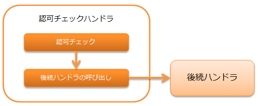

.. _`permission_check_handler`:

权限检查handler
=======================================

.. contents:: 目录
  :depth: 3
  :local:

本handler执行 :ref:`permission_check_handler-request_checking` 。

权限检查使用库的 :ref:`permission_check` 进行。
因此，要使用本handler，需要将实现了 :java:extdoc:`PermissionFactory <nablarch.common.permission.PermissionFactory>` 的类设置到本handler。

本handler执行以下处理。

* 权限检查

处理流程如下。

handler类名
--------------------------------------------------
* :java:extdoc:`nablarch.common.permission.PermissionCheckHandler`

模块列表
--------------------------------------------------
.. code-block:: xml

  <dependency>
    <groupId>com.nablarch.framework</groupId>
    <artifactId>nablarch-common-auth</artifactId>
  </dependency>

约束
------------------------------
:ref:`thread_context_handler` 之后配置
  本handler基于线程上下文上设置的请求ID和用户ID进行权限检查，
  因此需要将本handler配置在 :ref:`thread_context_handler` 之后。

:ref:`forwarding_handler` 之后配置
  当内部forward执行时，希望基于forward目标请求ID（ :ref:`内部请求ID <internal_request_id>` ）
  进行权限检查的情况下，需要将本handler配置在 :ref:`forwarding_handler` 之后。
  同时，需要在 :ref:`thread_context_handler` 的 ``attributes`` 中添加 :java:extdoc:`InternalRequestIdAttribute <nablarch.common.handler.threadcontext.InternalRequestIdAttribute>` 。

:ref:`http_error_handler` 之后配置
  为指定权限不足时显示的错误页面，
  需要将本handler配置在 :ref:`http_error_handler` 之后。

.. _permission_check_handler-request_checking:

对请求进行权限检查
--------------------------------------------------------------
检查登录用户是否对当前请求(请求ID)拥有权限。
检查详情参考 :ref:`permission_check` 。

有权限时
 :ref:`业务逻辑 <permission_check-server_side_check>` 或
 :ref:`画面显示控制 <permission_check-view_control>` 需要引用时，
 将权限检查使用的 :java:extdoc:`Permission <nablarch.common.permission.Permission>` 设置到线程本地。
 然后，调用后续handler。

无权限时
 抛出 :java:extdoc:`Forbidden(403) <nablarch.fw.results.Forbidden>` 。

希望将检查对象的请求ID改为forward目标请求ID时，
通过 :java:extdoc:`PermissionCheckHandler.setUsesInternalRequestId <nablarch.common.permission.PermissionCheckHandler.setUsesInternalRequestId(boolean)>`
指定true。默认值为false。

指定无权限时显示的错误页面
--------------------------------------------------------------
无权限时显示的错误页面在HTTP错误控制handler中指定。
指定方法参考 :ref:`HttpErrorHandler_DefaultPage` 。

将特定请求从权限检查中排除
--------------------------------------------------------------
对于登录前请求等希望排除权限检查的请求，
通过 :java:extdoc:`PermissionCheckHandler.setIgnoreRequestIds <nablarch.common.permission.PermissionCheckHandler.setIgnoreRequestIds(java.lang.String...)>`
指定。

.. code-block:: xml

  <component name="permissionCheckHandler"
             class="nablarch.common.permission.PermissionCheckHandler">
    <property name="permissionFactory" ref="permissionFactory"/>
    <!-- 以逗号分隔指定要排除权限检查的请求ID -->
    <property name="ignoreRequestIds" value="/action/login,/action/logout" />
  </component>
