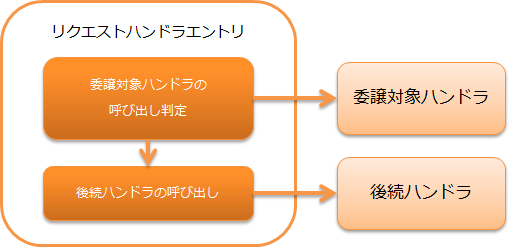

.. _request_handler_entry:

请求handler入口
========================================
.. contents:: 目录
  :depth: 3
  :local:

本handler是一种特殊的handler，只对特定请求路径调用委托目标的handler。
使用本handler可以实现"Web应用中仅对特定URL执行handler处理"的功能，
而无需修改handler。

本handler的主要用途是，使用 :ref:`resource_mapping` 实现"批量处理静态内容下载"的功能。
此外，还可以与 :ref:`database_connection_management_handler` 或 :ref:`transaction_management_handler` 同时使用，
用于"仅对特定URL更改使用的数据库连接"等用途。

本handler执行以下处理。

* 判定请求路径是否匹配，匹配则调用委托目标的handler。

处理流程如下。

handler类名
--------------------------------------------------
* :java:extdoc:`nablarch.fw.RequestHandlerEntry`

模块列表
--------------------------------------------------
.. code-block:: xml

  <dependency>
    <groupId>com.nablarch.framework</groupId>
    <artifactId>nablarch-core</artifactId>
  </dependency>

约束
------------------------------
无。

.. _request_handler_entry_usage:

本handler的使用示例
------------------------------

使用本handler时，需要设置指定处理目标请求路径的 ``requestPattern`` 属性，
以及指定委托目标handler的 ``handler`` 属性。

下面展示使用 :ref:`resource_mapping` 下载JPEG文件静态内容的配置示例。

.. code-block:: xml

  <!-- 执行图片文件静态资源下载的handler -->
  <component name="imgMapping"
             class="nablarch.fw.web.handler.ResourceMapping">
    <property name="baseUri" value="/"/>
    <property name="basePath" value="servlet:///"/>
  </component>

  <!-- handler队列构成 -->
  <component name="webFrontController"
             class="nablarch.fw.web.servlet.WebFrontController">

    <property name="handlerQueue">
      <list>

        <component class="nablarch.fw.handler.GlobalErrorHandler"/>
        <component class="nablarch.fw.web.handler.HttpCharacterEncodingHandler"/>
        <component class="nablarch.common.io.FileRecordWriterDisposeHandler" />
        <component class="nablarch.fw.web.handler.HttpResponseHandler"/>

        <!-- 下载扩展名为".jpg"的静态JPG文件的设置 -->
        <component class="nablarch.fw.RequestHandlerEntry">
          <property name="requestPattern" value="//*.jpg"/>
          <property name="handler" ref="imgMapping"/>
        </component>

        <!--
          对于下载以"*.jpg"结尾的JPEG文件之外的请求，
          调用以下handler
          -->
        <component-ref name="multipartHandler"/>
        <component-ref name="sessionStoreHandler" />

请求模式指定的变体
--------------------------------------------------

从 :ref:`request_handler_entry_usage` 的配置示例可以看出，
本handler的 ``requestPattern`` 属性可以使用类似Glob表达式的格式设置，
如 ``//*.jpg`` 。

通配符设置示例如下。

       +----------------+------------------+-------------------------------------------+
       | requestPattern | 请求路径         | 结果                                      |
       +================+==================+===========================================+
       | /              |  /               | 被调用                                    |
       |                +------------------+-------------------------------------------+
       |                |  /index.jsp      | 不被调用                                  |
       +----------------+------------------+-------------------------------------------+
       | /*             | /                | 被调用                                    |
       |                +------------------+-------------------------------------------+
       |                | /app             | 被调用                                    |
       |                +------------------+-------------------------------------------+
       |                | /app/            | 不被调用 (* 不匹配'/' )                   |
       |                +------------------+-------------------------------------------+
       |                | /index.jsp       | 不被调用 (* 不匹配'.' )                   |
       +----------------+------------------+-------------------------------------------+
       | /app/\*.jsp    | /app/index.jsp   | 被调用                                    |
       |                +------------------+-------------------------------------------+
       |                | /app/admin       | 不被调用                                  |
       +----------------+------------------+-------------------------------------------+
       | /app/\*/test   | /app/admin/test  | 被调用                                    |
       |                +------------------+-------------------------------------------+
       |                | /app/test/       | 不被调用                                  |
       +----------------+------------------+-------------------------------------------+

此外，末尾的'/'如果以'//'重叠，
则表示此前字符串前方匹配即为匹配成功的记法也可使用。

以下为设置示例。

       +----------------+-------------------------+-------------------------------------------+
       | requestPattern | 请求路径                | 结果                                      |
       +================+=========================+===========================================+
       | /app//         | /                       | 不被调用                                  |
       |                +-------------------------+-------------------------------------------+
       |                | /app/                   | 被调用                                    |
       |                +-------------------------+-------------------------------------------+
       |                | /app/admin/             | 被调用                                    |
       |                +-------------------------+-------------------------------------------+
       |                | /app/admin/index.jsp    | 被调用                                    |
       +----------------+-------------------------+-------------------------------------------+
       | //\*.jsp       | /app/index.jsp          | 被调用                                    |
       |                +-------------------------+-------------------------------------------+
       |                | /app/admin/index.jsp    | 被调用                                    |
       |                +-------------------------+-------------------------------------------+
       |                | /app/index.html         | 不被调用('\*.jsp'不匹配)                  |
       +----------------+-------------------------+-------------------------------------------+
