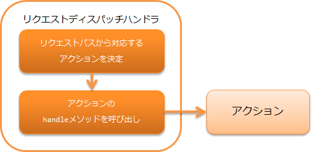

.. _request_path_java_package_mapping:

请求分发handler
========================================
.. contents:: 目录
  :depth: 3
  :local:

本handler将处理委托给记载应用程序各功能处理内容的Action。
本handler主要用于 :ref:`消息处理 <messaging>` 功能，用于分发到任意Action。

本handler以 :java:extdoc:`Request#getRequestPath() <nablarch.fw.Request.getRequestPath()>` 获取的
请求路径为基础，选择分发目标的Action。
假设请求路径的格式如下。

请求路径格式: /\<basePath\>/\<className\>

上述格式中<>包围的部分分别表示如下。

============= =================================================================
标签          含义
============= =================================================================
basePath      表示分发目标的基准路径
className     类名 (必填)
============= =================================================================

例如，调用类 ``xxx.yyy.ExampleBatchAction`` 时，如果基准路径为 ``batch`` ，则
指定请求路径为 ``/batch/ExampleBatchAction`` 。

.. important::
  通常， :java:extdoc:`Request#getRequestPath() <nablarch.fw.Request.getRequestPath()>` 获取的请求路径如 :ref:`main` 所述，
  是在命令行启动时使用 ``-requestPath`` 选项指定的。

本handler执行以下处理。

* 解析请求路径，调用对应Action的 handle 方法。

处理流程如下。

handler类名
--------------------------------------------------
* :java:extdoc:`nablarch.fw.handler.RequestPathJavaPackageMapping`

模块列表
--------------------------------------------------
.. code-block:: xml

  <dependency>
    <groupId>com.nablarch.framework</groupId>
    <artifactId>nablarch-fw</artifactId>
  </dependency>

约束
------------------------------

无。

.. _request_path_java_package_mapping_path_setting:

基准包、基准路径的设置
------------------------------------------------------------

本handler分发目标类所在的基准包，以及请求路径上要附加的基准路径，
可通过 ``basePackage`` 和 ``basePath`` 属性设置。

以下为将基准包设置为 ``nablarch.application`` 、基准路径设置为 ``/app/action`` 的示例。

.. code-block:: xml

  <component class="nablarch.fw.handler.RequestPathJavaPackageMapping">
    <property name="basePath"    value="/app/action/" />
    <property name="basePackage" value="nablarch.application" />
  </component>

.. _request_path_java_package_mapping_multi_package_dispatch:

分发到多个包的类
------------------------------------------------------------------------------------------------------------------------

使用本handler进行分发时，分发目标类可通过请求路径的指定分配到多个包中。
此时，在请求路径指定类名的位置，指定从基准包开始的相对包名。

例如上述 :ref:`request_path_java_package_mapping_path_setting` 设置时，要分发到 ``nablarch.application.xxx.ExampleBatchAction``
类，请求路径指定 ``/app/action/xxx/ExampleBatchAction`` 即可。

类名前缀、后缀的设置
------------------------------------------------------------------------------------------------------------------------

如果不想在请求路径中显示类名的前缀、后缀，可通过设置本handler的 ``classNamePrefix`` 和 ``classNameSuffix``
来省略请求路径中的指定。

例如，类名采用 ``XxxProjectXxxxBatchAction`` 这样的规则，前缀使用 ``XxxProject`` 这样的项目名，
后缀使用 ``BatchAction`` 时，通过如下设置可以将请求路径省略为
``/app/action/Xxxx`` 。

.. code-block:: xml

  <component class="nablarch.fw.handler.RequestPathJavaPackageMapping">
    <property name="basePath"    value="/app/action/" />
    <property name="basePackage" value="nablarch.application" />
    <property name="classNamePrefix" value="XxxProject" />
    <property name="classNameSuffix" value="BatchAction" />
  </component>

.. _request_path_java_package_mapping_optional_package_dispatch:

分发到复杂的包
------------------------------------------------------------------------------------------------------------------------

:ref:`request_path_java_package_mapping_multi_package_dispatch` 所示的方法存在
"必须将Action配置的包汇总到同一包下的子包中"的约束。
本handler在存在此类分发问题的情况下，提供按请求路径分别设置Action配置包的方法。

例如，考虑设置以下请求路径和分发目标的情况。

========================================== ======================================
请求路径                                   分发目标类
========================================== ======================================
/admin/AdminApp                            nablarch.sample.apps1.admin.AdminApp
/user/UserApp                              nablarch.sample.apps2.user.UserApp
/BaseApp                                   nablarch.sample.base.BaseApp
========================================== ======================================

进行此类分发时，通过 ``optionalPackageMappingEntries`` 属性使用
:java:extdoc:`JavaPackageMappingEntry <nablarch.fw.handler.JavaPackageMappingEntry>` 类进行如下设置。

.. code-block:: xml

  <component class="nablarch.fw.handler.RequestPathJavaPackageMapping">
      <property name="optionalPackageMappingEntries">
        <!-- 按希望匹配请求路径模式与Java包组合的顺序记载 -->
        <list>
          <component class="nablarch.fw.handler.JavaPackageMappingEntry">
            <property name="requestPattern" value="/admin//" />
            <property name="basePackage" value="nablarch.sample.apps1" />
          </component>
          <component class="nablarch.fw.handler.JavaPackageMappingEntry">
            <property name="requestPattern" value="/user//" />
            <property name="basePackage" value="nablarch.sample.apps2" />
          </component>
        </list>
      </property>
      <!-- optionalPackageMappingEntries中不存在匹配项时使用的Java包 -->
      <property name="basePackage" value="nablarch.sample.base" />
  </component>

.. _request_path_java_package_mapping_optional_immediate:

延迟执行分发目标类
------------------------------------------------------------------------------------------------------------------------

默认情况下分发目标类的委托是立即执行的，但希望在handler队列上后续handler执行后再委托给分发目标类时，
参考以下示例将 ``immediate`` 属性设置为false。

.. code-block:: xml

    <component class="nablarch.fw.handler.RequestPathJavaPackageMapping">
      <property name="basePackage" value="${nablarch.commonProperty.basePackage}" />
      <property name="immediate" value="false" />
    </component>
