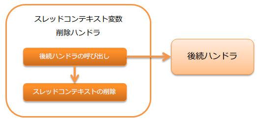

.. _thread_context_clear_handler:

线程上下文变量删除handler
=======================================

.. contents:: 目录
  :depth: 3
  :local:
  
删除 :ref:`thread_context_handler` 设置的线程本地变量的handler。

本handler执行以下处理。

* :ref:`thread_context_clear_handler-clear`

处理流程如下。

handler类名
--------------------------------------------------
* :java:extdoc:`nablarch.common.handler.threadcontext.ThreadContextClearHandler`

模块列表
--------------------------------------------------
.. code-block:: xml

  <dependency>
    <groupId>com.nablarch.framework</groupId>
    <artifactId>nablarch-fw</artifactId>
  </dependency>

约束
---------------------------------------
本handler应尽量配置在靠前位置。
因为在返回处理中，本handler之前的handler将无法访问线程上下文。

.. _thread_context_clear_handler-clear:

线程上下文的删除处理
-----------------------------------------------------------
删除 :ref:`thread_context_handler` 在线程本地设置的所有值。
