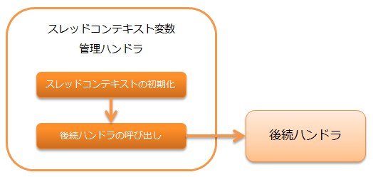

.. _thread_context_handler:

线程上下文变量管理handler
=======================================

.. contents:: 目录
  :depth: 3
  :local:

用于对线程上下文的各属性值进行以请求为单位的初始化处理的handler。

线程上下文是一种将请求ID、用户ID等同一处理线程内共享的值保持在线程本地存储(Thread Local Storage)的机制。

.. important::
  通过此handler设置的线程本地上的值，需要使用 :ref:`thread_context_clear_handler` 在后处理中删除。
  本handler的前处理中无法获得前面的handler从线程上下文中获取的值，
  因此请注意不要在本handler之前访问线程上下文。

.. tip::
 线程上下文的属性值大多通过此handler设置，
 但也可以从此handler以外的handler或业务动作中设置任意变量。

本handler执行以下处理。

* :ref:`thread_context_handler-initialization`

处理流程如下。

handler类名
--------------------------------------------------
* :java:extdoc:`nablarch.common.handler.threadcontext.ThreadContextHandler`

模块列表
--------------------------------------------------
.. code-block:: xml

  <dependency>
    <groupId>com.nablarch.framework</groupId>
    <artifactId>nablarch-fw</artifactId>
  </dependency>

  <!-- 仅在创建可通过国际化支持选择语言和时区的画面时  -->
  <dependency>
    <groupId>com.nablarch.framework</groupId>
    <artifactId>nablarch-fw-web</artifactId>
  </dependency>

约束
---------------------------------------
无。

.. _thread_context_handler-initialization:

リクエスト毎にスレッドコンテキストの初期化を行う
-----------------------------------------------------------
スレッドコンテキストの初期化は、
:java:extdoc:`ThreadContextAttributeインタフェース <nablarch.common.handler.threadcontext.ThreadContextAttribute>`
を実装したクラスを使用して行う。

デフォルトで以下のクラスを提供している。

リクエストID、内部リクエストID
 * :java:extdoc:`RequestIdAttribute <nablarch.common.handler.threadcontext.RequestIdAttribute>`
 * :java:extdoc:`InternalRequestIdAttribute <nablarch.common.handler.threadcontext.InternalRequestIdAttribute>` \ [#]_\

.. [#] 
   :ref:`permission_check_handler` や :ref:`ServiceAvailabilityCheckHandler` のような、内部リクエストIDに対する処理を実施するハンドラを使用する場合に設定する。

ユーザID
 * :java:extdoc:`UserIdAttribute <nablarch.common.handler.threadcontext.UserIdAttribute>`
 * :java:extdoc:`UserIdAttributeInSessionStore <nablarch.common.web.handler.threadcontext.UserIdAttributeInSessionStore>`

言語
 * :java:extdoc:`LanguageAttribute <nablarch.common.handler.threadcontext.LanguageAttribute>`
 * :java:extdoc:`HttpLanguageAttribute <nablarch.common.web.handler.threadcontext.HttpLanguageAttribute>`
 * :java:extdoc:`LanguageAttributeInHttpCookie <nablarch.common.web.handler.threadcontext.LanguageAttributeInHttpCookie>`
 * :java:extdoc:`LanguageAttributeInHttpSession <nablarch.common.web.handler.threadcontext.LanguageAttributeInHttpSession>`

タイムゾーン
 * :java:extdoc:`TimeZoneAttribute <nablarch.common.handler.threadcontext.TimeZoneAttribute>`
 * :java:extdoc:`TimeZoneAttributeInHttpCookie <nablarch.common.web.handler.threadcontext.TimeZoneAttributeInHttpCookie>`
 * :java:extdoc:`TimeZoneAttributeInHttpSession <nablarch.common.web.handler.threadcontext.TimeZoneAttributeInHttpSession>`

実行時ID
 * :java:extdoc:`ExecutionIdAttribute <nablarch.common.handler.threadcontext.ExecutionIdAttribute>`

これらのクラスは、コンポーネント設定ファイルに定義を追加して使用する。

.. code-block:: xml

 <component class="nablarch.common.handler.threadcontext.ThreadContextHandler">
   <property name="attributes">
     <list>

       <!-- リクエストID -->
       <component class="nablarch.common.handler.threadcontext.RequestIdAttribute" />

       <!-- 内部リクエストID -->
       <component class="nablarch.common.handler.threadcontext.InternalRequestIdAttribute" />

       <!-- ユーザID -->
       <component class="nablarch.common.handler.threadcontext.UserIdAttribute">
         <property name="sessionKey"  value="user.id" />
         <property name="anonymousId" value="guest" />
       </component>

       <!-- 言語 -->
       <component class="nablarch.common.handler.threadcontext.LanguageAttribute">
         <property name="defaultLanguage" value="ja" />
       </component>

       <!-- タイムゾーン -->
       <component class="nablarch.common.handler.threadcontext.TimeZoneAttribute">
         <property name="defaultTimeZone" value="Asia/Tokyo" />
       </component>

       <!-- 実行時ID -->
       <component class="nablarch.common.handler.threadcontext.ExecutionIdAttribute" />
     </list>
   </property>
 </component>

.. _thread_context_handler-user_id_attribute_setting:

ユーザIDを設定する
^^^^^^^^^^^^^^^^^^^^^^^^^^^^^^^^^^^^^^^^^^^^^^^^^^^^^^^^^^
:java:extdoc:`UserIdAttributeInSessionStore <nablarch.common.web.handler.threadcontext.UserIdAttributeInSessionStore>` は、デフォルトではセッションストアからユーザIDを取得する。
セッションストアへの設定はフレームワークでは実施しないため、ログイン時などに应用で設定する必要がある。
セッションストアに設定する際のキーはデフォルトでは"user.id"が使用される。
上書きする場合は、 :java:extdoc:`UserIdAttribute#sessionKey <nablarch.common.handler.threadcontext.UserIdAttribute.setSessionKey(java.lang.String)>` に値を設定する。
"login_id"に上書きする例を以下に示す。

.. code-block:: xml

  <component name="threadContextHandler" class="nablarch.common.handler.threadcontext.ThreadContextHandler">
    <property name="attributes">
      <list>
        <!-- ユーザID -->
        <component class="nablarch.common.web.handler.threadcontext.UserIdAttributeInSessionStore">
          <property name="sessionKey" value="login_id"/>
          <property name="anonymousId" value="${nablarch.userIdAttribute.anonymousId}"/>
        </component>
        <!-- その他のコンポーネント定義は省略 -->
      </list>
    </property>
  </component>

デフォルトのキーでセッションストアにユーザIDを設定する実装例を以下に示す。

.. code-block:: java

  SessionUtil.put(context, "user.id", userId);

また、セッションストアに直接ユーザIDを格納するのではなく、ログイン情報をまとめて格納したいといった要件が考えられる。
その場合は以下のように :java:extdoc:`UserIdAttribute#getUserIdSession <nablarch.common.handler.threadcontext.UserIdAttribute.getUserIdSession(nablarch.fw.ExecutionContext,java.lang.String)>` 
をオーバーライドすることで任意の取得元からユーザIDを取得することが可能となる。
"userContext"というキーでセッションストアに設定したオブジェクトからユーザIDを取得する場合の実装例を以下に示す。
下記の場合も、应用でセッションストアへオブジェクトを設定する必要がある。

.. code-block:: java

  public class SessionStoreUserIdAttribute extends UserIdAttribute {
      @Override
      protected Object getUserIdSession(ExecutionContext ctx, String skey) {
          LoginUserPrincipal userContext = SessionUtil.orNull(ctx, "userContext");
          if (userContext == null) {
              return null;
          }
          return String.valueOf(userContext.getUserId());
      }
  }

.. code-block:: xml

 <component class="nablarch.common.handler.threadcontext.ThreadContextHandler">
   <property name="attributes">
     <list>
        <!-- ユーザID -->
        <component class="com.nablarch.example.proman.web.common.handler.threadcontext.SessionStoreUserIdAttribute">
          <property name="anonymousId" value="${nablarch.userIdAttribute.anonymousId}"/>
        </component>
        <!-- その他のコンポーネント定義は省略 -->
     </list>
   </property>
 </component>

.. _thread_context_handler-attribute_access:

スレッドコンテキストの属性値を設定/取得する
-----------------------------------------------------------
スレッドコンテキストへのアクセスは、
:java:extdoc:`ThreadContext <nablarch.core.ThreadContext>` を使用する。

.. code-block:: java

 // リクエストIDの取得
 String requestId = ThreadContext.getRequestId();

.. _thread_context_handler-language_selection:

ユーザが言語を選択する画面を作る
-----------------------------------------------------------
国際化対応などで、ユーザが言語を選択できることが求められることがある。
このような場合、以下のクラスのいずれかと
:java:extdoc:`LanguageAttributeInHttpUtil <nablarch.common.web.handler.threadcontext.LanguageAttributeInHttpUtil>`
を使うことで、ユーザの言語選択を実現できる。

* :java:extdoc:`LanguageAttributeInHttpCookie <nablarch.common.web.handler.threadcontext.LanguageAttributeInHttpCookie>`
* :java:extdoc:`LanguageAttributeInHttpSession <nablarch.common.web.handler.threadcontext.LanguageAttributeInHttpSession>`

ここでは、クッキーに言語を保持し、リンクにより言語を選択させる画面の実装例を示す。

設定例
 .. code-block:: xml

  <!-- LanguageAttributeInHttpUtilを使用するため、
       コンポーネント名を"languageAttribute"にする。-->
  <component name="languageAttribute"
             class="nablarch.common.web.handler.threadcontext.LanguageAttributeInHttpCookie">
    <property name="defaultLanguage" value="ja" />
    <property name="supportedLanguages" value="ja,en" />
  </component>

JSPの実装例
  .. code-block:: jsp

    <%-- n:submitLinkタグを使用しリンクを出力し
      n:paramタグを使用しリンク毎に別々の言語を送信する --%>

    <n:submitLink uri="/action/menu/index" name="switchToEnglish">

      英語

      <n:param paramName="user.language" value="en" />
    </n:submitLink>
    <n:submitLink uri="/action/menu/index" name="switchToJapanese">

      日本語

      <n:param paramName="user.language" value="ja" />
    </n:submitLink>

ハンドラの実装例
 .. code-block:: java

  // ユーザが選択した言語の保持を行うハンドラ。
  // 複数画面でユーザに言語を選択させる場合を想定しハンドラとして実装する。
  public class I18nHandler implements HttpRequestHandler {

      public HttpResponse handle(HttpRequest request, ExecutionContext context) {
          String language = getLanguage(request, "user.language");
          if (StringUtil.hasValue(language)) {

              // LanguageAttributeInHttpUtilのkeepLanguageメソッドを呼び出し、
              // クッキーに選択された言語を設定する。
              // スレッドコンテキストにも言語が設定される。
              // 指定された言語がサポート対象の言語でない場合は、
              // クッキーとスレッドコンテキストへの設定を行わない。
              LanguageAttributeInHttpUtil.keepLanguage(request, context, language);
          }
          return context.handleNext(request);
      }

      private String getLanguage(HttpRequest request, String paramName) {
          if (!request.getParamMap().containsKey(paramName)) {
              return null;
          }
          return request.getParam(paramName)[0];
      }
  }

.. _thread_context_handler-time_zone_selection:

ユーザがタイムゾーンを選択する画面を作る
-----------------------------------------------------------
国際化対応などで、ユーザがタイムゾーンを選択できることが求められることがある。
このような場合、以下のクラスのいずれかと
:java:extdoc:`TimeZoneAttributeInHttpUtil <nablarch.common.web.handler.threadcontext.TimeZoneAttributeInHttpUtil>`
を使うことで、ユーザのタイムゾーン選択を実現できる。

* :java:extdoc:`TimeZoneAttributeInHttpCookie <nablarch.common.web.handler.threadcontext.TimeZoneAttributeInHttpCookie>`
* :java:extdoc:`TimeZoneAttributeInHttpSession <nablarch.common.web.handler.threadcontext.TimeZoneAttributeInHttpSession>`

ここでは、クッキーにタイムゾーンを保持し、リンクによりタイムゾーンを選択させる画面の実装例を示す。

設定例
 .. code-block:: xml

  <!-- TimeZoneAttributeInHttpUtilを使用するため、
       コンポーネント名を"timeZoneAttribute"にする。-->
  <component name="timeZoneAttribute"
             class="nablarch.common.web.handler.threadcontext.TimeZoneAttributeInHttpCookie">
    <property name="defaultTimeZone" value="Asia/Tokyo" />
    <property name="supportedTimeZones" value="Asia/Tokyo,America/New_York" />
  </component>

JSPの実装例
 .. code-block:: jsp

  <%-- n:submitLinkタグを使用しリンクを出力し
    n:paramタグを使用しリンク毎に別々のタイムゾーンを送信する --%>

  <n:submitLink uri="/action/menu/index" name="switchToNewYork">

    ニューヨーク

    <n:param paramName="user.timeZone" value="America/New_York" />
  </n:submitLink>
  <n:submitLink uri="/action/menu/index" name="switchToTokyo">

    東京

    <n:param paramName="user.timeZone" value="Asia/Tokyo" />
  </n:submitLink>

ハンドラの実装例
 .. code-block:: java

  // ユーザが選択したタイムゾーンの保持を行うハンドラ。
  // 複数画面でユーザにタイムゾーンを選択させる場合を想定しハンドラとして実装する。
  public class I18nHandler implements HttpRequestHandler {

      public HttpResponse handle(HttpRequest request, ExecutionContext context) {
          String timeZone = getTimeZone(request, "user.timeZone");
          if (StringUtil.hasValue(timeZone)) {

              // TimeZoneAttributeInHttpUtilのkeepTimeZoneメソッドを呼び出し、
              // クッキーに選択されたタイムゾーンを設定する。
              // スレッドコンテキストにもタイムゾーンが設定される。
              // 指定されたタイムゾーンがサポート対象のタイムゾーンでない場合は、
              // クッキーとスレッドコンテキストへの設定を行わない。
              TimeZoneAttributeInHttpUtil.keepTimeZone(request, context, timeZone);
          }
          return context.handleNext(request);
      }

      private String getTimeZone(HttpRequest request, String paramName) {
          if (!request.getParamMap().containsKey(paramName)) {
              return null;
          }
          return request.getParam(paramName)[0];
      }
  }
