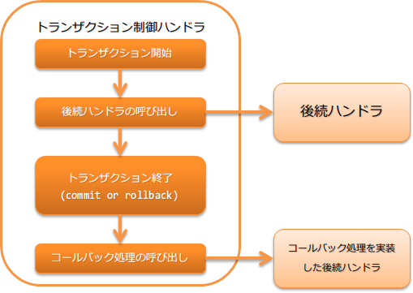

.. _transaction_management_handler:

事务控制handler
==================================================

.. contents:: 目录
  :depth: 3
  :local:

使用数据库和消息队列等支持事务的资源，在后续处理中实现透明事务的handler。

事务功能的详情参考 :ref:`transaction` 。

本handler执行以下处理。

* 事务的开始
* 事务的结束(提交或回滚)
* 事务结束时的回调

处理流程如下。

handler类名
--------------------------------------------------
* :java:extdoc:`nablarch.common.handler.TransactionManagementHandler`

模块列表
--------------------------------------------------
.. code-block:: xml

  <dependency>
    <groupId>com.nablarch.framework</groupId>
    <artifactId>nablarch-core-transaction</artifactId>
  </dependency>

  <!-- 仅当控制数据库事务时需要 -->
  <dependency>
    <groupId>com.nablarch.framework</groupId>
    <artifactId>nablarch-core-jdbc</artifactId>
  </dependency>

  <!-- 仅当在事务结束时执行任意处理时需要 -->
  <dependency>
    <groupId>com.nablarch.framework</groupId>
    <artifactId>nablarch-core</artifactId>
  </dependency>

约束
------------------------------
:ref:`database_connection_management_handler` 之后配置
  控制数据库事务时，需要事务管理目标的数据库连接存在于线程上。
  因此，本handler需要配置在 :ref:`database_connection_management_handler` 之后。

设置事务控制目标
--------------------------------------------------
本handler使用 :java:extdoc:`transactionFactory <nablarch.common.handler.TransactionManagementHandler.setTransactionFactory(nablarch.core.transaction.TransactionFactory)>`
属性设置的工厂类( :java:extdoc:`TransactionFactory <nablarch.core.transaction.TransactionFactory>` 实现类)获取事务的控制目标，并在线程上进行管理。

在线程上管理时，设置用于识别事务的名称。
默认使用 ``transaction`` ，但使用任意名称时，可在 :java:extdoc:`transactionName <nablarch.common.handler.TransactionManagementHandler.setTransactionName(java.lang.String)>` 属性中设置。
:ref:`使用多个事务时 <transaction_management_handler-multi_transaction>` ， :java:extdoc:`transactionName <nablarch.common.handler.TransactionManagementHandler.setTransactionName(java.lang.String)>` 属性的值设置是必需的。

.. tip::

  控制 :ref:`database_connection_management_handler` 设置的数据库的事务时，
  将 :java:extdoc:`DbConnectionManagementHandler#connectionName <nablarch.common.handler.DbConnectionManagementHandler.setConnectionName(java.lang.String)>` 设置的值与
  :java:extdoc:`transactionName <nablarch.common.handler.TransactionManagementHandler.setTransactionName(java.lang.String)>` 属性设置为相同的值。

  另外，如果未在 :java:extdoc:`DbConnectionManagementHandler#connectionName <nablarch.common.handler.DbConnectionManagementHandler.setConnectionName(java.lang.String)>` 设置值，
  则可省略 :java:extdoc:`transactionName <nablarch.common.handler.TransactionManagementHandler.setTransactionName(java.lang.String)>` 的设置。

参考以下设置文件示例，设置本handler。

.. code-block:: xml

  <!-- 事务控制handler -->
  <component class="nablarch.common.handler.TransactionManagementHandler">
    <property name="transactionFactory" ref="databaseTransactionFactory" />
    <property name="transactionName" value="name" />
  </component>

  <!-- 控制数据库事务时，设置JdbcTransactionFactory -->
  <component name="databaseTransactionFactory"
      class="nablarch.core.db.transaction.JdbcTransactionFactory">
    <!-- 属性设置省略 -->
  </component>

特定异常情况下提交事务
----------------------------------------------------------------------------------------------------
本handler的默认动作是所有错误和异常都作为回滚对象，
但根据发生的异常内容，有时希望提交事务。

此时，可在 :java:extdoc:`transactionCommitExceptions <nablarch.common.handler.TransactionManagementHandler.setTransactionCommitExceptions(java.util.List)>` 属性中
设置作为提交对象的异常类来对应。
另外，设置的异常类的子类也会成为提交对象。

以下为设置示例。

.. code-block:: xml

  <component class="nablarch.common.handler.TransactionManagementHandler">
    <!-- 在transactionCommitExceptions属性中以FQCN设置提交对象的异常类 -->
    <property name="transactionCommitExceptions">
      <list>
        <!-- 将example.TransactionCommitException设为提交对象 -->
        <value>example.TransactionCommitException</value>
      </list>
    </property>
  </component>

希望在事务结束时执行任意处理
--------------------------------------------------
本handler在事务结束(提交或回滚)时执行回调处理。

被回调的处理是本handler之后配置的handler中实现了 :java:extdoc:`TransactionEventCallback <nablarch.fw.TransactionEventCallback>` 的处理。
如果有多个handler实现了 :java:extdoc:`TransactionEventCallback <nablarch.fw.TransactionEventCallback>` ，则从配置在更靠前位置的handler开始依次执行回调处理。

事务回滚时，在回滚后执行回调处理。
因此，回调处理在新的事务中执行，回调正常结束后会提交。

.. important::

  多个handler实现回调处理时，如果回调处理中发生错误或异常，
  注意剩余的handler的回调处理将不会执行。

以下为示例。

创建执行回调处理的handler
  如以下实现示例所示，创建实现了 :java:extdoc:`TransactionEventCallback <nablarch.fw.TransactionEventCallback>` 的handler。

  在 :java:extdoc:`transactionNormalEnd <nablarch.fw.TransactionEventCallback.transactionNormalEnd(TData,nablarch.fw.ExecutionContext)>` 中实现事务提交时的回调处理，
  在 :java:extdoc:`transactionAbnormalEnd <nablarch.fw.TransactionEventCallback.transactionAbnormalEnd(java.lang.Throwable,TData,nablarch.fw.ExecutionContext)>` 中实现事务回滚时的回调处理。

  .. code-block:: java

    public static class SampleHandler
        implements Handler<Object, Object>, TransactionEventCallback<Object> {

      @Override
      public Object handle(Object o, ExecutionContext context) {
        // 实现handler的处理
        return context.handleNext(o);
      }

      @Override
      public void transactionNormalEnd(Object o, ExecutionContext ctx) {
        // 实现事务提交时的回调处理
      }

      @Override
      public void transactionAbnormalEnd(Throwable e, Object o, ExecutionContext ctx) {
        // 实现事务回滚时的回调处理
      }
    }

构建handler队列
  如下所示，在本handler的后续handler中设置实现回调处理的handler。

  .. code-block:: xml

    <list name="handlerQueue">
      <!-- 事务控制handler -->
      <component class="nablarch.common.handler.TransactionManagementHandler">
        <!-- 属性设置省略 -->
      </component>

      <!-- 实现回调处理的handler -->
      <component class="sample.SampleHandler" />
    </list>

.. _transaction_management_handler-multi_transaction:

应用中使用多个事务
----------------------------------------------------------------------------------------------------
考虑一个应用需要多个事务控制的情况。
此时，通过在handler队列上设置多个本handler来对应。

以下为控制多个数据库连接事务的设置示例。

.. code-block:: xml

  <!-- 设置默认的数据库连接 -->
  <component name="defaultDatabaseHandler"
      class="nablarch.common.handler.DbConnectionManagementHandler">

    <property name="connectionFactory" ref="connectionFactory" />

  </component>

  <!-- 以userAccessLog为名注册数据库连接 -->
  <component name="userAccessLogDatabaseHandler"
      class="nablarch.common.handler.DbConnectionManagementHandler">

    <property name="connectionFactory" ref="userAccessLogConnectionFactory" />
    <property name="connectionName" value="userAccessLog" />

  </component>

  <!-- 默认数据库连接的事务控制设置 -->
  <component name="defaultTransactionHandler"
      class="nablarch.common.handler.TransactionManagementHandler">

    <property name="transactionFactory" ref="databaseTransactionFactory" />

  </component>

  <!-- userAccessLog数据库连接的事务控制设置 -->
  <component name="userAccessLogTransactionHandler"
      class="nablarch.common.handler.TransactionManagementHandler">

    <property name="transactionFactory" ref="databaseTransactionFactory" />
    <property name="transactionName" value="userAccessLog" />

  </component>

以上为handler队列设置的示例如下。

.. code-block:: xml

  <!-- 数据库和事务控制以外的handler省略 -->

  <list name="handlerQueue">
    <!-- 默认数据库的连接和事务控制 -->
    <component-ref name="defaultDatabaseHandler" />
    <component-ref name="defaultTransactionHandler" />

    <!-- userAccessLog数据库的连接和事务控制 -->
    <component-ref name="userAccessLogDatabaseHandler" />
    <component-ref name="userAccessLogTransactionHandler" />
  </list>

