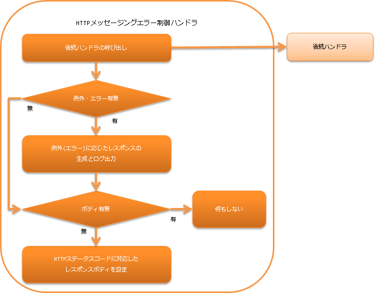

.. _http_messaging_error_handler:

HTTP消息传递错误控制handler
==================================================
.. contents:: 目录
  :depth: 3
  :local:

此handler捕获后续handler中发生的异常和错误，并根据异常(错误)进行日志输出和响应生成。
此外，如果后续handler中没有设置响应体，则设置与HTTP状态码对应的默认响应体。

此handler执行以下处理。

* 根据异常(错误)进行日志输出和响应生成。
  详细信息请参考 :ref:`http_messaging_error_handler-error_response_and_log`。

* 设置默认响应体。
  详细信息请参考 :ref:`http_messaging_error_handler-default_page`。

处理流程如下。

  
handler类名
--------------------------------------------------
* :java:extdoc:`nablarch.fw.messaging.handler.HttpMessagingErrorHandler`

模块列表
--------------------------------------------------
.. code-block:: xml

  <dependency>
    <groupId>com.nablarch.framework</groupId>
    <artifactId>nablarch-fw-messaging-http</artifactId>
  </dependency>

约束
------------------------------
请配置在 :ref:`http_response_handler` 之后
  :ref:`http_response_handler` 会处理由此handler生成的 :java:extdoc:`HttpResponse <nablarch.fw.web.HttpResponse>`。
  因此，需要将此handler设置在 :ref:`http_response_handler` 之后。

.. _http_messaging_error_handler-error_response_and_log:

根据异常类型进行日志输出和响应生成
--------------------------------------------------------------
:java:extdoc:`nablarch.fw.NoMoreHandlerException`
  :日志级别: INFO
  :响应: 404
  :说明: 表示不存在应处理请求的handler，因此作为审计日志记录。
         同时，表示不存在应处理的 *action class*，因此生成HTTP状态码为 *404* 的响应。

:java:extdoc:`nablarch.fw.web.HttpErrorResponse`
  :日志级别: 不输出日志
  :响应: :java:extdoc:`HttpErrorResponse#getResponse() <nablarch.fw.web.HttpErrorResponse.getResponse()>`
  :说明: 表示在后续handler中发生了业务异常(如验证等结果异常)，因此不进行日志输出。

:java:extdoc:`nablarch.fw.Result.Error`
  :日志级别: 根据设置
  :响应: :java:extdoc:`Error#getStatusCode() <nablarch.fw.Result.Error.getStatusCode()>`
  :说明: 参考 :ref:`http_messaging_error_handler-write_failure_log_pattern`

:java:extdoc:`nablarch.core.message.ApplicationException` 和 :java:extdoc:`nablarch.fw.messaging.MessagingException`
  :日志级别: \-
  :响应: 400
  :说明: 表示客户端请求不正确的异常，因此生成HTTP状态码为 *400* 的响应。

上述以外的异常和错误
  :日志级别: FATAL
  :响应: 500
  :说明: 对于不属于上述情况的异常和错误，作为故障进行日志输出。
         同时，由于是意外异常和错误，响应设置为 **500**。

.. _http_messaging_error_handler-write_failure_log_pattern:

关于nablarch.fw.Result.Error的日志输出
~~~~~~~~~~~~~~~~~~~~~~~~~~~~~~~~~~~~~~~~~~~~~~
当后续handler中发生的异常是 :java:extdoc:`Error <nablarch.fw.Result.Error>` 时，是否输出日志取决于
:java:extdoc:`writeFailureLogPattern <nablarch.fw.web.handler.HttpErrorHandler.setWriteFailureLogPattern(java.lang.String)>` 中设置的值。
此属性可以设置正则表达式，当该正则表达式与 :java:extdoc:`Error#getStatusCode() <nablarch.fw.Result.Error.getStatusCode()>` 匹配时，输出 `FATAL` 级别的日志。

.. _http_messaging_error_handler-default_page:

响应体为空时的默认响应设置
--------------------------------------------------------
详细信息请参考 :ref:`HTTP错误控制handler的默认页面设置 <HttpErrorHandler_DefaultPage>`。
