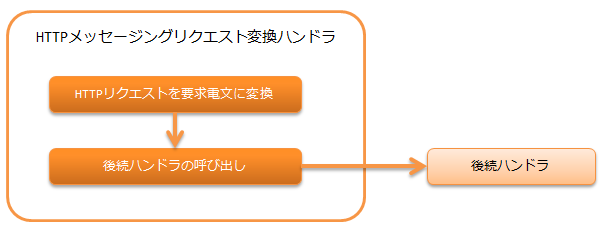

.. _http_messaging_request_parsing_handler:

HTTP消息传递请求转换handler
==================================================
.. contents:: 目录
  :depth: 3
  :local:

将HTTP请求(
:java:extdoc:`HttpRequest<nablarch.fw.web.HttpRequest>`
)转换为请求电文(
:java:extdoc:`RequestMessage<nablarch.fw.messaging.RequestMessage>`
)的handler。

此handler执行以下处理。

* 将HTTP请求转换为请求电文。
  详细信息请参考 :ref:`http_messaging_request_parsing_handler-convert`。

处理流程如下。

  
handler类名
--------------------------------------------------
* :java:extdoc:`nablarch.fw.messaging.handler.HttpMessagingRequestParsingHandler`

模块列表
--------------------------------------------------
.. code-block:: xml

  <dependency>
    <groupId>com.nablarch.framework</groupId>
    <artifactId>nablarch-fw-messaging-http</artifactId>
  </dependency>

约束
------------------------------

请配置在 :ref:`http_response_handler` 之后
  当转换处理失败时，会向客户端返回指定状态码的响应，
  因此此handler必须配置在 :ref:`http_response_handler` 之后。

请配置在 :ref:`thread_context_handler` 之后
  此handler基于线程上下文中设置的请求ID，
  获取用于请求电文和响应电文转换的
  :java:extdoc:`DataRecordFormatter<nablarch.core.dataformat.DataRecordFormatter>`，
  因此必须将此handler配置在 :ref:`thread_context_handler` 之后。

.. _http_messaging_request_parsing_handler-convert:

将HTTP请求转换为请求电文
--------------------------------------------------------------
转换内容如下所示。

.. list-table::
   :header-rows: 1
   :class: white-space-normal
   :widths: 30,30,40

   * - HTTP请求(转换源)
     - 请求电文(转换目标)
     - 补充说明

   * - 请求ID
     - 请求电文的请求路径
     -

   * - X-Message-Id请求头
     - 请求电文的消息ID
     - 如果此头不存在，则向客户端返回 ``400``。

   * - X-Correlation-Id请求头
     - 请求电文的相关消息ID
     - 如果此头不存在，则不设置。

   * - 其余请求头
     - 请求电文的协议头
     -

   * - 请求体
     - 框架控制头和数据记录
     - 详细信息请参考 :ref:`请求体的转换<http_messaging_request_parsing_handler-convert_body>`。

.. _http_messaging_request_parsing_handler-convert_body:

请求体的转换
 请求体的转换由 :ref:`data_format` 执行。
 需要按照以下规则准备格式定义文件。

  接收时的格式定义文件逻辑名
   <请求ID> + "_RECEIVE"

  发送时的格式定义文件逻辑名
   <请求ID> + "_SEND"

 默认情况下，将读取的数据作为结构化数据处理，
 但不设置框架控制头的各项。
 因此，如需设置框架控制头的各项，
 请在组件配置文件中添加
 :java:extdoc:`StructuredFwHeaderDefinition<nablarch.fw.messaging.reader.StructuredFwHeaderDefinition>`，
 并指定从电文中获取头信息时的键信息。

 配置示例如下。

 要点
   * 键信息在
     :java:extdoc:`StructuredFwHeaderDefinition#fwHeaderKeys<nablarch.fw.messaging.reader.StructuredFwHeaderDefinition.setFwHeaderKeys(java.util.Map)>`
     属性中指定。
   * :java:extdoc:`StructuredFwHeaderDefinition#fwHeaderKeys<nablarch.fw.messaging.reader.StructuredFwHeaderDefinition.setFwHeaderKeys(java.util.Map)>`
     属性中，键指定字段名，值指定电文上的位置。
     电文上的位置描述的是结构化数据转换为Map后的键信息。
     关于结构化数据转换为Map时的键信息，请参考 :ref:`data_format-structured_data`。

 .. code-block:: xml

  <component class="nablarch.fw.messaging.handler.HttpMessagingRequestParsingHandler">
    <property name="fwHeaderDefinition" ref="fwHeaderDefinition"/>
  </component>

  <component name="fwHeaderDefinition"
             class="nablarch.fw.messaging.reader.StructuredFwHeaderDefinition">
    <property name="FwHeaderKeys">
      <map>
        <entry key="userId"     value="_nbctlhdr.userId"/>
        <entry key="resendFlag" value="_nbctlhdr.resendFlag"/>
        <entry key="statusCode" value="_nbctlhdr.statusCode"/>
      </map>
    </property>
  </component>

 此外，处理固定长数据或可变长数据时，请指定标准框架控制头定义。

 .. code-block:: xml

  <component name="fwHeaderDefinition"
             class="nablarch.fw.messaging.StandardFwHeaderDefinition" />

转换时的异常处理
 转换时捕获的异常和处理内容如下所示。
 对于未在以下列出的异常不予捕获。

 :java:extdoc:`nablarch.fw.results.RequestEntityTooLarge`
  :日志级别: INFO
  :响应: 413
  :说明: 由于请求体大小超过上限，作为审计日志记录。
         然后，为表示大小超过限制，生成HTTP状态码为 *413* 的响应。

 :java:extdoc:`nablarch.fw.messaging.MessagingException`
  :日志级别: INFO
  :响应: 400
  :说明: 由于请求体不正确，作为审计日志记录。
         然后，为表示客户端错误，生成HTTP状态码为 *400* 的响应。

 :java:extdoc:`nablarch.core.dataformat.InvalidDataFormatException`
  :日志级别: INFO
  :响应: 400
  :说明: 由于请求体格式不正确，作为审计日志记录。
         然后，为表示客户端错误，生成HTTP状态码为 *400* 的响应。

.. _http_messaging_request_parsing_handler-limit_size:

防止过大的请求
--------------------------------------------------------------
当请求的请求体过大时，
可能因磁盘资源耗尽等原因导致系统无法正常运行。

因此，handler在处理的大小超过请求体上限的请求时，
会输出INFO日志作为审计记录，并向客户端返回 ``413``。

请求体大小上限以字节数设置。
省略设置时，为 :java:extdoc:`Integer#MAX_VALUE<java.lang.Integer>`。

以下为配置示例。

.. code-block:: xml

  <component class="nablarch.fw.messaging.handler.HttpMessagingRequestParsingHandler">
    <!-- 上传大小(Content-Length)上限(约10M) -->
    <property name="bodyLengthLimit" value="10000000" />
  </component>
