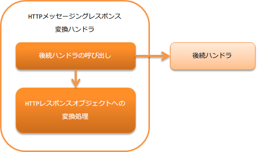

.. _http_messaging_response_building_handler:

HTTP消息传递响应转换handler
==================================================
.. contents:: 目录
  :depth: 3
  :local:

此handler将后续handler创建的响应电文对象转换为HTTP响应对象。
此外，将响应电文对象内的协议头值设置到对应的HTTP头中，并进行XML或JSON等格式的序列化。

此handler执行以下处理。

* 将响应电文对象的内容转换为HTTP响应对象。

处理流程如下。

  
handler类名
--------------------------------------------------
* :java:extdoc:`nablarch.fw.messaging.handler.HttpMessagingResponseBuildingHandler`

模块列表
--------------------------------------------------
.. code-block:: xml

  <dependency>
    <groupId>com.nablarch.framework</groupId>
    <artifactId>nablarch-fw-messaging-http</artifactId>
  </dependency>

约束
------------------------------

请设置在 :ref:`http_response_handler` 之后
  因为 :ref:`http_response_handler` 会将此handler生成的 :java:extdoc:`HTTP响应对象 <nablarch.fw.web.HttpResponse>` 返回给客户端。

.. _http_messaging_response_building_handler-header:

设置到响应头的值
--------------------------------------------------
基于后续handler创建的响应电文对象，设置以下响应头。

:Status-Code:
  设置响应电文对象的状态码。

:Content-Type:
  从响应电文对象持有的格式化器(:java:extdoc:`InterSystemMessage.getFormatter() <nablarch.fw.messaging.InterSystemMessage.getFormatter()>`)获取以下值并设置。

  * MIME(:java:extdoc:`DataRecordFormatterSupport#getMimeType() <nablarch.core.dataformat.DataRecordFormatterSupport.getMimeType()>`
  * cherset(:java:extdoc:`DataRecordFormatterSupport#getDefaultEncoding() <nablarch.core.dataformat.DataRecordFormatterSupport.getDefaultEncoding()>`

  当MIME为 ``application/json`` 且charset为 ``utf-8`` 时，Content-Type为以下值。

  **application/json;charset=utf-8**

:相关消息ID: 在响应头的 ``X-Correlation-Id`` 中，设置响应电文头中设置的 ``CorrelationId`` 值。

.. important::
  此handler无法设置上述未记载的响应头。

  如需使用上述之外的响应头，请在项目中创建handler进行对应。

更改框架控制头的结构
--------------------------------------------------
如需更改响应电文内的框架控制头定义，需要设置项目中扩展的框架控制头定义。
未设置时，将使用默认的 :java:extdoc:`StructuredFwHeaderDefinition <nablarch.fw.messaging.reader.StructuredFwHeaderDefinition>`。

关于框架控制头的详细信息，请参考 :ref:`框架控制头 <http_system_messaging-fw_header>`。

以下为配置示例。

.. code-block:: xml

  <component class="nablarch.fw.messaging.handler.HttpMessagingResponseBuildingHandler">
    <!-- 框架控制头的设置 -->
    <property name="fwHeaderDefinition">
      <component class="sample.SampleFwHeaderDefinition" />
    </property>
  </component> 

.. |br| raw:: html

   
