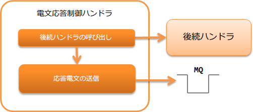

.. _message_reply_handler:

电文应答控制handler
==================================================
.. contents:: 目录
  :depth: 3
  :local:

此handler基于后续handler的处理结果，即 :java:extdoc:`ResponseMessage <nablarch.fw.messaging.ResponseMessage>` 对象的内容，
创建应答电文并返回(发送)给连接的目标系统。

此handler执行以下处理。

* 执行应答电文的发送处理

处理流程如下。

  
handler类名
--------------------------------------------------
* :java:extdoc:`nablarch.fw.messaging.handler.MessageReplyHandler`

模块列表
--------------------------------------------------
.. code-block:: xml

  <dependency>
    <groupId>com.nablarch.framework</groupId>
    <artifactId>nablarch-fw-messaging</artifactId>
  </dependency>

约束
------------------------------
请设置在 :ref:`messaging_context_handler` 之后
  此handler发送应答电文(放入消息队列)。
  因此，需要将此handler设置在建立MQ连接的 :ref:`messaging_context_handler` 之后。

与 :ref:`transaction_management_handler` 的位置关系
  与 :ref:`transaction_management_handler` 的位置关系取决于是否使用两阶段提交。

  使用两阶段提交时
    通过事务管理器将数据库事务和消息队列(Jakarta Messaging)事务一起提交。
    因此，需要在事务控制前发送应答电文，必须将此handler设置在 :ref:`transaction_management_handler` 之后。

  不使用两阶段提交时
  此handler在发送应答前需要确定业务处理的结果。
  因此，需要将 :ref:`transaction_management_handler` 设置在此handler之后。

框架控制头的设置
--------------------------------------------------
如需更改应答电文内的框架控制头定义，需要设置项目中扩展的框架控制头定义。
未设置时，将使用默认的 :java:extdoc:`StandardFwHeaderDefinition <nablarch.fw.messaging.StandardFwHeaderDefinition>`。

关于框架控制头的详细信息，请参考 :ref:`框架控制头 <mom_system_messaging-fw_header>`。

以下为配置示例。

.. code-block:: xml

  <component class="nablarch.fw.messaging.handler.MessageReplyHandler">
    <!-- 框架控制头的设置 -->
    <property name="fwHeaderDefinition">
      <component class="sample.SampleFwHeaderDefinition" />
    </property>
  </component> 
