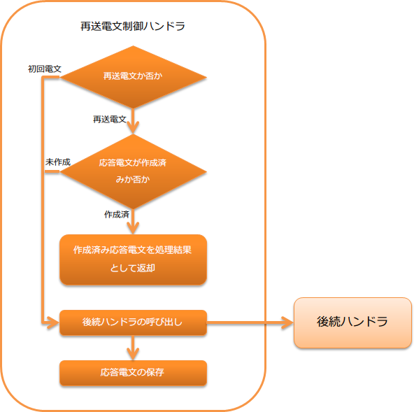

.. _message_resend_handler:

消息重发控制handler
==================================================
.. contents:: 目录
  :depth: 3
  :local:

本handler用于对重复接收同一电文时进行重发控制。

具体来说，当重复接收同一电文时，判断该电文的处理是否已完成（是否已创建响应电文）。
如果处理已完成（已创建响应电文），则不执行业务处理，而是自动发送已创建的响应电文。

判断是否为同一电文的方法请参考 :ref:`message_resend_handler-resent_message` 。

.. tip::
  应用本handler的优点如下。

  * 如果响应电文已创建，可以省略业务处理，从而降低系统负载。
  * 对于向数据库注册的处理，可以省略业务处理，因此不需要实现防止重复导入的逻辑。

本handler执行以下处理。

* 响应电文的保存处理
* 重发电文时，发送已保存的响应电文
* 非重发电文或没有已保存响应电文时，委托给后续handler处理

处理流程如下。

  
handler类名
--------------------------------------------------
* :java:extdoc:`nablarch.fw.messaging.handler.MessageResendHandler`

模块列表
--------------------------------------------------
.. code-block:: xml

  <dependency>
    <groupId>com.nablarch.framework</groupId>
    <artifactId>nablarch-fw-messaging</artifactId>
  </dependency>

约束
------------------------------
:ref:`message_reply_handler` 之后设置
  本handler需要发送创建的响应电文。
  因此，需要将本handler设置在用于发送电文的 :ref:`message_reply_handler` 之后。

:ref:`transaction_management_handler` 之后设置
  本handler将响应电文保存到数据库中。
  因此，需要将本handler设置在实现数据库事务控制的 :ref:`transaction_management_handler` 之后。

响应电文的保存位置
--------------------------------------------------
后续handler创建的响应电文存储在数据库表中。
因此，需要预先创建响应电文的保存表。

存储响应电文的表定义如下。
默认的表名和物理名值请参考 :java:extdoc:`SentMessageTableSchema <nablarch.fw.messaging.tableschema.SentMessageTableSchema>` 。

.. list-table::
  :header-rows: 1
  :class: white-space-normal
  :widths: 30 30 40

  * - 列名
    - 约束等
    - 存储的值

  * - 请求ID
    - 主键 |br| 字符串型
    - 请求电文的请求ID

  * - 消息ID
    - 主键 |br| 字符串型
    - 请求电文的消息ID

      重发电文时，使用相关消息ID而非消息ID。

      详情请参考 :ref:`message_resend_handler-resent_message`

  * - 目标队列的逻辑名
    - 字符串型
    - 发送响应电文的目标队列逻辑名 |br|
      (:java:extdoc:`InterSystemMessage#getDestination() <nablarch.fw.messaging.InterSystemMessage.getDestination()>`)

  * - 处理结果代码
    - 字符串型
    - 响应电文的处理结果代码 |br| 
      (:java:extdoc:`ResponseMessage#getStatusCode() <nablarch.fw.messaging.ResponseMessage.getStatusCode()>`)

  * - 响应电文
    - 二进制型
    - 响应电文的内容 |br|
      (:java:extdoc:`ResponseMessage#getBodyBytes() <nablarch.fw.messaging.ResponseMessage.getBodyBytes()>`)

如需更改默认的表名和列名，可通过设置进行更改。
详情请参考 :java:extdoc:`SentMessageTableSchema <nablarch.fw.messaging.tableschema.SentMessageTableSchema>` 以及
:java:extdoc:`sentMessageTableSchema属性 <nablarch.fw.messaging.handler.MessageResendHandler.setSentMessageTableSchema(nablarch.fw.messaging.tableschema.SentMessageTableSchema)>` 。

.. _message_resend_handler-resent_message:

同一电文(重发电文)的判断方法
--------------------------------------------------
本handler接收的电文满足以下条件时，判断为已接收已处理的请求电文，并返回保存的响应电文作为处理结果。

* 框架控制头部的重发请求标志已设置值
* 接收的请求电文相关联的请求ID和消息ID的数据存在于保存响应电文的表中

框架控制头部的详情请参考 :ref:`框架控制头部 <mom_system_messaging-fw_header>` 。

.. important::

  对方系统在重发请求电文时，需要满足以下约束。
  如果无法满足此约束，则不能使用本handler，需要项目方自行创建实现重发控制的handler。

  * 重发电文的相关消息ID需设置为初次发送时请求电文的消息ID
  * 框架控制头部的重发请求标志需设置值

框架控制头部的设置
--------------------------------------------------
如需更改响应电文内的框架控制头部定义，需要设置项目中扩展的框架控制头部定义。
未设置时，将使用默认的 :java:extdoc:`StandardFwHeaderDefinition <nablarch.fw.messaging.StandardFwHeaderDefinition>` 。

框架控制头部的详情请参考 :ref:`框架控制头部 <mom_system_messaging-fw_header>` 。

以下显示设置示例。

.. code-block:: xml

  <component class="nablarch.fw.messaging.handler.MessageResendHandler">
    <!-- 框架控制头部的设置 -->
    <property name="fwHeaderDefinition">
      <component class="sample.SampleFwHeaderDefinition" />
    </property>
  </component> 

.. |br| raw:: html

   
