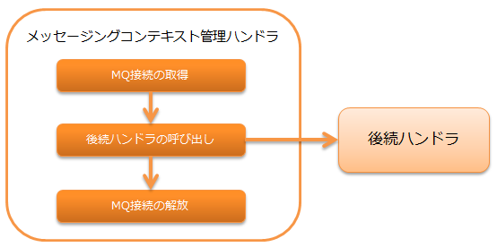

.. _messaging_context_handler:

消息处理上下文管理handler
==================================================

.. contents:: 目录
  :depth: 3
  :local:

在线程上管理后续handler和库使用的MQ连接的handler。

MOM消息处理的详情请参考 :ref:`system_messaging` 。

本handler执行以下处理。

* 获取MQ连接
* 释放MQ连接

处理流程如下。

handler类名
--------------------------------------------------
* :java:extdoc:`nablarch.fw.messaging.handler.MessagingContextHandler`

模块列表
--------------------------------------------------
.. code-block:: xml

  <dependency>
    <groupId>com.nablarch.framework</groupId>
    <artifactId>nablarch-fw-messaging</artifactId>
  </dependency>

约束
------------------------------
无。

设置MQ连接目标
--------------------------------------------------
本handler使用在 :java:extdoc:`messagingProvider <nablarch.fw.messaging.handler.MessagingContextHandler.setMessagingProvider(nablarch.fw.messaging.MessagingProvider)>`
属性中设置的provider类( :java:extdoc:`MessagingProvider <nablarch.fw.messaging.MessagingProvider>` 实现类)来获取MQ连接。

以下显示设置示例。
provider类的设置内容请参考使用的
:java:extdoc:`MessagingProvider <nablarch.fw.messaging.MessagingProvider>` 实现类的Javadoc。

.. code-block:: xml

 <!-- 消息上下文管理handler -->
 <component class="nablarch.fw.messaging.handler.MessagingContextHandler">
   <property name="messagingProvider" ref="messagingProvider" />
 </component>

 <!-- provider类 -->
 <component name="messagingProvider"
     class="nablarch.fw.messaging.provider.JmsMessagingProvider">
   <!-- 属性设置省略 -->
 </component>
