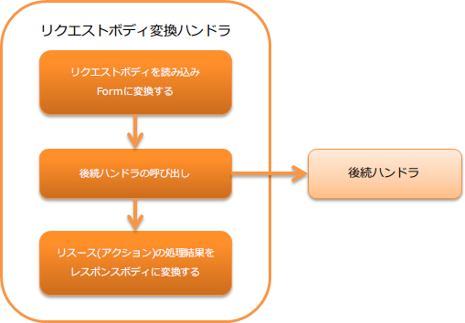

.. _body_convert_handler:

请求主体转换handler
==================================================
.. contents:: 目录
  :depth: 3
  :local:

本handler负责请求主体和响应主体的转换处理。

转换时使用的格式由处理请求的资源(Action)类的方法中设置的
:java:extdoc:`Consumes <jakarta.ws.rs.Consumes>` 及 :java:extdoc:`Produces <jakarta.ws.rs.Produces>` 注解指定。

本handler执行以下处理。

* 将请求主体转换为资源(Action)类接受的Form。
  详情请参阅 :ref:`body_convert_handler-convert_request`。

* 将资源(Action)类的处理结果转换为响应主体。
  详情请参阅 :ref:`body_convert_handler-convert_response`。

处理流程如下。

  
handler类名
--------------------------------------------------
* :java:extdoc:`nablarch.fw.jaxrs.BodyConvertHandler`

模块列表
--------------------------------------------------
.. code-block:: xml

  <dependency>
    <groupId>com.nablarch.framework</groupId>
    <artifactId>nablarch-fw-jaxrs</artifactId>
  </dependency>

约束
------------------------------
本handler应设置在 :ref:`router_adaptor` 之后
  本handler根据资源(Action)类的方法中设置的注解信息
  进行请求及响应的转换处理。
  因此，需要设置在用于确定分发目标的 :ref:`router_adaptor` 之后。

设置执行转换处理的converter
--------------------------------------------------
本handler使用设置在 :java:extdoc:`bodyConverters <nablarch.fw.jaxrs.BodyConvertHandler.setBodyConverters(java.util.List)>` 属性中的
:java:extdoc:`BodyConverter <nablarch.fw.jaxrs.BodyConverter>` 实现类进行请求及响应的转换处理。
:java:extdoc:`bodyConverters <nablarch.fw.jaxrs.BodyConvertHandler.setBodyConverters(java.util.List)>` 属性中应设置
项目中使用的MIME对应的 :java:extdoc:`BodyConverter <nablarch.fw.jaxrs.BodyConverter>`。

以下为例。

.. code-block:: xml

  <component class="nablarch.fw.jaxrs.BodyConvertHandler">
    <property name="bodyConverters">
      <list>
        <!-- 对应application/xml的请求/响应converter -->
        <component class="nablarch.fw.jaxrs.JaxbBodyConverter" />
        <!-- 对应application/x-www-form-urlencoded的请求/响应converter -->
        <component class="nablarch.fw.jaxrs.FormUrlEncodedConverter" />
      </list>
    </property>
  </component>

.. tip::
  如果使用了 :java:extdoc:`bodyConverters <nablarch.fw.jaxrs.BodyConvertHandler.setBodyConverters(java.util.List)>` 属性中设置的converter
  无法转换的MIME，则返回表示不支持的媒体类型的状态码(``415``)。

.. _body_convert_handler-convert_request:

将请求主体转换为Form
--------------------------------------------------
请求主体转换处理使用的格式由处理请求的方法中设置的 :java:extdoc:`Consumes <jakarta.ws.rs.Consumes>` 决定。
如果请求头部的Content-Type中设置的MIME与 :java:extdoc:`Consumes <jakarta.ws.rs.Consumes>` 中设置的MIME不同，
则返回表示不支持的媒体类型的状态码(``415``)。

资源(Action)方法的实现例如下。

本例中，使用对应 ``MediaType.APPLICATION_JSON`` 所表示的 ``application/json`` 的
:java:extdoc:`BodyConverter <nablarch.fw.jaxrs.BodyConverter>` 将请求主体转换为 ``Person``。

.. code-block:: java

  @Consumes(MediaType.APPLICATION_JSON)
  @Valid
  public HttpResponse saveJson(Person person) {
      UniversalDao.insert(person);
      return new HttpResponse();
  }

.. _body_convert_handler-convert_response:

将资源(Action)的处理结果转换为响应主体
----------------------------------------------------------------------
响应主体转换处理使用的格式由处理请求的方法中设置的 :java:extdoc:`Produces <jakarta.ws.rs.Produces>` 决定。

资源(Action)方法的实现例如下。

本例中，使用对应 ``MediaType.APPLICATION_JSON`` 所表示的 ``application/json`` 的
:java:extdoc:`BodyConverter <nablarch.fw.jaxrs.BodyConverter>` 将请求主体转换为 ``Person``。

.. code-block:: java

  GET
  @Produces(MediaType.APPLICATION_JSON)
  public List<Person> findJson() {
      return UniversalDao.findAll(Person.class);
  }

