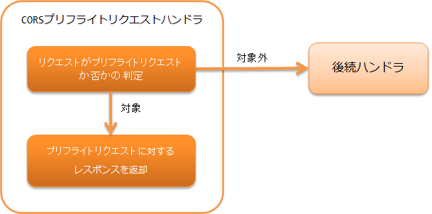

.. _cors_preflight_request_handler:

CORS预检请求handler
==================================================
.. contents:: 目录
  :depth: 3
  :local:

本handler用于 :ref:`RESTful Web服务<restful_web_service>` 实现CORS(Cross-Origin Resource Sharing)。

要实现CORS，需要对预检请求和实际请求分别进行处理。预检请求在实际请求之前发送。
预检请求由本handler处理，实际请求的处理由 :ref:`jaxrs_response_handler-response_finisher` 中说明的
实现了ResponseFinisher的 :java:extdoc:`CorsResponseFinisher <nablarch.fw.jaxrs.cors.CorsResponseFinisher>` 处理。

本handler执行以下处理。

* 如果请求是预检请求，则返回预检请求的响应。

处理流程如下。

handler类名
--------------------------------------------------
* :java:extdoc:`nablarch.fw.jaxrs.CorsPreflightRequestHandler`

模块列表
--------------------------------------------------
.. code-block:: xml

  <dependency>
    <groupId>com.nablarch.framework</groupId>
    <artifactId>nablarch-fw-jaxrs</artifactId>
  </dependency>

约束
------------------------------
应配置在 :ref:`jaxrs_response_handler` 之后
  本handler生成的 :java:extdoc:`HttpResponse <nablarch.fw.web.HttpResponse>` 由 :ref:`jaxrs_response_handler` 处理，
  因此本handler需要配置在 :ref:`jaxrs_response_handler` 之后。

.. _cors_preflight_request_handler-setting:

实现CORS
--------------------------------------------------
要实现CORS，需要配置本handler和 :java:extdoc:`CorsResponseFinisher <nablarch.fw.jaxrs.cors.CorsResponseFinisher>`。

CORS处理由 :java:extdoc:`Cors <nablarch.fw.jaxrs.cors.Cors>` 接口执行。
框架提供了CORS的基本实现类 :java:extdoc:`BasicCors <nablarch.fw.jaxrs.cors.BasicCors>`。
本handler和CorsResponseFinisher只需指定BasicCors即可。

设置如下。

.. code-block:: xml

  <!-- BasicCors -->
  <component name="cors" class="nablarch.fw.jaxrs.cors.BasicCors">
    <!-- 允许的Origin指定。此设置为必填 -->
    <property name="allowOrigins">
      <list>
        <value>https://www.example.com</value>
      </list>
    </property>
  </component>

  <!-- handler队列构成 -->
  <component name="webFrontController" class="nablarch.fw.web.servlet.WebFrontController">
    <property name="handlerQueue">
      <list>
        <!-- 其他handler省略 -->

        <!-- JaxRsResponseHandler -->
        <component class="nablarch.fw.jaxrs.JaxRsResponseHandler">
          <property name="responseFinishers">
            <list>
              <!-- CorsResponseFinisher -->
              <component class="nablarch.fw.jaxrs.cors.CorsResponseFinisher">
                <!-- 指定BasicCors -->
                <property name="cors" ref="cors" />
              </component>
            </list>
          </property>
        </component>

        <!-- CorsPreflightRequestHandler -->
        <component class="nablarch.fw.jaxrs.CorsPreflightRequestHandler">
          <!-- 指定BasicCors -->
          <property name="cors" ref="cors" />
        </component>

      </list>
    </property>
  </component>

:java:extdoc:`BasicCors <nablarch.fw.jaxrs.cors.BasicCors>` 默认执行以下处理。

预检请求(CorsPreflightRequestHandler调用的处理)
  - 请求满足以下所有条件时判定为预检请求。

      - HTTP方法：OPTIONS
      - Origin头部：存在
      - Access-Control-Request-Method头部：存在

  - 请求为预检请求时返回以下响应。

.. textlint-disable ja-technical-writing/max-comma
      - 状态码：204
      - Access-Control-Allow-Methods头部：OPTIONS, GET, POST, PUT, DELETE, PATCH
      - Access-Control-Allow-Headers头部：Content-Type, X-CSRF-TOKEN
      - Access-Control-Max-Age头部：-1
      - 同时设置以下"实际请求"的响应头部。
.. textlint-enable ja-technical-writing/max-comma

实际请求(CorsResponseFinisher调用的处理)
  - 设置以下响应头部。

      - Access-Control-Allow-Origin头部：请求的Origin头部

          - 仅当请求的Origin头部包含在允许的Origin中时才设置此头部
      - Vary头部：Origin

          - 仅当请求的Origin头部包含在允许的Origin中时才设置此头部
      - Access-Control-Allow-Credentials头部：true

默认处理中，可以通过设置更改响应头部的内容。
可通过设置更改的内容请参阅 :java:extdoc:`BasicCors <nablarch.fw.jaxrs.cors.BasicCors>` 的Javadoc。
