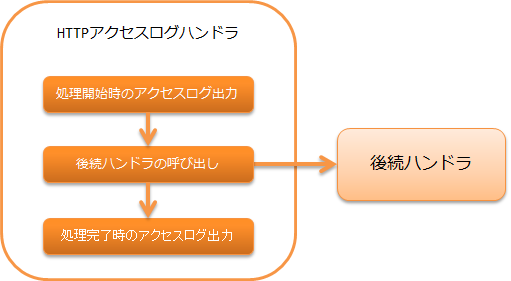

.. _jaxrs_access_log_handler:

HTTP访问日志（RESTful Web服务用）handler
======================================================
.. contents:: 目录
  :depth: 3
  :local:

输出 :ref:`HTTP访问日志（RESTful Web服务用）<jaxrs_access_log>` 的handler。

本handler执行以下处理。

* 输出请求处理开始时的访问日志
* 输出请求处理完成时的访问日志

处理流程如下。

handler类名
--------------------------------------------------
* :java:extdoc:`nablarch.fw.jaxrs.JaxRsAccessLogHandler`

模块列表
--------------------------------------------------
.. code-block:: xml

  <dependency>
    <groupId>com.nablarch.framework</groupId>
    <artifactId>nablarch-fw-jaxrs</artifactId>
  </dependency>

约束
--------------------------------------------------

应配置在 :ref:`thread_context_handler` 之后
  本handler调用的日志输出处理中，通常需要 :java:extdoc:`ThreadContext <nablarch.core.ThreadContext>` 中保存的内容。
  因此，需要配置在 :ref:`thread_context_handler` 之后。

应配置在 :ref:`http_error_handler` 之前
  此外，由于完成时的日志输出需要错误代码，因此需要配置在 :ref:`http_error_handler` 之前。

如需输出会话存储ID，应配置在 :ref:`session_store_handler` 之后
  详情请参阅 :ref:`jaxrs_access_log-session_store_id`。

访问日志输出内容的切换
--------------------------------------------------

访问日志输出内容的切换方法请参阅 :ref:`log` 以及 :ref:`jaxrs_access_log`。
