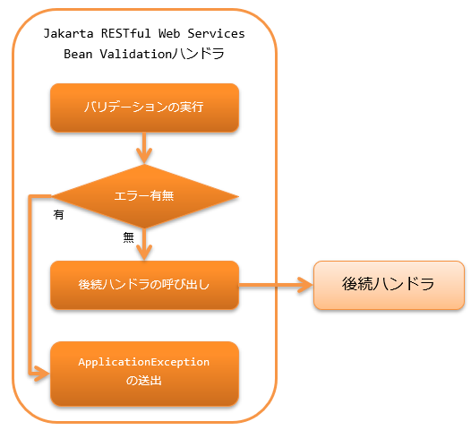

.. _jaxrs_bean_validation_handler:

Jakarta RESTful Web Services Bean Validation handler
======================================================
.. contents:: 目录
  :depth: 3
  :local:

.. tip::
  本功能在Nablarch5之前的版本名为"JAX-RS BeanValidation handler"。
  但随着Java EE移管至Eclipse Foundation导致规范名称变更，现更名为"Jakarta RESTful Web Services Bean Validation handler"。

  仅名称变更，功能上无差异。

  其他Nablarch6中名称变更的功能请参阅 :ref:`renamed_features_in_nablarch_6`。

本handler对资源(Action)类接收的Form(Bean)执行 :ref:`bean_validation`。
如果验证时发生验证错误，则不将处理委托给后续handler，
而是抛出 :java:extdoc:`ApplicationException <nablarch.core.message.ApplicationException>` 结束处理。

本handler执行以下处理。

* 对资源(Action)类方法接收的Form执行 :ref:`bean_validation`。

处理流程如下。

  
handler类名
--------------------------------------------------
* :java:extdoc:`nablarch.fw.jaxrs.JaxRsBeanValidationHandler`

模块列表
--------------------------------------------------
.. code-block:: xml

  <dependency>
    <groupId>com.nablarch.framework</groupId>
    <artifactId>nablarch-fw-jaxrs</artifactId>
  </dependency>

  <!-- Bean Validation的模块 -->
  <dependency>
    <groupId>com.nablarch.framework</groupId>
    <artifactId>nablarch-core-validation-ee</artifactId>
  </dependency>

约束
------------------------------
应设置在 :ref:`body_convert_handler` 之后
  本handler对 :ref:`body_convert_handler` 从请求主体转换后的Form(Bean)执行验证。

.. _jaxrs_bean_validation_handler_perform_validation:

对资源(Action)接收的Form(Bean)执行验证
----------------------------------------------------------------------------------------------------
如果要对资源(Action)方法接收的Form(Bean)执行验证，
需要在该方法上设置 :java:extdoc:`Valid <jakarta.validation.Valid>` 注解。

以下为例。

.. code-block:: java

  // 要对Person对象执行验证，
  // 所以设置Valid注解。
  @POST
  @Consumes(MediaType.APPLICATION_JSON)
  @Valid
  public HttpResponse save(Person person) {
      UniversalDao.insert(person);
      return new HttpResponse();
  }

指定Bean Validation的组
-------------------------------------------------
通过在设置了 :java:extdoc:`Valid <jakarta.validation.Valid>` 注解的方法上
设置 :java:extdoc:`ConvertGroup <jakarta.validation.groups.ConvertGroup>` 注解，可以指定Bean Validation的组。

:java:extdoc:`ConvertGroup <jakarta.validation.groups.ConvertGroup>` 注解必须指定 ``from`` 属性和 ``to`` 属性。
分别指定如下。

* ``from`` 、、、固定为 :java:extdoc:`Default.class <jakarta.validation.groups.Default>`

  * 方法上设置 :java:extdoc:`Valid <jakarta.validation.Valid>` 注解时，
    验证会作为设置了 :java:extdoc:`Default <jakarta.validation.groups.Default>` 组来执行。

* ``to`` 、、、指定Bean Validation的组

以下为例。

.. code-block:: java

  // 使用Person类中设置的验证规则中
  // 属于Create组的规则进行验证。
  @POST
  @Consumes(MediaType.APPLICATION_JSON)
  @Valid
  @ConvertGroup(from = Default.class, to = Create.class)
  public HttpResponse save(Person person) {
      UniversalDao.insert(person);
      return new HttpResponse();
  }
