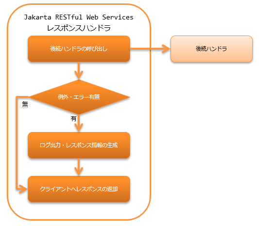

.. _jaxrs_response_handler:

Jakarta RESTful Web Services响应handler
==================================================
.. contents:: 目录
  :depth: 3
  :local:

.. tip::
  本功能在Nablarch5之前的版本名为"JAX-RS响应handler"。
  但随着Java EE移管至Eclipse Foundation导致规范名称变更，现更名为"Jakarta RESTful Web Services响应handler"。

  仅名称变更，功能上无差异。

  其他Nablarch6中名称变更的功能请参阅 :ref:`renamed_features_in_nablarch_6`。

本handler将后续handler(资源(Action)类或 :ref:`body_convert_handler`)
返回的响应信息返回给客户端。
如果后续handler中抛出异常或错误，则构建对应异常及错误的响应信息返回给客户端。

本handler执行以下处理。

* 生成异常及错误发生时的响应信息。
  详情请参阅 :ref:`jaxrs_response_handler-error_response`。
* 输出异常及错误发生时的日志。
  详情请参阅 :ref:`jaxrs_response_handler-error_log`
* 返回给客户端的响应。

处理流程如下。

  
handler类名
--------------------------------------------------
* :java:extdoc:`nablarch.fw.jaxrs.JaxRsResponseHandler`

模块列表
--------------------------------------------------
.. code-block:: xml

  <dependency>
    <groupId>com.nablarch.framework</groupId>
    <artifactId>nablarch-fw-jaxrs</artifactId>
  </dependency>

约束
------------------------------
无。

.. _jaxrs_response_handler-error_response:

根据异常及错误生成响应
--------------------------------------------------
根据异常及错误生成响应信息由设置在 :java:extdoc:`errorResponseBuilder <nablarch.fw.jaxrs.JaxRsResponseHandler.setErrorResponseBuilder(nablarch.fw.jaxrs.ErrorResponseBuilder)>` 属性中的
:java:extdoc:`ErrorResponseBuilder <nablarch.fw.jaxrs.ErrorResponseBuilder>` 执行。
但是，如果发生的异常类为 :java:extdoc:`HttpErrorResponse <nablarch.fw.web.HttpErrorResponse>`，
则返回 :java:extdoc:`HttpErrorResponse#getResponse() <nablarch.fw.web.HttpErrorResponse.getResponse()>` 
返回的 :java:extdoc:`HttpResponse <nablarch.fw.web.HttpResponse>` 给客户端。

如果省略设置，则使用默认实现的 :java:extdoc:`ErrorResponseBuilder <nablarch.fw.jaxrs.ErrorResponseBuilder>`。
如果默认实现无法满足项目需求，可以通过继承默认实现类来对应。

以下为例。

.. code-block:: xml

  <component class="nablarch.fw.jaxrs.JaxRsResponseHandler">
    <property name="errorResponseBuilder">
      <component class="sample.SampleErrorResponseBuilder" />
    </property>
  </component>

.. important::
  ErrorResponseBuilder的职责是根据异常及错误生成响应，如果在ErrorResponseBuilder的处理过程中发生异常，
  则无法生成响应，导致无法向客户端返回响应。
  因此，项目在自定义ErrorResponseBuilder时，应确保ErrorResponseBuilder的处理过程中不会发生异常。
  如果在ErrorResponseBuilder的处理过程中发生异常，框架将以WARN级别
  输出日志，生成状态码500的响应，并继续后续处理。

.. _jaxrs_response_handler-error_log:

根据异常及错误输出日志
--------------------------------------------------
根据异常及错误输出日志由设置在 :java:extdoc:`errorLogWriter <nablarch.fw.jaxrs.JaxRsResponseHandler.setErrorLogWriter(nablarch.fw.jaxrs.JaxRsErrorLogWriter)>` 属性中的
:java:extdoc:`JaxRsErrorLogWriter <nablarch.fw.jaxrs.JaxRsErrorLogWriter>` 执行。

如果省略设置，则使用默认实现的 :java:extdoc:`JaxRsErrorLogWriter <nablarch.fw.jaxrs.JaxRsErrorLogWriter>`。
如果默认实现无法满足项目需求，可以通过继承默认实现类来对应。

以下为例。

.. code-block:: xml

  <component class="nablarch.fw.jaxrs.JaxRsResponseHandler">
    <property name="errorLogWriter">
      <component class="sample.SampleJaxRsErrorLogWriter" />
    </property>
  </component>

扩展示例
--------------------------------------------------

.. _jaxrs_response_handler-error_response_body:

在错误时响应中设置消息
~~~~~~~~~~~~~~~~~~~~~~~~~~~~~~~~~~~~~~~~~~~~~~~~~~~~~
验证错误发生时等，有时希望在错误响应主体中设置错误消息返回。
这种情况下，可以创建 :java:extdoc:`ErrorResponseBuilder <nablarch.fw.jaxrs.ErrorResponseBuilder>` 的继承类来对应。

以下是在响应中设置JSON格式错误消息时的实现例。

.. code-block:: java

  public class SampleErrorResponseBuilder extends ErrorResponseBuilder {

      private final ObjectMapper objectMapper = new ObjectMapper();

      @Override
      public HttpResponse build(final HttpRequest request,
              final ExecutionContext context, final Throwable throwable) {
          if (throwable instanceof ApplicationException) {
              return createResponseBody((ApplicationException) throwable);
          } else {
              return super.build(request, context, throwable);
          }
      }

      private HttpResponse createResponseBody(final ApplicationException ae) {
          final HttpResponse response = new HttpResponse(400);
          response.setContentType(MediaType.APPLICATION_JSON);

          // 错误消息生成处理省略

          try {
              response.write(objectMapper.writeValueAsString(errorMessages));
          } catch (JsonProcessingException ignored) {
              return new HttpResponse(500);
          }
          return response;
      }
  }

.. _jaxrs_response_handler-individually_error_response:

特定错误时返回单独定义的错误响应
~~~~~~~~~~~~~~~~~~~~~~~~~~~~~~~~~~~~~~~~~~~~~~~~~~~~~~~~~~~~~
对于本handler后续处理中发生的错误，
有时希望返回单独定义了状态码和主体的错误响应。

这种情况下，可以创建 :java:extdoc:`ErrorResponseBuilder <nablarch.fw.jaxrs.ErrorResponseBuilder>` 的继承类，
根据抛出的异常单独实现响应的生成处理。

实现例如下。

.. code-block:: java

  public class SampleErrorResponseBuilder extends ErrorResponseBuilder {

      @Override
      public HttpResponse build(final HttpRequest request,
              final ExecutionContext context, final Throwable throwable) {
          if (throwable instanceof NoDataException) {
              return new HttpResponse(404);
          } else {
              return super.build(request, context, throwable);
          }
      }
  }

.. _jaxrs_response_handler-response_finisher:

给返回客户端的响应添加通用处理
~~~~~~~~~~~~~~~~~~~~~~~~~~~~~~~~~~~~~~~~~~~~~~~~~~~~~~~~~~~~~
无论正常时还是错误发生时，有时希望对返回客户端的响应统一设置CORS对应或安全对应的响应头部。

为应对此类情况，框架提供了完善响应的 :java:extdoc:`ResponseFinisher <nablarch.fw.jaxrs.ResponseFinisher>` 接口。
如需给响应添加通用处理，可以创建实现ResponseFinisher接口的类，
指定到本handler的responseFinishers属性中。

实现例和设置例如下。

.. code-block:: java

  public class CustomResponseFinisher implements ResponseFinisher {
      @Override
      public void finish(HttpRequest request, HttpResponse response, ExecutionContext context) {
          // 设置响应头部等，执行通用处理。
      }
  }

.. code-block:: xml

  <component class="nablarch.fw.jaxrs.JaxRsResponseHandler">
    <property name="responseFinishers">
      <list>
        <!-- 指定实现ResponseFinisher的类 -->
        <component class="sample.CustomResponseFinisher" />
      </list>
    </property>
  </component>

有时希望将设置安全相关响应头部的 :ref:`secure_handler` 等现有handler作为ResponseFinisher使用。
为应对此类情况，提供了将handler适配为ResponseFinisher的
:java:extdoc:`AdoptHandlerResponseFinisher <nablarch.fw.jaxrs.AdoptHandlerResponseFinisher>` 类。

可在AdoptHandlerResponseFinisher中使用的handler，仅限那些不自行创建响应，而是对后续handler返回的响应进行更改的handler。

AdoptHandlerResponseFinisher使用例如下。

.. code-block:: xml

  <component class="nablarch.fw.jaxrs.JaxRsResponseHandler">
    <property name="responseFinishers">
      <list>
        <!-- AdoptHandlerResponseFinisher -->
        <component class="nablarch.fw.jaxrs.AdoptHandlerResponseFinisher">
          <!-- handler属性中指定handler -->
          <property name="handler" ref="secureHandler" />
        </component>
      </list>
    </property>
  </component>
