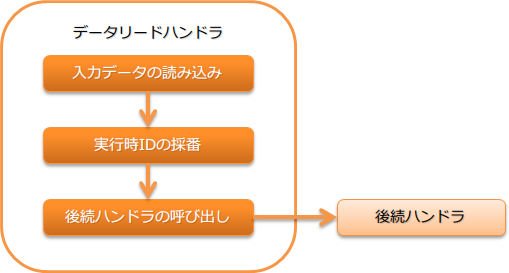

.. _data_read_handler:

数据读取handler
========================================
.. contents:: 目录
  :depth: 3
  :local:

使用:ref:`データリーダ <nablarch_batch-data_reader>` 来顺序读取业务处理所需的输入数据，并将其作为参数传递给后续handler进行处理。

本handler会使用运行上下文上的 :ref:`データリーダ <nablarch_batch-data_reader>` 来顺序读取业务处理所需的输入数据，并将其作为参数传递给后续handler进行处理。
:ref:`データリーダ <nablarch_batch-data_reader>` 读取到数据的末尾时，会返回 :java:extdoc:`NoMoreRecord <nablarch.fw.DataReader.NoMoreRecord>` 异常。

本handler执行以下处理。

* データリーダを使用して入力データの読み込み
* :ref:`実行時ID <log-execution_id>` の採番

处理流程如下。

ハンドラクラス名
--------------------------------------------------
* :java:extdoc:`nablarch.fw.handler.DataReadHandler`

モジュール一覧
--------------------------------------------------
.. code-block:: xml

  <dependency>
    <groupId>com.nablarch.framework</groupId>
    <artifactId>nablarch-fw-standalone</artifactId>
  </dependency>

制約
------------------------------
本ハンドラより手前のハンドラにて、 :java:extdoc:`ExecutionContext <nablarch.fw.ExecutionContext>` に :java:extdoc:`DataReader <nablarch.fw.DataReader>` を設定する必要がある。
本ハンドラが呼び出されたタイミングで :java:extdoc:`DataReader <nablarch.fw.DataReader>` が設定されていない場合、処理対象データ無しとして本ハンドラは処理を終了( :java:extdoc:`NoMoreRecord <nablarch.fw.DataReader.NoMoreRecord>` を返却)する。

.. _data_read_handler-max_count:

最大処理件数の設定
--------------------------------------------------
本ハンドラには、最大の処理件数を設定することが出来る。最大処理件数分のデータを処理し終わると、本ハンドラは処理対象レコードなしを示す  :java:extdoc:`NoMoreRecord <nablarch.fw.DataReader.NoMoreRecord>`  を返却する。

この設定値は、大量データを処理するバッチ処理を数日に分けて処理させる場合などに指定する。
この設定値を使用することで、最大100万件を処理するバッチを、日次で最大10万件だけ処理をさせ10日間かけて全件を処理させることが実現できる。

以下に設定例を示す。

.. code-block:: xml

  <component class="nablarch.fw.handler.DataReadHandler">
    <!-- 処理する件数は、最大1万レコード -->
    <property name="maxCount" value="10000" />
  </component>

