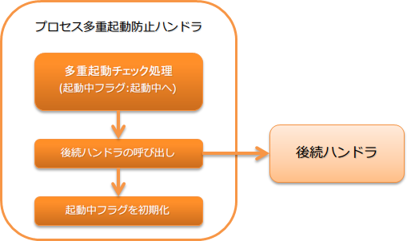

.. _duplicate_process_check_handler:

防止进程重复启动handler
==================================================
.. contents:: 目录
  :depth: 3
  :local:

此handler具有在同时执行多个相同Batch进程时，使后续执行的进程异常终止的功能。
通过应用此handler，可以防止同一Batch进程的同时执行，从而预先防止数据的重复导入等。

同一Batch进程的识别使用设置在线程变量上的请求ID。
因此，即使是使用同一Batch操作进行处理的Batch，如果请求ID不同，也会被视为不同的Batch进程。

.. important::
 原则上应在JP1等作业调度器端进行控制。
 在作业调度器端无法控制的情况下，可应用此handler在应用层防止多重启动。

此handler执行以下处理。

* 进程多重启动检查处理(在多重启动检查时将启动中标志更改为启动中)
* 将启动中标志更改为初始化(未启动)

处理流程如下。

handler类名
--------------------------------------------------
* :java:extdoc:`nablarch.fw.handler.DuplicateProcessCheckHandler`

模块列表
--------------------------------------------------
.. code-block:: xml

  <dependency>
    <groupId>com.nablarch.framework</groupId>
    <artifactId>nablarch-fw-batch</artifactId>
  </dependency>

约束
------------------------------

此handler应设置在线程上下文变量管理handler之后
  此handler基于设置在线程上下文上的请求ID进行进程多重启动检查。
  因此，需要将此handler设置在 :ref:`thread_context_handler` 之后。

.. _duplicate_process_check_handler-configuration:

进行防止重复启动检查的设置
--------------------------------------------------
需要在此handler中设置执行防止Batch进程重复启动的检查的类等。
设置项目的详细信息，请参考 :java:extdoc:`DuplicateProcessCheckHandler <nablarch.fw.handler.DuplicateProcessCheckHandler>`。

执行防止重复启动的检查的类的详细信息，请参考 :java:extdoc:`BasicDuplicateProcessChecker <nablarch.fw.handler.BasicDuplicateProcessChecker>`。

以下为示例。

.. code-block:: xml

  <!-- 防止执行多重启动的检查的类 -->
  <component name="duplicateProcessChecker" class="nablarch.fw.handler.BasicDuplicateProcessChecker">
    <!-- 用于访问数据库的事务设置 -->
    <property name="dbTransactionManager" ref="transaction" />

    <!-- 检查中使用的表的定义信息 -->
    <property name="tableName" value="BATCH_REQUEST" />
    <property name="processIdentifierColumnName" value="REQUEST_ID" />
    <property name="processActiveFlgColumnName" value="PROCESS_ACTIVE_FLG" />
  </component>

  <!-- 防止进程重复启动的handler -->
  <component name="duplicateProcessCheckHandler"
      class="nablarch.fw.handler.DuplicateProcessCheckHandler">

    <!-- 设置防止执行重复启动的检查的类 -->
    <property name="duplicateProcessChecker" ref="duplicateProcessChecker" />

    <!-- 设置结束代码(可选) -->
    <property name="exitCode" value="10" />
  </component>

  <!-- BasicDuplicateProcessChecker是需要初始化的类，因此添加到初始化对象列表中 -->
  <component name="initializer"
      class="nablarch.core.repository.initialization.BasicApplicationInitializer">
    <property name="initializeList">
      <list>
        <component-ref name="duplicateProcessChecker" />
        <!-- 其他组件的设置 -->
      </list>
    </property>
  </component>

自定义防止重复启动的检查处理
--------------------------------------------------
如需自定义防止重复启动的检查的处理，可以通过实现 :java:extdoc:`DuplicateProcessChecker <nablarch.fw.handler.DuplicateProcessChecker>` 解决。

实现的类可以按照 :ref:`duplicate_process_check_handler-configuration` 中所述，设置到此handler中使用。

