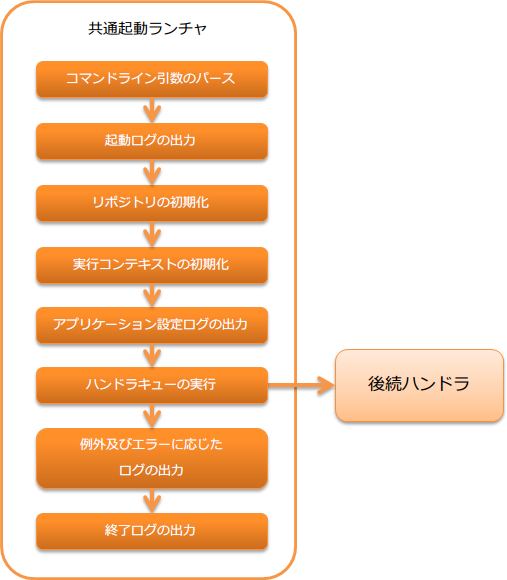

.. _`main`:

通用启动器
==================================================

.. contents:: 目录
  :depth: 3
  :local:

作为独立应用启动的起点的handler。

通过直接使用java命令启动应用时，会初始化System Repository，并执行其中定义的handler队列。

本handler会执行以下处理。
处理的详细内容请参考Javadoc。

* 命令行参数解析( :java:extdoc:`CommandLine<nablarch.fw.launcher.CommandLine>` )
* 启动日志输出( :java:extdoc:`LauncherLogFormatter#getStartLogFormat<nablarch.fw.launcher.logging.LauncherLogFormatter.getStartLogFormat()>` )
* System Repository初始化
* 运行上下文初始化( :java:extdoc:`Main#setupExecutionContext <nablarch.fw.launcher.Main.setupExecutionContext(nablarch.fw.launcher.CommandLine,nablarch.fw.ExecutionContext)>` )
* 应用配置日志输出( :java:extdoc:`ApplicationSettingLogFormatter<nablarch.core.log.app.ApplicationSettingLogFormatter>` )
* handler队列的执行
* 异常及错误日志输出
* 结束日志输出( :java:extdoc:`LauncherLogFormatter#getEndLogFormat<nablarch.fw.launcher.logging.LauncherLogFormatter.getEndLogFormat()>` )

处理流程如下。

handler类名
--------------------------------------------------
* :java:extdoc:`nablarch.fw.launcher.Main`

模块列表
--------------------------------------------------
.. code-block:: xml

  <dependency>
    <groupId>com.nablarch.framework</groupId>
    <artifactId>nablarch-fw-standalone</artifactId>
  </dependency>

.. _main-run_application:

应用启动
--------------------------------------------------
使用java命令启动应用时，需要指定 :java:extdoc:`Main类<nablarch.fw.launcher.Main>` 。

フレームワークの動作に必要となる以下の3つのオプションは、必ず指定する必要がある。
以下のオプションのうちいずれかが欠けていた場合は、即座に異常終了する。(終了コード = 127)

\-diConfig
 System Repositoryの設定ファイルのパスを指定する。
 このオプションで指定されたパスを使ってSystem Repositoryを初期化する。

\-requestPath
 実行するアクションとリクエストIDを指定する。

 以下の書式で定義される文字列を設定する。

 .. code-block:: bash

  実行するアクションのクラス名/リクエストID

 このオプションで指定されたリクエストパスを
 :java:extdoc:`Request#getRequestPath<nablarch.fw.Request.getRequestPath()>`
 が返すようになる。

\-userId
 ユーザIDを設定する。
 この値はセッションコンテキスト変数に ``user.id`` という名前で格納される。

以下に実行例を示す。

.. code-block:: bash

 java nablarch.fw.launcher.Main \
   -diConfig file:./batch-config.xml \
   -requestPath admin.DataUnloadBatchAction/BC0012 \
   -userId testUser

.. _main-option_parameter:

应用起動に任意のオプションを設定する
--------------------------------------------------
:java:extdoc:`Mainクラス<nablarch.fw.launcher.Main>` 起動時に、任意のオプションパラメータを指定することが出来る。

オプションパラメータは、「オプション名称」と「オプションの値」のペアで設定する。

例えば、オプション名称が ``optionName`` で 値が ``optionValue`` の場合は、以下のように指定する。

.. code-block:: bash

 java nablarch.fw.launcher.Main \
   -optionName optionValue

应用でオプションを使用する場合は、 :java:extdoc:`ExecutionContext <nablarch.fw.ExecutionContext>` から取得する。

.. code-block:: java

     @Override
    public Result handle(String inputData, ExecutionContext ctx) {
      // getSessionScopedVarにオプション名称を指定して、値を取得する。
      final String value = ctx.getSessionScopedVar("optionName");

      // 処理

      return new Result.Success();
    } 

.. tip::

  应用起動時に必ず指定する必要があるオプションは、 :ref:`main-run_application` を参照

异常及错误处理
--------------------------------------------------
本handler会捕捉到的异常及错误内容，根据其类型执行以下处理。

.. list-table::
  :header-rows: 1
  :class: white-space-normal
  :widths: 25 75

  * - 异常类
    - 处理内容

  * - :java:extdoc:`Result.Error <nablarch.fw.Result.Error>`

      (包含其子类)

    - FATALレベルのログ出力を行う。

      ログ出力後、ハンドラの処理結果として、以下の値を返す。

       ステータスコードが0～127の場合
        ステータスコードをそのまま返す。

       ステータスコードが0～127以外の場合
        127を返す。

  * - 上記以外の例外クラス

    - FATALレベルのログ出力を行う。

      ログ出力後、ハンドラの処理結果として、127を返す。
