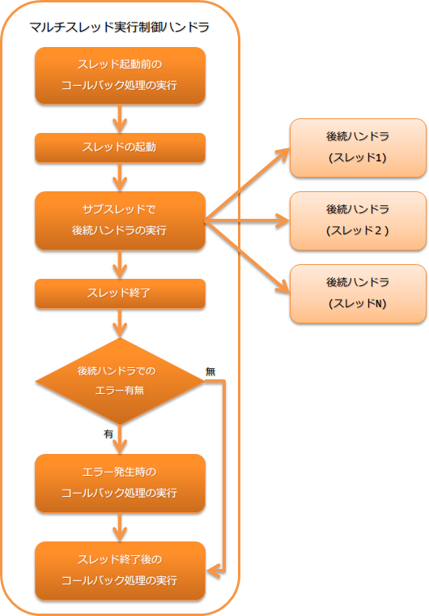
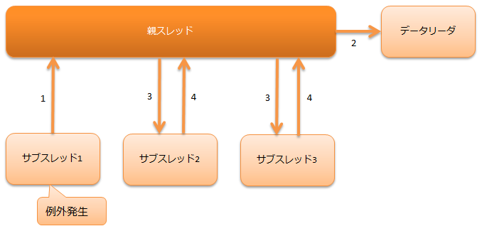

.. _multi_thread_execution_handler:

多线程执行控制handler
==================================================
.. contents:: 目录
  :depth: 3
  :local:

本handler创建子线程，在handler队列上的后续handler处理在各子线程上并行执行。
本handler的处理结果是汇总各子线程执行结果的对象(:java:extdoc:`MultiStatus <nablarch.fw.Result.MultiStatus>`)。

本handler执行以下处理。

* :ref:`子线程启动前的回调处理 <multi_thread_execution_handler-callback>`
* :ref:`子线程的启动 <multi_thread_execution_handler-thread_count>`
* 子线程中后续handler的执行
* :ref:`子线程中发生异常及错误时的回调处理 <multi_thread_execution_handler-callback>`
* :ref:`子线程处理结束后的回调处理 <multi_thread_execution_handler-callback>`

处理流程如下。

  
handler类名
--------------------------------------------------
* :java:extdoc:`nablarch.fw.handler.MultiThreadExecutionHandler`

模块列表
--------------------------------------------------
.. code-block:: xml

  <dependency>
    <groupId>com.nablarch.framework</groupId>
    <artifactId>nablarch-fw-standalone</artifactId>
  </dependency>

约束
------------------------------
无特别约束

.. _multi_thread_execution_handler-thread_count:

指定线程数
--------------------------------------------------
本handler默认只启动一个后续子线程并执行handler。

如果希望通过并行化后续处理（例如批处理action的处理）来提升性能，可以通过更改设置值来多重化后续handler的处理。

以下显示示例。

.. code-block:: xml

  <component class = "nablarch.fw.handler.MultiThreadExecutionHandler">
    <!-- 以8重方式执行后续handler -->
    <property name="concurrentNumber" value="8" />
  </component>

.. important::

  如果本handler之后的处理在多个线程中执行，后续handler和批处理action等需要是线程安全的实现。
  如果将未保证线程安全的处理随意在多个线程中执行，可能会导致意外异常或数据不一致，请注意。

.. _multi_thread_execution_handler-callback:

希望在线程启动前后执行任意处理
--------------------------------------------------
本handler在子线程启动前及结束后执行回调处理。

回调处理在以下3个点执行。

* 子线程启动前
* 子线程发生异常后的所有线程结束后
* 所有子线程结束后(子线程发生异常时也执行)

被回调的处理是在本handler之后设置的handler中实现了 :java:extdoc:`ExecutionHandlerCallback <nablarch.fw.handler.ExecutionHandlerCallback>` 的处理。
如果多个handler实现了 :java:extdoc:`ExecutionHandlerCallback <nablarch.fw.handler.ExecutionHandlerCallback>` ，则从设置在前面的handler开始依次执行回调处理。

.. important::

  如果多个handler实现了回调处理，且在回调处理中发生错误或异常，则不会执行剩余handler的回调处理，请注意。

.. important::

  回调处理中进行的数据库处理使用父线程侧handler队列中设置的数据库连接和事务。
  因此，这些处理进行的更新处理将在本handler结束后，由父线程侧设置的 :ref:`transaction_management_handler` 确定(提交)。

  如果需要立即确定回调处理内进行的处理，请不要使用父线程侧设置的数据库连接，而是使用单独的事务进行处理。

  详情请参考以下文档。

  * :ref:`在UniversalDAO中使用单独事务 <universal_dao-transaction>`
  * :ref:`在数据库访问功能中使用单独事务 <database-new_transaction>`

以下显示回调处理的实现示例。

.. code-block:: java

  public class SampleHandler implements Handler<Object, Result>, ExecutionHandlerCallback<Object, Result> {

    @Override
    public Result handle(Object input, ExecutionContext context) {
      // 实现handler的处理。
      return context.handleNext(input);
    }

    @Override
    public void preExecution(Object input, ExecutionContext context) {
      // 实现子线程启动前的回调处理
    }

    @Override
    public void errorInExecution(Throwable error, ExecutionContext context) {
      // 实现子线程发生错误时的回调处理
    }

    @Override
    public void postExecution(Result result, ExecutionContext context) {
      // 实现子线程结束后的回调处理
      // 可从参数的Result判定子线程侧的处理是否正常结束。
      if (result.isSuccess()) {
          // 子线程正常结束
      } else {
          // 子线程异常结束
      }
    }
  }

数据库连接相关设置
--------------------------------------------------
如果父线程侧的处理需要数据库连接，需要在本handler之前设置 :ref:`database_connection_management_handler` 。
如果子线程侧需要访问数据库，需要在本handler之后子线程执行的handler构成中设置 :ref:`database_connection_management_handler` 。
(父线程和子线程都需要与数据库连接配套控制事务的handler)

因此，在父线程和子线程都进行数据库访问的handler构成中，至少需要使用2个数据库连接。
如果子线程为多个，则需要线程数分的数据库连接。例如，子线程数为10时，需要合计11个数据库连接。

子线程发生异常时的行为
--------------------------------------------------
子线程内发生预期外异常时，为使批处理应用程序异常结束，
调用
:java:extdoc:`ThreadPoolExecutor#shutdownNow()<java.util.concurrent.ThreadPoolExecutor.shutdownNow()>`
，在异常未发生的其他处理中的子线程完成数据处理后安全结束。

以下显示在子线程侧设置 :ref:`database_connection_management_handler` 及 :ref:`transaction_management_handler` ，
按每个子线程管理事务时，子线程发生异常时父线程和子线程的动作。

1. 发生异常的子线程处理中断并回滚。
2. 父线程关闭各子线程使用的DataReader。
3. 父线程向所有子线程发出停止请求。
4. 各子线程由于 ``2.`` 中DataReader已关闭，
   在执行中的处理结束时正常结束。

.. important::

  如果捕获了 :java:extdoc:`InterruptedException<java.lang.InterruptedException>` ，
  表示因中断请求无法安全处理，因此需要抛出异常等方式使处理异常结束。
