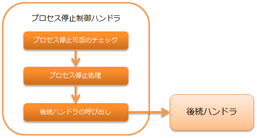

.. _process_stop_handler:

进程停止控制handler
==================================================

.. contents:: 目录
  :depth: 3
  :local:

本handler配置在以下进行循环控制的handler之后，
提供中断循环并发出进程停止请求异常的功能。

* :ref:`process_resident_handler`
* :ref:`loop_handler`
* :ref:`request_thread_loop_handler`

本handler执行以下处理。

* 进程停止可否检查(进程停止标志为"1"则判定为进程停止对象)
* 进程停止处理

.. tip::

  在按需启动批处理中，当处理大量数据无法结束时，使用本handler强制停止处理。

.. important::

  本handler不执行进程停止标志的初始化。
  再次执行相同进程时，需要预先初始化进程停止标志。

处理流程如下。

handler类名
--------------------------------------------------
* :java:extdoc:`nablarch.fw.handler.BasicProcessStopHandler`

模块列表
--------------------------------------------------
.. code-block:: xml

  <dependency>
    <groupId>com.nablarch.framework</groupId>
    <artifactId>nablarch-fw-standalone</artifactId>
  </dependency>

  <dependency>
    <groupId>com.nablarch.framework</groupId>
    <artifactId>nablarch-fw-batch</artifactId>
  </dependency>

约束
--------------------------------------------------
:ref:`thread_context_handler` 之后设置
  本handler基于线程上下文上的请求ID执行停止处理，
  因此需要将本handler设置在 :ref:`thread_context_handler` 之后。

执行进程停止控制的设置
--------------------------------------------------
要执行进程停止控制，需要向本handler设置进程停止可否检查中使用的表定义信息等。
设置项详情请参考 :java:extdoc:`BasicProcessStopHandler <nablarch.fw.handler.BasicProcessStopHandler>` 。

以下显示设置示例。

要点
  * 在按需启动批处理中使用时，本handler设置在子线程侧。
  * 在常驻批处理中使用时，本handler设置在主线程侧。
  * 需要初始化，因此设置在初始化对象列表中。

.. code-block:: xml

  <component name="processStopHandler" class="nablarch.fw.handler.BasicProcessStopHandler">
    <!-- 访问数据库所需的事务设置 -->
    <property name="dbTransactionManager" ref="simpleDbTransactionManager" />

    <!-- 检查使用的表的定义信息 -->
    <property name="tableName" value="BATCH_REQUEST" />
    <property name="requestIdColumnName" value="REQUEST_ID" />
    <property name="processHaltColumnName" value="PROCESS_HALT_FLG" />

    <!-- 进程停止标志的检查间隔(可选) -->
    <property name="checkInterval" value="1" />

    <!-- 进程停止时的结束代码(可选) -->
    <property name="exitCode" value="50" />
  </component>

  <component name="initializer"
      class="nablarch.core.repository.initialization.BasicApplicationInitializer">
    <property name="initializeList">
      <list>
        <!-- 其他组件省略 -->
        <component-ref name="processStopHandler" />
      </list>
    </property>
  </component>
