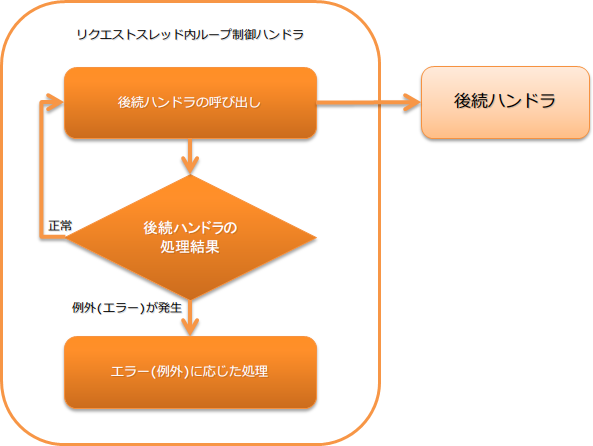

.. _request_thread_loop_handler:

请求线程内循环控制handler
==================================================
.. contents:: 目录
  :depth: 3
  :local:

直到有进程停止请求为止，重复执行后续handler的handler。
本handler用于监视消息队列或数据库上的表等，随时处理未处理数据的进程。

.. tip::

  在监视消息队列或数据库上的表并进行处理的进程中，单个请求(数据)独立处理。
  即使1个请求处理出错，其他请求处理也应继续。
  因此，本handler捕获的异常除进程正常停止请求和部分致命异常外，都会继续处理。

  详情请参考 :ref:`request_thread_loop_handler-error_handling` 。

本handler执行以下处理。

* 重复执行后续handler
* 发生进程停止请求异常时停止后续handler执行 |br|
  详情请参考 :ref:`request_thread_loop_handler-stop`
* 根据后续handler发生的异常(错误)进行处理(日志输出等) |br|
  详情请参考 :ref:`request_thread_loop_handler-error_handling`

处理流程如下。

  
handler类名
--------------------------------------------------
* :java:extdoc:`nablarch.fw.handler.RequestThreadLoopHandler`

模块列表
--------------------------------------------------
.. code-block:: xml

  <dependency>
    <groupId>com.nablarch.framework</groupId>
    <artifactId>nablarch-fw-standalone</artifactId>
  </dependency>

约束
------------------------------
:ref:`retry_handler` 之后配置
  本handler在处理可继续的异常时会发出 :java:extdoc:`可重试异常(Retryable) <nablarch.fw.handler.retry.Retryable>` 。
  因此，需要将本handler设置在处理可重试异常的 :ref:`retry_handler` 之后。

.. _request_thread_loop_handler-interval:

设置服务闭塞中的等待时间
--------------------------------------------------
可以设置后续handler发出表示服务闭塞中的异常(:java:extdoc:`ServiceUnavailable <nablarch.fw.results.ServiceUnavailable>`)时的等待时间。
通过设置此时间，可以调整检查服务是否开局的时机。

等待时间过长会导致服务已开局变更后无法立即开始处理的问题，因此请根据需求设置值。
另外，如果省略设置，则等待1秒后重新执行后续handler。

以下显示设置示例。

.. code-block:: xml

  <component class="nablarch.fw.handler.RequestThreadLoopHandler">
    <!-- 将等待时间设置为5秒 -->
    <property name="serviceUnavailabilityRetryInterval" value="5000" />
  </component>

.. tip::
  如果不在后续handler中设置 :ref:`ServiceAvailabilityCheckHandler` ，则无需设置本设置值。
  (即使设置了，也不会使用此值。)

.. _request_thread_loop_handler-stop:

本handler的停止方法
--------------------------------------------------
本handler在发出进程停止请求异常之前，会重复向后续handler委托处理。
因此，如需在维护等情况下停止进程，需要将本handler后续设置 :ref:`process_stop_handler` ，
以便从外部停止进程。

发生进程停止请求异常时的处理内容请参考 :ref:`request_thread_loop_handler-error_handling` 。

.. _request_thread_loop_handler-error_handling:

根据后续handler发生的异常(错误)的处理内容
------------------------------------------------------------
对本handler根据后续handler发生的异常(错误)进行的处理内容进行说明。

服务闭塞中异常(:java:extdoc:`ServiceUnavailable <nablarch.fw.results.ServiceUnavailable>`)
  等待一定时间后，再次向后续handler委托处理。
  等待时间的设置方法请参考 :ref:`request_thread_loop_handler-interval` 。

表示进程停止请求的异常(:java:extdoc:`ProcessStop <nablarch.fw.handler.ProcessStopHandler.ProcessStop>`)
  由于是表示进程停止请求的异常，因此结束本handler的处理。

表示进程异常结束的异常(:java:extdoc:`ProcessAbnormalEnd <nablarch.fw.launcher.ProcessAbnormalEnd>`)
  由于是表示进程异常结束的异常，因此重新抛出捕获的异常。

表示无法继续处理的服务错误(:java:extdoc:`ServiceError <nablarch.fw.results.ServiceError>`)
  将日志输出处理委托给捕获的异常类，并发出 :java:extdoc:`可重试异常(Retryable) <nablarch.fw.handler.retry.Retryable>` 。

表示handler处理异常结束的异常(:java:extdoc:`Result.Error <nablarch.fw.Result.Error>`)
  输出 ``FATAL`` 级别日志，并发出 :java:extdoc:`可重试异常(Retryable) <nablarch.fw.handler.retry.Retryable>` 。

运行时异常(:java:extdoc:`RuntimeException <java.lang.RuntimeException>`)
  输出 ``FATAL`` 级别日志，并发出 :java:extdoc:`可重试异常(Retryable) <nablarch.fw.handler.retry.Retryable>` 。
 
表示线程停止的异常(:java:extdoc:`ThreadDeath <java.lang.ThreadDeath>`)
  输出 ``INFO`` 级别日志，并重新抛出捕获的异常(ThreadDeath)。

堆栈溢出错误(:java:extdoc:`StackOverflowError <java.lang.StackOverflowError>`)
  输出 ``FATAL`` 级别日志，并发出 :java:extdoc:`可重试异常(Retryable) <nablarch.fw.handler.retry.Retryable>` 。

堆内存不足错误(:java:extdoc:`OutOfMemoryError <java.lang.OutOfMemoryError>`)
  向标准错误输出发出表示发生堆内存不足的消息，并输出 ``FATAL`` 级别日志。
  (由于日志输出时可能再次发生堆内存不足，因此在向标准错误输出消息后进行日志输出。)

  由于可能导致堆内存不足原因的对象引用被切断，处理可能可以继续，因此发出 :java:extdoc:`可重试异常(Retryable) <nablarch.fw.handler.retry.Retryable>` 。
  
表示JVM异常的错误(:java:extdoc:`VirtualMachineError <java.lang.VirtualMachineError>`)
  重新抛出发生的异常

上述以外的错误
  输出 ``FATAL`` 级别日志，并发出 :java:extdoc:`可重试异常(Retryable) <nablarch.fw.handler.retry.Retryable>` 。

.. |br| raw:: html

   
