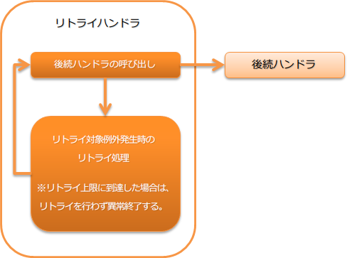

.. _retry_handler:

重试handler
========================================
.. contents:: 目录
  :depth: 3
  :local:

本handler对数据库访问时的死锁等可通过简单重试恢复的错误，自动控制重试。

本handler将实现了 :java:extdoc:`Retryable <nablarch.fw.handler.retry.Retryable>` 的运行时异常视为可重试错误，重新执行后续handler。
另外，关于重试上限的判断处理，已作为 :java:extdoc:`RetryContext <nablarch.fw.handler.RetryHandler.RetryContext>` 的实现类外部化。默认提供以下实现。

* :java:extdoc:`根据重试次数的上限设置 <nablarch.fw.handler.retry.CountingRetryContext>`
* :java:extdoc:`根据经过时间的上限设置 <nablarch.fw.handler.retry.TimeRetryContext>`

本handler执行以下处理。

* 重试对象异常发生时的重试处理
* 到达重试上限时的异常发出处理

处理流程如下。

  
handler类名
--------------------------------------------------
* :java:extdoc:`nablarch.fw.handler.RetryHandler`

模块列表
--------------------------------------------------
.. code-block:: xml

  <dependency>
    <groupId>com.nablarch.framework</groupId>
    <artifactId>nablarch-fw-standalone</artifactId>
  </dependency>

约束
------------------------------
发出重试对象异常的handler需设置在本handler之后。
在本handler之前发出重试对象的异常，只会作为异常处理，请注意。

设置重试上限
--------------------------------------------------
本handler不会无限重试，而是当一定次数的重试后处理仍未成功时，
视为重试失败并使处理异常结束。
因此，使用本handler时必须设置重试上限。

上限设置可从上述2种中选择。如果与项目需求不匹配，可由项目方添加实现进行对应。

* :java:extdoc:`根据重试次数的上限设置 <nablarch.fw.handler.retry.CountingRetryContext>`
* :java:extdoc:`根据经过时间的上限设置 <nablarch.fw.handler.retry.TimeRetryContext>`

以下显示根据重试次数的上限设置示例。

.. code-block:: xml

  <component name="retryHandler" class="nablarch.fw.handler.RetryHandler">
    <property name="retryContextFactory">
      <component class="nablarch.fw.handler.retry.CountingRetryContextFactory">
        <property name="retryCount" value="3" />          <!-- 最多重试3次 -->
        <property name="retryIntervals" value="5000" />   <!-- 重试前等待5秒 -->
      </component>
    </property>
  </component>

.. tip::

  上限设置的值应设置为预估最大恢复时间加上余量的值。

  例如，如果Active/Standby构成的数据库切换最多需要5分钟，
  则设置5分钟加上余量的时间(例如7分钟等)作为上限值。

  另外，如果需要实现对多个异常的重试，应以恢复时间最长的为基准设置上限值。

