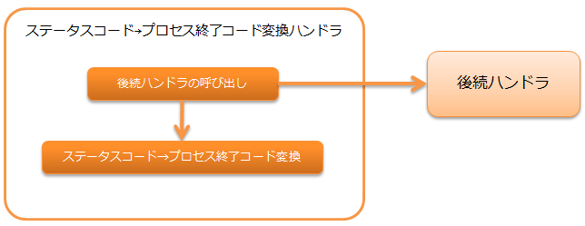

.. _status_code_convert_handler:

状态码→进程结束代码转换handler
==================================================

.. contents:: 目录
  :depth: 3
  :local:

将后续handler处理结果的状态码转换为进程结束代码的handler。

处理流程如下。

handler类名
--------------------------------------------------
* :java:extdoc:`nablarch.fw.handler.StatusCodeConvertHandler`

模块列表
--------------------------------------------------
.. code-block:: xml

  <dependency>
    <groupId>com.nablarch.framework</groupId>
    <artifactId>nablarch-fw-standalone</artifactId>
  </dependency>

约束
--------------------------------------------------
:ref:`main` 的紧后设置
  本handler将处理结果的状态码转换为进程的结束代码。

.. _status_code_convert_handler-rules:

状态码→进程结束代码转换
--------------------------------------------------------------
状态码→进程结束代码转换按以下规则进行。

.. important::
 在应用程序的错误处理中指定状态码时，
 请使用100～199。

============================ ============================
状态码                       进程结束代码
============================ ============================
-1以下                       1
0～199                       0～199(不转换)
200～399                     0
400                          10
401                          11
403                          12
404                          13
409                          14
上述以外的400～499           15
500以上                      20
============================ ============================

.. tip::
 本handler无法通过设置等切换转换规则。
 因此，如果此转换规则无法满足需求，
 请创建项目固有的转换用handler进行对应。
