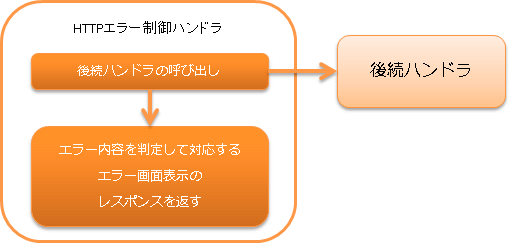

.. _http_error_handler:

HTTP错误控制handler
============================

.. contents:: 目录
  :depth: 3
  :local:

对后续handler发生的异常进行日志输出和转换为响应的handler。

本handler执行以下处理。

* :ref:`根据异常类型输出日志 <HttpErrorHandler_ErrorHandling>`
* :ref:`根据异常类型生成并返回错误用HttpResponse <HttpErrorHandler_ErrorHandling>`
* :ref:`设置默认页面 <HttpErrorHandler_DefaultPage>`

处理流程如下。

handler类名
--------------------------------------------------
* :java:extdoc:`nablarch.fw.web.handler.HttpErrorHandler`

模块列表
--------------------------------------------------
.. code-block:: xml

  <dependency>
    <groupId>com.nablarch.framework</groupId>
    <artifactId>nablarch-fw-web</artifactId>
  </dependency>

约束
------------------------------

应配置在 :ref:`http_response_handler` 之后
  本handler生成的 :java:extdoc:`HttpResponse <nablarch.fw.web.HttpResponse>` 需要由HTTP响应handler处理，
  因此本handler必须配置在 :ref:`http_response_handler` 之后。

应配置在 :ref:`http_access_log_handler` 之后
  本handler生成的错误用 :java:extdoc:`HttpResponse <nablarch.fw.web.HttpResponse>` 将作为日志输出的依据，
  因此需要配置在 :ref:`http_access_log_handler` 之后。

.. _HttpErrorHandler_ErrorHandling:

根据异常类型的处理和响应生成
--------------------------------------------------------------

:java:extdoc:`nablarch.fw.NoMoreHandlerException`
  :日志级别: INFO
  :响应: 404
  :说明: 表示不存在处理请求的handler，作为审计日志记录。
         同时表示不存在处理用的 *action class* ，因此响应设置为 *404* 。

:java:extdoc:`nablarch.fw.web.HttpErrorResponse`
  :日志级别: 不输出日志
  :响应: :java:extdoc:`HttpErrorResponse#getResponse() <nablarch.fw.web.HttpErrorResponse.getResponse()>`
  :说明: 表示后续handler抛出了业务异常（如验证结果的异常响应），因此不输出日志。

        .. _http_error_handler-error_messages:

        当 ``HttpErrorResponse`` 的原因异常为 :java:extdoc:`ApplicationException <nablarch.core.message.ApplicationException>` 时，
        为了使View能够处理错误消息，执行以下处理。

        1. 将 ``ApplicationException`` 持有的消息信息转换为 :java:extdoc:`ErrorMessages <nablarch.fw.web.message.ErrorMessages>` 。
        2. 将 ``ErrorMessages`` 设置到请求作用域。
           设置到请求作用域时的键名，默认为 ``errors`` 。键名可以在组件配置文件中更改。

           配置示例
             .. code-block:: xml

              <component name="webConfig" class="nablarch.common.web.WebConfig">
                <!-- 将键改为messages -->
                <property name="errorMessageRequestAttributeName" value="messages" />
              </component>

:java:extdoc:`nablarch.fw.Result.Error`
  :日志级别: 根据设置
  :响应: :java:extdoc:`Error#getStatusCode() <nablarch.fw.Result.Error.getStatusCode()>`
  :说明: 参考 `nablarch.fw.Result.Error的日志输出说明`_

:java:extdoc:`java.lang.StackOverflowError`
  :日志级别: FATAL
  :响应: 500
  :说明: 可能是由数据或实现缺陷引起的，作为故障进行通知。
         由于是意外错误，因此响应设置为 **500** 。

:java:extdoc:`java.lang.ThreadDeath` 和 :java:extdoc:`java.lang.VirtualMachineError` ( :java:extdoc:`java.lang.StackOverflowError` 除外)
  :日志级别: \-
  :响应: \-
  :说明: 本handler不做任何处理，将处理委托给上层handler。（重新抛出错误）

上述以外的异常和错误
  :日志级别: FATAL
  :响应: 500
  :说明: 对于不符合上述条件的异常和错误，作为故障处理并输出日志。
         由于是意外异常或错误，因此响应设置为 **500** 。

nablarch.fw.Result.Error的日志输出说明
~~~~~~~~~~~~~~~~~~~~~~~~~~~~~~~~~~~~~~~~~~~~~~
对于后续handler发生的异常，如果是 :java:extdoc:`Error <nablarch.fw.Result.Error>` ，是否输出日志取决于
:java:extdoc:`writeFailureLogPattern <nablarch.fw.web.handler.HttpErrorHandler.setWriteFailureLogPattern(java.lang.String)>` 中设置的值。
该属性可以设置正则表达式，当该正则表达式与 :java:extdoc:`Error#getStatusCode() <nablarch.fw.Result.Error.getStatusCode()>` 匹配时，输出 `FATAL` 级别的日志。

.. _HttpErrorHandler_DefaultPage:

默认页面设置
---------------------------
对后续handler和本handler的错误处理创建的 :java:extdoc:`HttpResponse <nablarch.fw.web.HttpResponse>` 应用默认页面。
此功能在 :java:extdoc:`HttpResponse <nablarch.fw.web.HttpResponse>` 未设置时，
应用 :java:extdoc:`defaultPage <nablarch.fw.web.handler.HttpErrorHandler.setDefaultPage(java.lang.String,java.lang.String)>` 或
:java:extdoc:`defaultPages <nablarch.fw.web.handler.HttpErrorHandler.setDefaultPages(java.util.Map)>` 中设置的默认页面。

以下显示配置示例。

.. code-block:: xml

 <component class="nablarch.fw.web.handler.HttpErrorHandler">
   <property name="defaultPages">
     <map>
       <entry key="4.." value="/USER_ERROR.jsp" />
       <entry key="404" value="/NOT_FOUND.jsp" />
       <entry key="5.." value="/ERROR.jsp" />
       <entry key="503" value="/NOT_IN_SERVICE.jsp" />
     </map>
   </property>
 </component>

.. important::

  使用此功能时，需要同时在Servlet API规定的 `web.xml` 中设置错误页面（ `error-page` 元素），造成重复配置。
  如果未在 `web.xml` 中设置，根据错误发生位置的不同，可能会显示Web服务器的默认错误页面。

  因此，建议不使用本功能，而是在 `web.xml` 中进行默认错误页面的设置。

