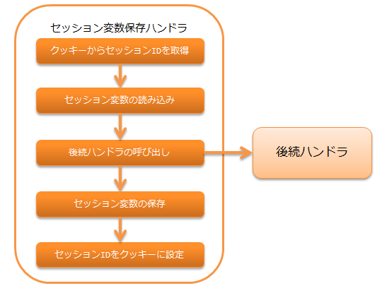

.. _session_store_handler:

会话变量保存handler
============================

.. contents:: 目录
  :depth: 3
  :local:

将后续handler和库中添加、更新、删除的会话变量保存到会话存储的handler。

会话存储功能的详细说明请参考 :ref:`session_store` 。

本handler的处理流程如下。

.. important:: 

  当同一会话的处理在多个线程中执行时（例如，使用标签浏览器从多个标签同时发起请求），
  根据使用的存储不同，可能会产生后写入者获胜的情况。
  详细请参考以下图示。

  .. image:: ../images/SessionStoreHandler/multi-thread.png
    :scale: 80

  因此，需要充分理解所使用存储的特性，选择符合需求的存储。
  存储的详细说明请参考 :ref:`session_store-future_of_store` 。

handler类名
--------------------------------------------------
* :java:extdoc:`nablarch.common.web.session.SessionStoreHandler`

模块列表
--------------------------------------------------
.. code-block:: xml

  <dependency>
    <groupId>com.nablarch.framework</groupId>
    <artifactId>nablarch-fw-web</artifactId>
  </dependency>

  <!-- 仅在数据库存储、使用有效期DB保存时需要 -->
  <dependency>
    <groupId>com.nablarch.framework</groupId>
    <artifactId>nablarch-fw-web-dbstore</artifactId>
  </dependency>

.. _session_store_handler-constraint:

约束
------------------------------
应配置在 :ref:`http_response_handler` 之后
  为了在Servlet forward时，forward目标能够访问会话存储的值，
  本handler必须配置在 :ref:`http_response_handler` 之后。

使用HIDDEN存储时应配置在 :ref:`multipart_handler` 之后
  为了在使用HIDDEN存储时能够访问请求参数，
  本handler必须配置在 :ref:`multipart_handler` 之后。

应配置在 :ref:`forwarding_handler` 之前
  如果将 :ref:`forwarding_handler` 配置在本handler之前，会话存储的读取、保存会执行多次，
  但HIDDEN存储从请求参数中读取会话变量，将会话变量保存到请求作用域，
  因此在内部forward时使用HIDDEN存储，会出现无法获取最新会话变量的问题。
  因此，本handler必须配置在 :ref:`forwarding_handler` 之前。

使用会话存储的设置
--------------------------------------------------------------
要使用会话存储，需要将设置了以下内容的 :java:extdoc:`SessionManager <nablarch.common.web.session.SessionManager>`
配置到本handler的 :java:extdoc:`sessionManager <nablarch.common.web.session.SessionStoreHandler.setSessionManager(nablarch.common.web.session.SessionManager)>` 属性中。

* 应用中使用的会话存储（可指定多个）
* 默认使用的会话存储名称

请参考以下配置示例，设置本handler。

.. code-block:: xml

  <component class="nablarch.common.web.session.SessionStoreHandler">
    <property name="sessionManager" ref="sessionManager"/>
  </component>

  <!-- 以"sessionManager"为组件名进行设置 -->
  <component name="sessionManager" class="nablarch.common.web.session.SessionManager">
    <!-- 属性设置省略 -->
  </component>

:java:extdoc:`SessionManager <nablarch.common.web.session.SessionManager>` 中设置的属性详细说明请参考 :ref:`session_store-use_config` 。

将会话变量序列化后保存到会话存储
--------------------------------------------------------------
本handler在将会话变量保存到会话存储时，可以选择序列化机制。

可选择的序列化机制详细说明请参考 :ref:`session_store-serialize` 。

检查会话存储是否被篡改
--------------------------------------------------------------
从会话存储中读取会话变量时，检查会话存储是否被篡改。

检测到HIDDEN存储被篡改时
  抛出状态码400的 :java:extdoc:`HttpErrorResponse <nablarch.fw.web.HttpErrorResponse>` 。

检测到其他存储被篡改时
  直接抛出会话存储解密处理时发生的异常。

.. _session_store_handler-error_forward_path:

设置篡改错误时的跳转目标
--------------------------------------------------------------
检测到会话存储被篡改时显示的错误页面需要在 `web.xml` 中配置。
因为，如 :ref:`session_store_handler-constraint` 所述，本handler必须配置在 :ref:`forwarding_handler` 之前。
此时，由于以下原因，本handler发生的异常无法应用 :ref:`HttpErrorHandler_DefaultPage` ，
因此需要在 `web.xml` 中进行设置。

原因
  :ref:`forwarding_handler` 必须配置在 :ref:`http_error_handler` 之前。
  这是为了能够正确处理 :ref:`HttpErrorHandler_DefaultPage` 中指定的内部forward路径所必需的配置顺序。

  结果，对于配置在 :ref:`forwarding_handler` 之前的本handler发生的异常，
  无法应用 :ref:`HttpErrorHandler_DefaultPage` 的设置，因此需要在 `web.xml` 中进行配置。

更改保存会话ID的Cookie名称和属性
--------------------------------------------------------------
保存会话ID的Cookie按以下方式设置，但可以将名称和部分属性更改为任意值。

:Cookie名称:    | NABLARCH_SID
:Path属性:      | 主机下的所有路径
                 | 如需明确指定可发送路径，请另行设置
:Domain属性:    | 不指定
                  | 如需明确指定可发送域，请另行设置
:Secure属性:    | 不使用
                  | 在HTTPS环境中使用时，请设置为 ``使用``
:MaxAge属性:    | 不指定
                  | 因为将保存会话ID的Cookie设为会话Cookie（浏览器关闭时删除），所以不使用MaxAge属性
:HttpOnly属性:  | 使用
                  | HttpOnly属性始终使用，无法通过配置文件等进行更改

.. important::
  会话存储的有效期默认保存在HTTP会话中。
  当在多个存储间设置不同的有效期时，将使用最长的期限值。
  （更改有效期保存位置为数据库时请参考 :ref:`db_managed_expiration` ）

要更改Cookie名称或属性时，请参考以下示例进行设置。

.. code-block:: xml

    <component class="nablarch.common.web.session.SessionStoreHandler">
      <!-- Cookie名称 -->
      <property name="cookieName" value="NABLARCH_SID" />
      <!-- Path属性 -->
      <property name="cookiePath" value="/" />
      <!-- Domain属性 -->
      <property name="cookieDomain" value="" />
      <!-- Secure属性 -->
      <property name="cookieSecure" value="false" />
      <!-- 会话管理器 -->
      <property name="sessionManager" ref="sessionManager"/>
    </component>

    <component name="sessionManager" class="nablarch.common.web.session.SessionManager">
      <property name="availableStores">
        <list>
          <component class="nablarch.common.web.session.store.DbStore">
            <!-- 有效期 -->
            <property name="expires" value="1800" />
            <!-- 其他属性省略 -->
          </component>
        </list>
      </property>
      <!-- 其他属性省略 -->
    </component>

.. _`db_managed_expiration`:

将有效期保存到数据库
--------------------------------------------------------------
可以更改会话有效期的保存位置。

默认使用 :java:extdoc:`HttpSessionManagedExpiration <nablarch.common.web.session.HttpSessionManagedExpiration>` ，
因此会话有效期保存在HTTP会话中。

通过将本handler的 :java:extdoc:`expiration <nablarch.common.web.session.SessionStoreHandler.setExpiration(nablarch.common.web.session.Expiration)>` 
属性替换为 :java:extdoc:`DbManagedExpiration <nablarch.common.web.session.DbManagedExpiration>` ，可以保存到数据库。

使用方法
~~~~~~~~~~~~~~~~~~~~~~~~~~~~~~

数据库上用于保存有效期的表，使用 :ref:`DB存储<session_store-use_config>` 中DB存储使用时所述的表。

.. important::

  将有效期保存到数据库时，不能将SESSION_OBJECT列设为必填属性。
  因为在登出时等情况下，可能会注册会话对象为Null的记录，所以必须允许Null。
  从5u15之前的原型创建的项目中，默认定义为必填属性。
  根据需要执行ALTER语句或重新创建表。

更改表名和列名时，在 :java:extdoc:`DbManagedExpiration.userSessionSchema <nablarch.common.web.session.DbManagedExpiration.setUserSessionSchema(nablarch.common.web.session.store.UserSessionSchema)>` 中
定义 :java:extdoc:`UserSessionSchema <nablarch.common.web.session.store.UserSessionSchema>` 的组件。
DB存储的表、列也请更改为相同的设置。

此外，有效期需要 :ref:`初始化<repository-initialize_object>` 。

以下显示配置示例。

.. code-block:: xml

  <component name="sessionStoreHandler" class="nablarch.common.web.session.SessionStoreHandler">
    <!-- 其他属性省略 -->
    <property name="expiration" ref="expiration" />
  </component>

  <component name="expiration" class="nablarch.common.web.session.DbManagedExpiration">
    <!-- 控制数据库事务的类 -->
    <property name="dbManager">
      <component class="nablarch.core.db.transaction.SimpleDbTransactionManager">
        <property name="dbTransactionName" value="expirationTransaction"/>
      </component>
    </property>
    <!-- 仅从上述表定义更改表名、列名时需要以下设置 -->
    <property name="userSessionSchema" ref="userSessionSchema" />
  </component>

  <!-- 更改表定义时请同时更改DB存储的定义 -->
  <component name="dbStore" class="nablarch.common.web.session.store.DbStore">
    <!-- 其他属性省略 -->
    <property name="userSessionSchema" ref="userSessionSchema" />
  </component>

  <!-- 仅从上述表定义更改表名、列名时需要以下设置 -->
  <component name="userSessionSchema" class="nablarch.common.web.session.store.UserSessionSchema">
    <property name="tableName" value="USER_SESSION_DB" />
    <property name="sessionIdName" value="SESSION_ID_COL" />
    <property name="sessionObjectName" value="SESSION_OBJECT_COL" />
    <property name="expirationDatetimeName" value="EXPIRATION_DATETIME_COL" />
  </component>

  <component name="initializer" class="nablarch.core.repository.initialization.BasicApplicationInitializer">
    <!-- 有效期需要initialize。 -->
    <property name="initializeList">
      <list>
        <component-ref name="expiration"/>
      </list>
    </property>
  </component>
