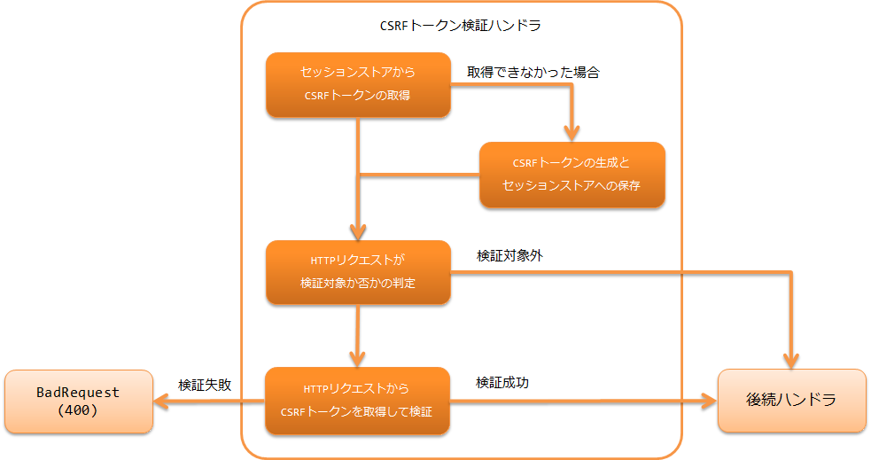

.. _csrf_token_verification_handler:

CSRF令牌验证handler
==================================================
.. contents:: 目录
  :depth: 3
  :local:

本handler提供使用令牌进行一般CSRF（跨站请求伪造）对策的功能。
使用本handler可以实现 :ref:`Web应用<web_application>` 和 :ref:`RESTful网络服务<restful_web_service>`
的CSRF对策。

将本handler包含在handler构成中时，会在请求处理中进行CSRF令牌的生成和验证，使用 :ref:`tag` 时会
自动在页面上输出CSRF令牌。
因此，无需应用程序员实现，可以无遗漏地进行 :ref:`Web应用<web_application>`
的CSRF对策。

为了在 :ref:`RESTful网络服务<restful_web_service>` 中实现CSRF对策，
本handler从请求头或请求参数中获取CSRF令牌。
Nablarch提供了用于获取生成的CSRF令牌的实用工具类(
:java:extdoc:`CsrfTokenUtil <nablarch.common.web.csrf.CsrfTokenUtil>` )，
可以根据项目架构实现向客户端发送CSRF令牌的机制。

本handler将CSRF令牌存储在Session存储中，因此使用本handler时必须使用 :ref:`session_store` 。

本handler执行以下处理。

* 从Session存储中获取CSRF令牌。
* 无法获取时生成CSRF令牌并保存到Session存储中。
* 判定HTTP请求是否为验证对象。
* 验证对象时从HTTP请求中获取CSRF令牌并进行验证。
* 验证失败时返回BadRequest(400)响应。
* 验证成功时将处理移交给下一个handler。

处理流程如下。

handler类名
--------------------------------------------------
* :java:extdoc:`nablarch.fw.web.handler.CsrfTokenVerificationHandler`

模块列表
--------------------------------------------------
.. code-block:: xml

  <dependency>
    <groupId>com.nablarch.framework</groupId>
    <artifactId>nablarch-fw-web</artifactId>
  </dependency>

约束
------------------------------
必须放置在 :ref:`session_store_handler` 之后
  由于将CSRF令牌存储在Session存储中，
  本handler必须放置在 :ref:`session_store_handler` 之后。

.. tip::

  使用 :ref:`multipart_handler` 进行文件上传时，
  如果希望在文件保存前进行CSRF令牌验证，请将本handler和 :ref:`session_store_handler` 放置在 :ref:`multipart_handler` 之前。

使用 :ref:`tag` 时必须放置在 :ref:`nablarch_tag_handler` 之后
  使用 :ref:`tag` 时由于使用 :ref:`tag-hidden_encryption` 在页面上输出CSRF令牌，
  本handler必须放置在 :ref:`nablarch_tag_handler` 之后。

.. _csrf_token_verification_handler-generation_verification:

CSRF令牌的生成与验证
--------------------------------------------------
在handler构成中添加本handler后会进行CSRF令牌的生成和验证。
使用 :ref:`tag` 时的设置例如下所示。

.. code-block:: xml

  <!-- handler构成 -->
  <component name="webFrontController" class="nablarch.fw.web.servlet.WebFrontController">
    <property name="handlerQueue">
      <list>
        <!-- 其他handler省略 -->

        <!-- Session存储handler -->
        <component-ref name="sessionStoreHandler" />

        <!-- Nablarch自定义标签控制handler -->
        <component-ref name="nablarchTagHandler"/>

        <!-- CSRF令牌验证handler -->
        <component-ref name="csrfTokenVerificationHandler"/>
      </list>
    </property>
  </component>

  <component name="csrfTokenVerificationHandler"
             class="nablarch.fw.web.handler.CsrfTokenVerificationHandler" />

默认进行以下处理。

从Session存储中获取CSRF令牌
  * 将CSRF令牌存储到Session存储中时使用的名称为 ``nablarch_csrf-token`` 。

无法获取时生成CSRF令牌并保存到Session存储中
  * CSRF令牌的生成由 :java:extdoc:`CsrfTokenGenerator<nablarch.fw.web.handler.csrf.CsrfTokenGenerator>` 执行。
    默认使用使用版本4的UUID生成CSRF令牌的 :java:extdoc:`UUIDv4CsrfTokenGenerator<nablarch.fw.web.handler.csrf.UUIDv4CsrfTokenGenerator>` 。
  * CSRF令牌的存储目标Session存储为默认Session存储。（不指定Session存储名称存储CSRF令牌）

判定HTTP请求是否为验证对象
  * 是否为验证对象的判定由 :java:extdoc:`VerificationTargetMatcher<nablarch.fw.web.handler.csrf.VerificationTargetMatcher>` 执行。
    默认使用从HTTP方法判定HTTP请求是否为验证对象的 :java:extdoc:`HttpMethodVerificationTargetMatcher<nablarch.fw.web.handler.csrf.HttpMethodVerificationTargetMatcher>` 。
  *  :java:extdoc:`HttpMethodVerificationTargetMatcher<nablarch.fw.web.handler.csrf.HttpMethodVerificationTargetMatcher>` 将HTTP方法的 ``GET`` ``HEAD`` ``TRACE`` ``OPTIONS`` 判定为CSRF令牌验证对象 **外** （即POST和PUT等成为检查对象）。

验证对象时从HTTP请求中获取CSRF令牌并进行验证
  * 将CSRF令牌存储到HTTP请求中时使用的名称如下。

    | HTTP请求头 ``X-CSRF-TOKEN``
    | HTTP请求参数 ``csrf-token``

验证成功时将处理移交给下一个handler，验证失败时返回BadRequest(400)响应
  * 验证失败时的处理由 :java:extdoc:`VerificationFailureHandler<nablarch.fw.web.handler.csrf.VerificationFailureHandler>` 执行。
    默认使用生成BadRequest(400)响应的 :java:extdoc:`BadRequestVerificationFailureHandler<nablarch.fw.web.handler.csrf.BadRequestVerificationFailureHandler>` 。

可以通过更改设置来改变默认行为。设置例如下所示。

.. code-block:: xml

    <component class="nablarch.fw.web.handler.CsrfTokenVerificationHandler">
      <!-- CSRF令牌生成接口 -->
      <property name="csrfTokenGenerator">
        <component class="com.sample.CustomCsrfTokenGenerator" />
      </property>
      <!-- HTTP请求是否为CSRF令牌验证对象的判定接口 -->
      <property name="verificationTargetMatcher">
        <component class="com.sample.CustomVerificationTargetMatcher" />
      </property>
      <!-- CSRF令牌验证失败时的处理接口 -->
      <property name="verificationFailureHandler" />
        <component class="com.sample.CustomVerificationFailureHandler" />
      </property>
    </component>

    <component name="webConfig" class="nablarch.common.web.WebConfig">
      <!-- 从HTTP请求头获取CSRF令牌时使用的名称 -->
      <property name="csrfTokenHeaderName" value="X-CUSTOM-CSRF-TOKEN" />
      <!-- 从HTTP请求参数获取CSRF令牌时使用的名称 -->
      <property name="csrfTokenParameterName" value="custom-csrf-token" />
      <!-- 将CSRF令牌存储到Session存储中时使用的名称 -->
      <property name="csrfTokenSessionStoredVarName" value="custom-csrf-token" />
      <!-- 保存CSRF令牌的Session存储名称 -->
      <property name="csrfTokenSavedStoreName" value="customStore" />
    </component>

.. important::

  对使用本handler的应用使用测试框架进行请求单元测试时，
  由于不会成为经过正确页面迁移的请求，CSRF令牌验证会失败。
  CSRF对策不是应用程序员实现制作的部分，
  在请求单元测试中禁用CSRF对策进行测试即可。
  在测试执行时的设置中将本handler替换为不处理任何内容的handler即可禁用CSRF对策。
  以下显示设置例。以下使用测试框架提供的不处理任何内容的handler :java:extdoc:`NopHandler<nablarch.test.NopHandler>` 。

  .. code-block:: xml

    <!-- 在测试设置中覆盖本handler的组件定义。
         通过匹配组件名称来进行覆盖。 -->

    <!-- 禁用CSRF对策 -->
    <component name="csrfTokenVerificationHandler" class="nablarch.test.NopHandler" />

.. _csrf_token_verification_handler-regeneration:

重新生成CSRF令牌
--------------------------------------------------
攻击者通过某种方式将CSRF令牌和保存它的Session存储的SessionID发送给用户，
用户在没有察觉的情况下进行了登录。
此时如果不重新生成CSRF令牌，恶意网站准备植入CSRF令牌的陷阱页面，
让用户进行链接点击等操作，就可以发送用户无意图的攻击请求。
为了防止这种情况，必须在登录时重新生成CSRF令牌。

CSRF令牌的重新生成通过在Action等的请求处理中调用
:java:extdoc:`CsrfTokenUtil.regenerateCsrfToken <nablarch.common.web.csrf.CsrfTokenUtil.regenerateCsrfToken(nablarch.fw.ExecutionContext)>`
方法，在本handler的返回处理中进行CSRF令牌的重新生成。

如果登录时采用销毁并重新生成Session存储的实现，则无需使用此方法。
因为随着Session存储的销毁，CSRF令牌也会被销毁，之后的页面显示时会生成新的CSRF令牌。
登录时不销毁Session存储本身而只是重新生成SessionID的实现情况下，
请使用此方法也重新生成CSRF令牌。
