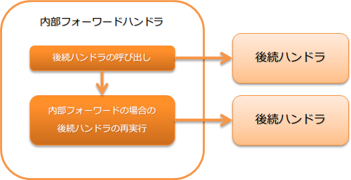

.. _forwarding_handler:

内部forward handler
==================================================
.. contents:: 目录
  :depth: 3
  :local:

本handler在后续handler返回的响应内容表示内部forward时，使用指定的请求路径重新执行后续handler。

内部forward用于跳转目标画面不是单纯的画面显示，而是需要在服务器端获取复选框、下拉列表等选项的情况。
例如，输入验证出错时，不仅是简单地重新显示输入画面，还需要在服务器端获取输入项目的选项时就会用到。详细请参考 :ref:`on_error-forward` 。

本handler执行以下处理。

* 内部forward时重新执行后续handler

处理流程如下。

handler类名
--------------------------------------------------
* :java:extdoc:`nablarch.fw.web.handler.ForwardingHandler`

模块列表
--------------------------------------------------
.. code-block:: xml

  <dependency>
    <groupId>com.nablarch.framework</groupId>
    <artifactId>nablarch-fw-web</artifactId>
  </dependency>

约束
--------------------------------------------------
应配置在 :ref:`session_store_handler` 之后
  应配置在 :ref:`session_store_handler` 之后的理由请参考
  :ref:`session_store_handler-error_forward_path`

返回表示内部forward的响应
--------------------------------------------------
在业务Action等返回表示内部forward的响应时，
将响应表示的内容路径以 ``forward://`` 开头。

以下显示示例。

.. code-block:: java

    public HttpResponse sample(HttpRequest request, ExecutionContext context) {
      // 业务处理

      // 内部forward到同一业务Action的initialize
      return new HttpResponse("forward://initialize");
    }

.. tip::

  状态码比较forward时和forward后的值，将较大的值作为响应时的状态码。

  以下显示示例。

  * forward时为 **200** ，forward后为 **500** 时，向客户端返回 **500** 。
  * forward时为 **400** ，forward后为 **200** 时，向客户端返回 **400** 。

内部forward指定路径的规则
--------------------------------------------------
内部forward中指定的跳转目标路径可以使用相对路径和绝对路径。

相对路径
  以当前请求URI为起点的路径。

绝对路径
  以Servlet上下文名为起点的路径。

  使用绝对路径时，将指定路径以 ``/`` 开头。

以下显示示例。

当前请求URI为 ``action/users/save`` 时，以下相对路径和绝对路径表示的内部forward目标是相同的。

.. code-block:: java

  // 相对路径
  new HttpResponse("forward://initialize");

  // 绝对路径
  new HttpResponse("forward:///action/users/initialize");

.. _internal_request_id:

关于内部请求ID
-----------------------------------------------
内部forward时，将forward目标的请求ID作为内部请求ID保存在线程上下文中。
