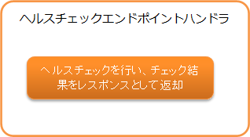

.. _health_check_endpoint_handler:

健康检查端点handler
==================================================
.. contents:: 目录
  :depth: 3
  :local:

本handler提供对应用进行健康检查的功能。
使用本handler可以实现 :ref:`Web应用<web_application>` 和 :ref:`RESTful Web服务<restful_web_service>`
的健康检查端点。

健康检查的默认实现提供了 :java:extdoc:`DB <nablarch.fw.web.handler.health.DbHealthChecker>` 和
:ref:`Redis<lettuce_adaptor>` 的健康检查。

本handler执行以下处理。

* 执行健康检查，将检查结果作为响应返回。

处理流程如下。

本handler作为健康检查的端点，不调用后续handler。

handler类名
--------------------------------------------------
* :java:extdoc:`nablarch.fw.web.handler.HealthCheckEndpointHandler`

模块列表
--------------------------------------------------
.. code-block:: xml

  <dependency>
    <groupId>com.nablarch.framework</groupId>
    <artifactId>nablarch-fw-web</artifactId>
  </dependency>

  <!-- 进行DB健康检查时 -->
  <dependency>
    <groupId>com.nablarch.framework</groupId>
    <artifactId>nablarch-core-jdbc</artifactId>
  </dependency>

约束
------------------------------
应配置在 :ref:`http_response_handler` 或 :ref:`jaxrs_response_handler` 之后
  本handler生成的 :java:extdoc:`HttpResponse <nablarch.fw.web.HttpResponse>` 需要由
  :ref:`http_response_handler` 或 :ref:`jaxrs_response_handler` 处理，
  因此本handler必须配置在 :ref:`http_response_handler` 或 :ref:`jaxrs_response_handler` 之后。

.. _health_check_endpoint_handler-health_check_endpoint:

创建健康检查端点
--------------------------------------------------
将本handler添加到handler配置中即可成为健康检查端点。
以下显示本handler的配置示例。

.. code-block:: xml

  <!-- handler配置 -->
  <component name="webFrontController" class="nablarch.fw.web.servlet.WebFrontController">
    <property name="handlerQueue">
      <list>
        <!-- 其他handler省略 -->

        <!-- HTTP响应handler -->
        <component class="nablarch.fw.web.handler.HttpResponseHandler"/>

        <!--
             健康检查端点handler
             使用RequestHandlerEntry仅在特定路径时执行。
        -->
        <component class="nablarch.fw.RequestHandlerEntry">
          <property name="requestPattern" value="/action/healthcheck" />
          <property name="handler">
            <component class="nablarch.fw.web.handler.HealthCheckEndpointHandler"/>
          </property>
        </component>

      </list>
    </property>
  </component>

默认不进行DB等的健康检查，返回状态码200和以下JSON响应。

.. code-block:: json

  {"status":"UP"}

DB等资源的健康检查由 :java:extdoc:`HealthChecker <nablarch.fw.web.handler.health.HealthChecker>`
这个抽象类执行。将继承 :java:extdoc:`HealthChecker <nablarch.fw.web.handler.health.HealthChecker>` 的类
指定到本handler的healthCheckers属性中，本handler执行时将作为各目标的健康检查使用。

以下显示默认提供的DB健康检查的配置示例。

.. code-block:: xml

    <!-- 健康检查端点handler -->
    <component class="nablarch.fw.web.handler.HealthCheckEndpointHandler">
      <!-- healthCheckers属性以列表形式指定 -->
      <property name="healthCheckers">
        <list>
          <!-- DB的健康检查 -->
          <component class="nablarch.fw.web.handler.health.DbHealthChecker">
            <!-- 指定数据源 -->
            <property name="dataSource" ref="dataSource" />
            <!-- 指定方言 -->
            <property name="dialect" ref="dialect" />
          </component>
        </list>
      </property>
    </component>

使用上述配置执行本handler时，将执行指定DB的健康检查并返回JSON响应。
以下显示健康检查成功时和失败时的响应。

.. code-block:: bash

  // 成功时
  // 状态码为200
  {
    "status":"UP",
    "targets":[
      {"name":"DB","status":"UP"}
    ]
  }

  // 失败时
  // 状态码为503
  {
    "status":"DOWN",
    "targets":[
      {"name":"DB","status":"DOWN"}
    ]
  }

默认在根节点的status中输出健康检查整体结果，在targets中输出各目标的健康检查结果。

.. _health_check_endpoint_handler-add_health_checker:

添加健康检查
--------------------------------------------------
如 :ref:`health_check_endpoint_handler-health_check_endpoint` 所述，
DB等资源的健康检查由 :java:extdoc:`HealthChecker <nablarch.fw.web.handler.health.HealthChecker>`
这个抽象类执行，因此创建继承 :java:extdoc:`HealthChecker <nablarch.fw.web.handler.health.HealthChecker>` 的类，
指定到本handler的healthCheckers属性中即可添加健康检查。

以下显示实现示例和配置示例。

.. code-block:: java

    public class CustomHealthChecker extends HealthChecker {

        public CustomHealthChecker() {
            // 指定表示目标名称
            setName("Custom");
        }

        @Override
        protected boolean tryOut(HttpRequest request, ExecutionContext context) throws Exception {
            // 实现作为健康检查的尝试处理
            // 健康检查失败时返回false或抛出异常
            // 以下是未发生异常时视为健康检查成功的实现示例
            CustomClient client = ...;
            client.execute();
            return true;
        }
    }

.. code-block:: xml

    <!-- 健康检查端点handler -->
    <component class="nablarch.fw.web.handler.HealthCheckEndpointHandler">
      <!-- healthCheckers属性以列表形式指定 -->
      <property name="healthCheckers">
        <list>
          <!-- DB的健康检查 -->
          <component class="nablarch.fw.web.handler.health.DbHealthChecker">
            <!-- 省略 -->
          </component>
          <!-- 指定继承HealthChecker创建的类 -->
          <component class="com.example.CustomHealthChecker">
        </list>
      </property>
    </component>

.. _health_check_endpoint_handler-change_response:

更改健康检查结果的响应
--------------------------------------------------
健康检查结果的响应由 :java:extdoc:`HealthCheckResponseBuilder <nablarch.fw.web.handler.health.HealthCheckResponseBuilder>` 创建。
默认的响应如下。

状态码
  - 健康检查成功：200
  - 健康检查失败：503

响应主体
  - Content-Type：application/json
  - 格式

    .. code-block:: bash

      {
        "status":"健康检查整体结果",
        "targets":[
          {
            "name":"目标1",
            "status":"目标1的健康检查结果"
          },
          {
            "name":"目标2",
            "status":"目标2的健康检查结果"
          },
          :
        ]
      }

    - 实际没有换行，为1行显示，上述仅为提高可读性而格式化。
    - 健康检查整体结果在targets的健康检查结果有任意一个失败时为失败。
    - targets包含与指定的 :java:extdoc:`HealthChecker <nablarch.fw.web.handler.health.HealthChecker>` 数量相同的条目。

健康检查结果标签
  - 健康检查成功：UP
  - 健康检查失败：DOWN

状态码、健康检查结果标签、响应主体输出与否可以通过设置更改。
以下显示配置示例。

.. code-block:: xml

    <component class="nablarch.fw.web.handler.HealthCheckEndpointHandler">
      <property name="healthCheckers">
        <!-- 省略 -->
      </property>
      <property name="healthCheckResponseBuilder">
        <component class="nablarch.fw.web.handler.health.HealthCheckResponseBuilder">
          <!-- 健康检查成功时的状态码 -->
          <property name="healthyStatusCode" value="201" />
          <!-- 健康检查成功时的标签 -->
          <property name="healthyStatus" value="OK" />
          <!-- 健康检查失败时的状态码 -->
          <property name="unhealthyStatusCode" value="500" />
          <!-- 健康检查失败时的标签 -->
          <property name="unhealthyStatus" value="NG" />
          <!-- 是否输出请求主体。不输出时指定false -->
          <property name="writeBody" value="false" />
        </component>
      </property>
    </component>

要更改响应主体的内容时，
需要创建继承 :java:extdoc:`HealthCheckResponseBuilder <nablarch.fw.web.handler.health.HealthCheckResponseBuilder>` 的类。

以下显示实现示例和配置示例。

.. code-block:: java

    public class CustomHealthCheckResponseBuilder extends HealthCheckResponseBuilder {
        @Override
        protected String getContentType() {
            // 返回Content-Type。
            return "text/plain";
        }
        @Override
        protected String buildResponseBody(
                HttpRequest request, ExecutionContext context, HealthCheckResult result) {
            // 返回请求主体。
            // 使用包含健康检查结果的HealthCheckResult创建响应主体。
            StringBuilder builder = new StringBuilder();
            builder.append("All=" + getStatus(result.isHealthy()));
            for (HealthCheckResult.Target target : result.getTargets()) {
                builder.append(", " + target.getName() + "=" + getStatus(target.isHealthy()));
            }
            return builder.toString();
        }
    }

.. code-block:: xml

    <component class="nablarch.fw.RequestHandlerEntry">
      <property name="requestPattern" value="/action/healthcheck" />
      <property name="handler">
        <component class="nablarch.fw.web.handler.HealthCheckEndpointHandler">
          <property name="healthCheckers">
            <!-- 省略 -->
          </property>
          <!-- 指定继承HealthCheckResponseBuilder创建的类 -->
          <property name="healthCheckResponseBuilder">
            <component class="com.nablarch.example.app.web.handler.health.CustomHealthCheckResponseBuilder" />
          </property>
        </component>
      </property>
    </component>
