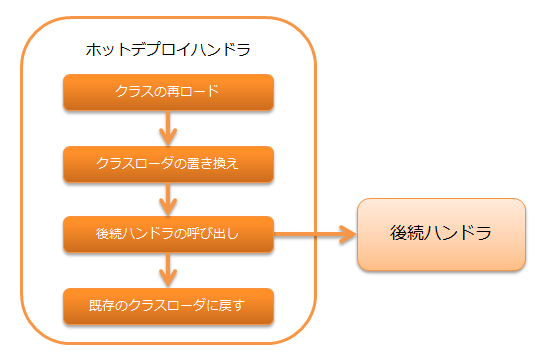

.. _hot_deploy_handler:

热部署handler
========================================

.. contents:: 目录
  :depth: 3
  :local:

开发时对应用进行热部署的handler。

使用本handler可以无需重启应用服务器即可立即反映Action类和Form类的更改。
由此可以省去每次修改源代码后重启应用服务器的麻烦，高效地推进工作。

处理流程如下。

.. important::

  本handler在每个请求时重新加载类，可能导致响应速度下降。
  因此，仅设想在开发环境中使用，**绝对不能在生产环境中使用。**

.. important::

  使用本handler时，请求单元测试可能无法正常运作，因此请求单元测试时不要使用本handler。

.. tip::

  使用本handler时，请禁用服务器的热部署功能。

handler类名
--------------------------------------------------
* :java:extdoc:`nablarch.fw.hotdeploy.HotDeployHandler`

模块列表
--------------------------------------------------
.. code-block:: xml

  <dependency>
    <groupId>com.nablarch.framework</groupId>
    <artifactId>nablarch-fw-web-hotdeploy</artifactId>
  </dependency>
  
约束
------------------------------
无。

指定热部署目标包
--------------------------------------------------
热部署目标包在 :java:extdoc:`targetPackages <nablarch.fw.hotdeploy.HotDeployHandler.setTargetPackages(java.util.List)>` 属性中设置。

以下显示配置示例。

.. code-block:: xml

  <component class="nablarch.fw.hotdeploy.HotDeployHandler">
    <property name="targetPackages">
      <list>
        <value>please.change.me.web.action</value>
        <value>please.change.me.web.form</value>
      </list>
    </property>
  </component>

.. important::

  由于以下原因，Entity类不能作为热部署目标。

  * 由于每个请求都会重新加载目标包内的所有类，
    如果将不常更改的Entity类等设为热部署目标，可能导致响应速度下降。
  * 由于每个请求都会更改类加载器，使用 :ref:`session_store` 时可能会出现Entity类转换失败的情况。
