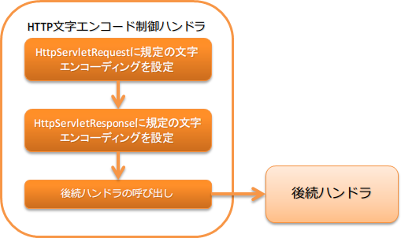

.. _http_character_encoding_handler:

HTTP字符编码控制handler
==================================================
.. contents:: 目录
  :depth: 3
  :local:

本handler对请求( :java:extdoc:`HttpServletRequest <jakarta.servlet.http.HttpServletRequest>` )
及响应( :java:extdoc:`HttpServletResponse <jakarta.servlet.http.HttpServletResponse>` )设置规定的字符编码。

本handler执行以下处理。

* 设置请求及响应的规定字符编码

处理流程如下。

handler类名
--------------------------------------------------
* :java:extdoc:`nablarch.fw.web.handler.HttpCharacterEncodingHandler`

模块列表
--------------------------------------------------
.. code-block:: xml

  <dependency>
    <groupId>com.nablarch.framework</groupId>
    <artifactId>nablarch-fw-web</artifactId>
  </dependency>

约束
------------------------------
本handler必须配置在所有handler之前。
  如果在本handler之前配置了其他handler，可能会发生以下问题。

  * 响应的规定字符编码未被设置
  * 访问请求参数后规定字符编码设置未生效，导致服务器端出现乱码

  因此，本handler必须配置在所有handler之前。

设置规定字符编码
--------------------------------------------------
字符编码在 :java:extdoc:`defaultEncoding <nablarch.fw.web.handler.HttpCharacterEncodingHandler.setDefaultEncoding(java.lang.String)>` 属性中设置。
省略设置时，使用 ``UTF-8`` 。

以下显示设置 ``Windows-31J`` 的示例。

.. code-block:: xml

  <component class="nablarch.fw.web.handler.HttpCharacterEncodingHandler">
    <property name="defaultEncoding" value="Windows-31J" />
  </component>

切换响应的规定字符编码设置
--------------------------------------------------------------------------------
使用本handler对响应设置规定字符编码时，
后续handler处理的所有响应都会被设置字符编码。

例如，后续返回图像时，Content-Type头部会变为「image/jpeg;charset=UTF-8」。
因此，本handler的默认行为是不对响应设置规定字符编码。

像WEB API这样需要对所有响应设置规定字符编码时，
请参考以下示例，将 :java:extdoc:`appendResponseCharacterEncoding <nablarch.fw.web.handler.HttpCharacterEncodingHandler.setAppendResponseCharacterEncoding(boolean)>` 属性设置为 ``true`` 。

.. code-block:: xml

  <component class="nablarch.fw.web.handler.HttpCharacterEncodingHandler">
    <property name="appendResponseCharacterEncoding" value="true" />
  </component>

希望按请求而不是统一更改字符编码时
----------------------------------------------------------------------
需要按请求更改字符编码时，需要继承本handler来对应。

例如，在处理来自外部站点请求的系统中，当每个外部站点的编码不同时，需要采取这种对应方式。

以下显示示例。

要点
  * 更改请求编码时，覆盖 :java:extdoc:`resolveRequestEncoding <nablarch.fw.web.handler.HttpCharacterEncodingHandler.resolveRequestEncoding(jakarta.servlet.http.HttpServletRequest)>` 。
  * 更改响应编码时，覆盖 :java:extdoc:`resolveResponseEncoding <nablarch.fw.web.handler.HttpCharacterEncodingHandler.resolveResponseEncoding(jakarta.servlet.http.HttpServletRequest)>` 。

.. code-block:: java

  public class CustomHttpCharacterEncodingHandler extends
          HttpCharacterEncodingHandler {

    @Override
    protected Charset resolveRequestEncoding(HttpServletRequest req) {
      return resolveCharacterEncoding(req);
    }

    @Override
    protected Charset resolveResponseEncoding(HttpServletRequest req) {
      return resolveCharacterEncoding(req);
    }

    /**
     * 解析字符编码。 
     *
     * URI中包含{@code /shop1}时，作为{@code Windows-31J}处理。
     *
     * @param req 请求
     * @return 字符编码
     */
    private Charset resolveCharacterEncoding(HttpServletRequest req) {
      if (req.getRequestURI().contains("/shop1")) {
        return Charset.forName("Windows-31J");
      }
      return getDefaultEncoding();
    }
  }
