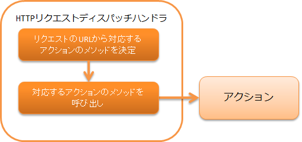
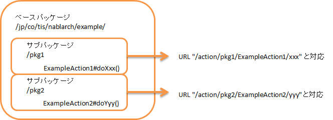

.. _http_request_java_package_mapping:

HTTP请求分发handler
==================================================

.. contents:: 目录
  :depth: 3
  :local:

本handler将处理委托给记录应用各功能处理内容的Action。
委托的类、方法由访问的URL决定。
使用本类进行分发时，假定URL格式如下。

URL格式
  /\<baseUri\>/\<className\>/\<methodName\>

上述格式中<>包围的部分分别表示以下内容。

.. list-table::
  :class: white-space-normal
  :header-rows: 1
  :widths: 20 80

  * - 标签
    - 含义
  
  * - baseUri
    - 上下文根目录的相对路径

  * - className
    - 类名

  * - methodName    
    - Action类的方法名，实现为HTTP方法 + 方法名。

      HTTP方法为 ``post`` 且URL的methodName为 ``register`` 时，
      Action类的方法名为 ``postRegister`` 。

      此外， ``get`` 和 ``post`` 可以使用 ``do`` 。
      上述示例中，为 ``doRegister`` 。

.. tip::
  URL与Action映射的指定方法请参考 :ref:`java_package_mapping_entry-dispatch_settings` 。

.. _http_request_java_package_mapping-router_adaptor:

.. important::
  HTTP请求分发handler中，URL由类名决定，无法使用灵活的URL。
  例如，要使用 ``/user/index`` 这样的URL，需要将类名设为 ``user`` 。
  这违反了Java一般类名规范，不推荐这样做。

  因此，推荐使用能够灵活设置URL与Action类映射的 :ref:`router_adaptor` ，而不是使用本handler。

本handler执行以下处理。

* 解析URI，调用对应的Action方法。

处理流程如下。

handler类名
--------------------------------------------------
* :java:extdoc:`nablarch.fw.web.handler.HttpRequestJavaPackageMapping`

模块列表
--------------------------------------------------
.. code-block:: xml

  <dependency>
    <groupId>com.nablarch.framework</groupId>
    <artifactId>nablarch-fw-web</artifactId>
  </dependency>
  
约束
-----------------------

放在handler队列的最后
  本handler不调用后续handler。
  因此，本handler必须放在handler队列的最后。

.. _java_package_mapping_entry-dispatch_settings:

分发设置
----------------------------------------------------------------------------------------------------

使用本类时，前述的baseUri和放置Action的包（基础包）设置是必需的。
以下显示将baseUri设为 ``action`` 、基础包设为 ``jp.co.tis.nablarch.example`` 的示例。

.. code-block:: xml

  <component name="packageMapping"
             class="nablarch.fw.web.handler.HttpRequestJavaPackageMapping">
    <property name="baseUri" value="/action/"/>
    <property name="basePackage" value="jp.co.tis.nablarch.example"/>
  </component>

上述设置时的分发示例如下。

:URL: /action/UserAction/index
:分发目标类: jp.co.tis.nablarch.example.UserAction

.. _java_package_mapping_entry-multi_package:

Action分布在多个包时的设置
-------------------------------------------------------------------------------------

Action可以分布在多个包中。
此时，将前述 :ref:`java_package_mapping_entry-dispatch_settings` 中记载的基础包设为放置所有Action的包，
在URI的类名中记录从基础包到对应Action的路径。

以下显示类放置位置和URL映射的示例。

