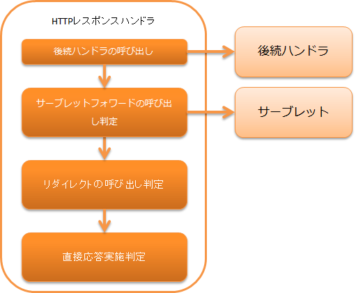

.. _http_response_handler:

HTTP响应handler
==================================================
.. contents:: 目录
  :depth: 3
  :local:

本handler根据后续handler返回的 :java:extdoc:`HttpResponse <nablarch.fw.web.HttpResponse>` ，
调用Servlet API向客户端进行响应。
响应方法有以下4种。

Servlet forward
  进行Servlet forward，渲染响应。主要用于使用JSP的响应。

自定义响应写入器
  使用 `自定义响应写入器`_ （后述），执行任意响应输出处理。
  主要用于使用模板引擎等外部库的响应。

重定向
  向客户端返回重定向响应。

直接响应
   使用 :java:extdoc:`ServletResponse <jakarta.servlet.ServletResponse>` 的 `getOutputStream` 方法直接
   进行响应。

处理流程如下。

handler类名
--------------------------------------------------
* :java:extdoc:`nablarch.fw.web.handler.HttpResponseHandler`

模块列表
--------------------------------------------------
.. code-block:: xml

  <dependency>
    <groupId>com.nablarch.framework</groupId>
    <artifactId>nablarch-fw-web</artifactId>
  </dependency>

约束
------------------------------

无。

响应的转换方法
------------------------------------------------------

本handler根据后续handler返回的scheme [#scheme]_ 和状态码  [#statusCode]_ 来更改向客户端返回的响应方法。

转换条件和响应方法如下表所示。

.. list-table::
  :header-rows: 1
  :widths: 5,5
  :class: white-space-normal

  * -   转换条件
    -   响应方法
  * -   scheme为
        ``servlet`` 时
    -   自定义响应写入器判定为处理对象时委托给自定义响应写入器。否则将处理转发到内容路径对应的Servlet。
  * -   scheme为
        ``redirect`` 时
    -   重定向到指定URL
  * -   scheme为
        ``http`` 或 ``https`` 时
    -   重定向到指定URL
  * -   scheme为上述以外且
        状态码为400以上时
    -   显示与状态码对应的错误画面。
  * -   上述以外的情况
    -   响应HttpResponse#getBodyStream()的结果。

.. [#scheme]
      此处所说的「scheme」是指后续handler返回的
      :java:extdoc:`HttpResponse#getContentPath() <nablarch.fw.web.HttpResponse.getContentPath()>`
      获取的  :java:extdoc:`ResourceLocator <nablarch.fw.web.ResourceLocator>` 的
      :java:extdoc:`getScheme()方法 <nablarch.fw.web.ResourceLocator.getScheme()>` 的返回值。
      未显式指定scheme时的默认scheme为 ``servlet`` 。

.. [#statusCode]
      此处所说的「状态码」是指后续handler返回的
      :java:extdoc:`HttpResponse <nablarch.fw.web.HttpResponse>` 类的
      :java:extdoc:`getStatusCode() <nablarch.fw.web.HttpResponse.getStatusCode()>` 方法的返回值。

.. _http_response_handler-convert_status_code:

自定义响应写入器
--------------------------

通过在本handler的属性 ``customResponseWriter`` 中设置
:java:extdoc:`CustomResponseWriter<nablarch.fw.web.handler.responsewriter.CustomResponseWriter>`
的实现类，可以执行任意响应输出处理\ [#resp]_ 。

.. [#resp] 具体示例包括不使用JSP而使用模板引擎输出响应的情况。
           Nablarch提供的实现有 :ref:`web_thymeleaf_adaptor` 。

HTTP状态码的更改
------------------------------------------------------

本handler将部分状态码更改后设置到向客户端的响应中。

决定HTTP状态码的转换条件和响应错误码如下表所示。

.. list-table::
  :header-rows: 1
  :widths: 3,7
  :class: white-space-normal

  * -   转换条件
    -   错误码
  * -   Ajax请求时
    -   原样返回原始状态码
  * -   原始状态码为400时
    -   返回状态码200
  * -   上述以外的情况
    -   原样返回状态码的结果

.. _http_response_handler-change_content_path:

按语言切换内容路径
------------------------------------------------------

本handler具有根据HTTP请求中包含的语言设置动态切换forward目标的功能。
使用此功能可以实现根据用户选择的语言切换forward的JSP的功能。

使用此功能时，在本handler的 ``contentPathRule`` 属性中设置以下任一类别。

============================================================================================================================= ============================================================================================
类名                                                                                                                      说明
============================================================================================================================= ============================================================================================
:java:extdoc:`DirectoryBasedResourcePathRule <nablarch.fw.web.i18n.DirectoryBasedResourcePathRule>`                           使用上下文根目录下的目录进行语言切换
                                                                                                                              |br|
                                                                                                                              的类。

                                                                                                                               .. code-block:: bash

                                                                                                                                # /management/user/search.jsp对应日语(ja)和
                                                                                                                                # 英语(en)时的配置示例
                                                                                                                                # 在上下文根目录下创建按语言的目录。
                                                                                                                                # 目录名使用语言名。
                                                                                                                                上下文根目录
                                                                                                                                ├─en
                                                                                                                                │  └─management
                                                                                                                                │      └─user
                                                                                                                                │           search.jsp
                                                                                                                                └─ja
                                                                                                                                    └─management
                                                                                                                                        └─user
                                                                                                                                             search.jsp

:java:extdoc:`FilenameBasedResourcePathRule <nablarch.fw.web.i18n.FilenameBasedResourcePathRule>`                             使用文件名进行语言切换的类。

                                                                                                                                .. code-block:: bash

                                                                                                                                 # /management/user/search.jsp对应日语(ja)和
                                                                                                                                 # 英语(en)时的配置示例
                                                                                                                                 # 按语言创建文件。
                                                                                                                                 # 文件名添加后缀「"_"＋语言名」。
                                                                                                                                 上下文根目录
                                                                                                                                 └─management
                                                                                                                                         └─user
                                                                                                                                              search_en.jsp
                                                                                                                                              search_ja.jsp
============================================================================================================================= ============================================================================================

此时的配置示例如下。

.. code-block:: xml

  <!-- 资源路径规则 -->
  <component name="resourcePathRule" class="nablarch.fw.web.i18n.DirectoryBasedResourcePathRule" />

  <!-- HTTP响应handler -->
  <component class="nablarch.fw.web.handler.HttpResponseHandler">
    <property name="contentPathRule" ref="resourcePathRule" />
  </component>

要使用上述以外的方法进行内容切换时，创建继承 :java:extdoc:`ResourcePathRule <nablarch.fw.web.i18n.ResourcePathRule>`
类的类，将创建的类像上述一样设置到 ``resourcePathRule`` 属性中。

.. tip::
   使用 `自定义响应写入器`_ 进行响应输出时，不能使用本功能。
   这是为了避免与模板引擎等具有的多语言支持功能混用。

本handler内发生致命错误的处理
------------------------------------------------------

本handler的处理中，当发生以下情况时，判断为无法正常响应，向客户端
返回状态码500的固定响应。

* Servlet forward时发生ServletException
* 发生RuntimeException及其子类异常
* 发生Error及其子类异常

此时的响应为以下HTML。

.. code-block:: html

  <html>
    <head>
      <title>A system error occurred.</title>
    </head>
    <body>
      

        We are sorry not to be able to proceed your request. 
        Please contact the system administrator of our system.
      

    </body>
  </html>

.. important::

    上述HTML响应是固定的，无法通过设置等进行更改。

    此响应仅在本handler内发生异常的极少数情况下使用。
    因此，通常此规格不会成为问题，但在任何情况下都绝对不能显示此响应
    的系统中，请参考本handler考虑自行创建handler。

.. |br| raw:: html

   
