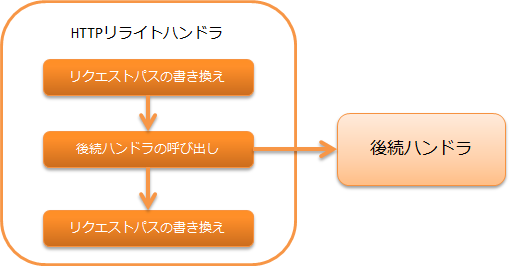

.. _http_rewrite_handler:

HTTP重写handler
==================================================
.. contents:: 目录
  :depth: 3
  :local:

本handler对HTTP的请求及响应提供重写请求路径和内容路径以及变量的功能。
此handler用于「未登录状态时强制跳转到登录画面」等需要特殊
跳转的情况。

本handler执行以下处理。

* 重写请求路径
* 重写内容路径

处理流程如下。

handler类名
--------------------------------------------------
* :java:extdoc:`nablarch.fw.web.handler.HttpRewriteHandler`

模块列表
--------------------------------------------------
.. code-block:: xml

  <dependency>
    <groupId>com.nablarch.framework</groupId>
    <artifactId>nablarch-fw-web</artifactId>
  </dependency>

约束
------------------------------

应配置在 :ref:`http_response_handler` 之后
  本handler重写的content path将被响应handler使用。
  因此，本handler必须配置在 :ref:`http_response_handler` 之后。

应配置在 :ref:`thread_context_handler` 之前
  本handler重写设置到线程上下文的请求路径。
  因此，本handler必须配置在 :ref:`thread_context_handler` 之前。

重写设置
------------------------------

重写设置在 :java:extdoc:`本handler <nablarch.fw.web.handler.HttpRewriteHandler>`  的属性 requestPathRewriteRules 或 contentPathRewriteRules 中进行。

以下显示配置示例。

.. code-block:: xml

  <component class="nablarch.fw.web.handler.HttpRewriteHandler">
    <!-- 对请求路径的重写规则 -->
    <property name="requestPathRewriteRules">
      <list>
        <!-- 对Servlet上下文根目录的访问，
             如果已登录则跳转到菜单画面。 -->
        <component class="nablarch.fw.web.handler.HttpRequestRewriteRule">
          <property name="pattern" value="^/$" />
          <property name="conditions">
          <list>
            <value>%{session:user.id} ^\S+$</value>
          </list>
          </property>
          <property name="rewriteTo" value="/action/MenuAction/show" />
        </component>

        <!-- 未登录时跳转到登录画面。 -->
        <component class="nablarch.fw.web.handler.HttpRequestRewriteRule">
          <property name="pattern"   value="^/$" />
          <property name="rewriteTo" value="/action/LoginAction/authenticate" />
        </component>
      </list>
    </property>

    <!-- 对响应content path的重写规则 -->
    <property name="contentPathRewriteRules">
      <list>

        <!-- 状态码为401时跳转到登录画面 -->
        <component class="nablarch.fw.web.handler.ContentPathRewriteRule">
          <property name="pattern"   value="^.*" />
          <property name="rewriteTo" value="redirect:///action/LoginAction/authenticate" />
          <property name="conditions">
            <list>
            <value>%{statusCode} ^401$</value>
            </list>
          </property>
        </component>
      </list>
    </property>
  </component>

如本例所示，设置使用 :java:extdoc:`HttpRequestRewriteRule <nablarch.fw.web.handler.HttpRequestRewriteRule>`
（重写请求路径时）或 :java:extdoc:`ContentPathRewriteRule <nablarch.fw.web.handler.ContentPathRewriteRule>`
（重写content path时）进行。

:java:extdoc:`HttpRequestRewriteRule <nablarch.fw.web.handler.HttpRequestRewriteRule>`
以及 :java:extdoc:`ContentPathRewriteRule <nablarch.fw.web.handler.ContentPathRewriteRule>`
具有以下属性。（属性定义在父类
:java:extdoc:`RewriteRule <nablarch.fw.handler.RewriteRule>` 中。）

==================== ====================================================
属性名         说明
==================== ====================================================
pattern              适用目标路径的模式
rewriteTo            重写后的字符串
conditions           路径以外的附加适用条件
exports              变量重写设置
==================== ====================================================

:java:extdoc:`HttpRequestRewriteRule <nablarch.fw.web.handler.HttpRequestRewriteRule>`
以及 :java:extdoc:`ContentPathRewriteRule <nablarch.fw.web.handler.ContentPathRewriteRule>`
中，conditions设置可以使用变量。
:java:extdoc:`HttpRequestRewriteRule <nablarch.fw.web.handler.HttpRequestRewriteRule>`
、 :java:extdoc:`ContentPathRewriteRule <nablarch.fw.web.handler.ContentPathRewriteRule>`
各自可使用的变量如下。

============================ ============================== ===========================================================
变量类型                     格式                           适用类
============================ ============================== ===========================================================
会话作用域           %{session:(变量名)}            HttpRequestRewriteRule / ContentPathRewriteRule
请求作用域           %{request:(变量名)}            HttpRequestRewriteRule / ContentPathRewriteRule
线程上下文         %{thread:(变量名)}             HttpRequestRewriteRule / ContentPathRewriteRule
请求参数         %{param:(变量名)}              HttpRequestRewriteRule
HTTP头部                   %{header:(头部名)}           HttpRequestRewriteRule / ContentPathRewriteRule
HTTP请求方法       %{httpMethod}                  HttpRequestRewriteRule
HTTP版本               %{httpVersion}                 HttpRequestRewriteRule
全部请求参数名     %{paramNames}                  HttpRequestRewriteRule
状态码             %{statusCode}                  ContentPathRewriteRule
============================ ============================== ===========================================================

设置变量值
---------------------------

HTTP重写handler中，除路径重写外还可以向请求作用域、会话作用域、
线程上下文、窗口作用域设置变量。

设置变量时，在 :java:extdoc:`HttpRequestRewriteRule <nablarch.fw.web.handler.HttpRequestRewriteRule>`
或 :java:extdoc:`ContentPathRewriteRule <nablarch.fw.web.handler.ContentPathRewriteRule>` 的
export 属性中设置。

以下显示配置示例。

.. code-block:: xml

  <!--发送Referer头部时，将其值设置到请求作用域。-->
  <component class="nablarch.fw.web.handler.HttpRequestRewriteRule">
    <!-- 以全部请求为对象。 -->
    <property name="pattern" value=".*" />
    <!-- 仅在Referer头部定义时适用。-->
    <property name="conditions">
      <list>
        <value>%{header:Referer} ^\S+$</value>
      </list>
    </property>
    <!-- 将Referer头部的值设置到请求作用域上的变量prevUrl。-->
    <property name="exports">
      <list>
        <value>%{request:prevUrl} ${header:Referer}</value>
      </list>
    </property>
  </component>

这样，通过在 exports 属性中以列表形式设置「要设置的变量名」（上例中为"%{request:prevUrl}"）和
「要设置的值」（上例中为"${header:Referer}"），可以向各作用域设置变量。

exports 中「要设置的变量名」可设置的变量作用域如下。

============================ ======================= ========================================================
变量作用域                 格式                    对象
============================ ======================= ========================================================
会话作用域           %{session:(变量名)}     HttpRequestRewriteRule / ContentPathRewriteRule
请求作用域           %{request:(变量名)}     HttpRequestRewriteRule / ContentPathRewriteRule
线程上下文         %{thread:(变量名)}      HttpRequestRewriteRule / ContentPathRewriteRule
窗口作用域           %{param:(变量名)}       HttpRequestRewriteRule
============================ ======================= ========================================================
