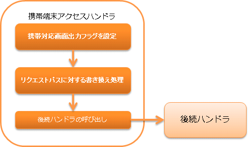

.. _keitai_access_handler:

手机端访问handler
==================================================

.. contents:: 目录
  :depth: 3
  :local:

本handler用于在JavaScript无法运行的环境（如所谓feature phone的功能手机等）中运行Web应用，实现以下功能：

* 根据画面点击的按钮名，分派到预期的URL
* 设置变量以阻止在JSP上输出JavaScript

处理流程如下。

handler类名
--------------------------------------------------
* :java:extdoc:`nablarch.fw.web.handler.KeitaiAccessHandler`

模块列表
--------------------------------------------------
.. code-block:: xml

  <dependency>
    <groupId>com.nablarch.framework</groupId>
    <artifactId>nablarch-fw-web</artifactId>
  </dependency>

约束
------------------------------

配置在 :ref:`http_response_handler` 之后
  本handler用于设置变量以阻止向JSP输出JavaScript，因此需要配置在负责JSP转发处理的 :ref:`http_response_handler` 之后。

配置在 :ref:`thread_context_handler` 之前
  由于包含通常由JSP输出的JavaScript决定URI的处理，因此需要配置在使用URI的 :ref:`thread_context_handler` 之前。

JavaScript输出被抑制的标签
--------------------------------------------------

使用手机端访问handler访问URL时，以下Nablarch标签库通常输出的JavaScript将完全不会输出。

 * :ref:`n:form 标签 <tag-form_tag>`
 * :ref:`n:script 标签 <tag-script_tag>`
 * :ref:`提交相关标签 <tag_reference_submit>`

 .. important::
   以下标签由于无法实现原本预期的功能，因此将无法使用。

   * :ref:`n:submitLink 标签 <tag-submit_link_tag>`

   请使用n:a标签作为n:submitLink标签的替代。
   特别是请求参数，需要通过GET方法的参数发送。

URL的关联
--------------------

应用手机端访问handler时，以下操作会将通常Nablarch使用JavaScript进行的form的URI属性改写改为在服务器端执行。

1. JSP显示时的动作

  1.1. 对于记载n:submit、n:button的位置输出的HTML input标签，将name属性设置为 ``nablarch_uri_override_<JSP上的name属性>|<提交目标的URI>``

  1.2. n:form标签仅输出简单的HTML <form>标签。\
  也就是说，点击按钮时会将按钮的name属性发送到HTML<form>标签中记载的URL。\
  （通常，在结束标签</form>中会插入根据点击的按钮更改<form>标签uri属性的JavaScript。）

2. form提交时的动作

  2.1. KeitaiAccessHandler在提交时，从点击的按钮设置的name属性（1.1.中设置的以 ``nablarch_uri_override_`` 开头的字符串）获取原始JSP标签中设置的URI属性。

  2.2. KeitaiAccessHandler将作为处理对象的URI参数键 ``nablarch_submit`` 设置为获取到的URI属性。
  （也就是说，将通常Nablarch使用JavaScript进行的form的URI属性改写改为在服务器端执行）

  2.3. 委托给后续处理。（此后，执行与客户端请求时指定了按钮对应URI时相同的动作）
