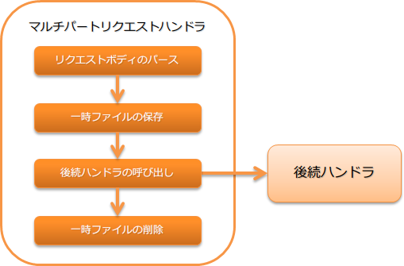

.. _multipart_handler:

multipart请求handler
==================================================
.. contents:: 目录
  :depth: 3
  :local:

当HTTP请求为multipart形式时，解析body部分并将上传文件保存为临时文件的handler。

本handler执行以下处理。

* multipart请求的解析
* 将上传文件保存为临时文件
* 删除保存的临时文件

处理流程如下。

handler类名
--------------------------------------------------
* :java:extdoc:`nablarch.fw.web.upload.MultipartHandler`

模块列表
--------------------------------------------------
.. code-block:: xml

  <dependency>
    <groupId>com.nablarch.framework</groupId>
    <artifactId>nablarch-fw-web</artifactId>
  </dependency>

  <!-- 仅当需要指定临时保存位置时 -->
  <dependency>
    <groupId>com.nablarch.framework</groupId>
    <artifactId>nablarch-core</artifactId>
  </dependency>

.. _multipart_handler-constraint:

约束
--------------------------------------------------
无。

本handler的动作条件
--------------------------------------------------
本handler仅在请求为multipart形式时解析请求body。是否multipart形式通过请求header的 ``Content-Type`` 判断。

当 ``Content-Type`` 与 ``multipart/form-data`` 一致时，判断请求为multipart形式，执行body解析处理。
其他情况下，本handler不执行任何操作，直接委托给后续handler。

指定上传文件的临时保存位置
--------------------------------------------------
上传文件的临时保存目录在 :ref:`file_path_management` 中设置。

如果文件路径管理中未指定临时保存位置，则使用系统属性 `java.io.tmpdir` 的值作为默认保存位置。

以下显示临时文件保存目录的设置示例。

要点
  * 保存目录的逻辑名称应为 ``uploadFileTmpDir`` 。

.. code-block:: xml

  <component name="filePathSetting" class="nablarch.core.util.FilePathSetting">
    <!-- 目录设置 -->
    <property name="basePathSettings">
      <map>
        <!-- 上传文件的临时保存目录 -->
        <entry key="uploadFileTmpDir" value="file:/var/nablarch/uploadTmpDir" />
      </map>
    </property>
  </component>

.. tip::

  上述示例中直接指定了保存目录，但该值在不同环境中可能不同。
  因此，建议不要直接在组件配置文件中设置，而是在环境配置文件中设置。

  详情请参考 :ref:`repository-environment_configuration` 。

.. _multipart_handler-file_limit:

防止上传巨大文件
--------------------------------------------------
如果被上传巨大文件，可能因磁盘资源耗尽等原因导致系统无法正常运作。
因此，本handler在上传大小超过上限时，会向客户端返回413(Payload Too Large)。

上传大小上限以字节数设置。省略设置时为无限制。
为防止DoS攻击，建议始终设置上传大小上限。

以下显示上传大小的设置示例。

.. code-block:: xml

  <component class="nablarch.fw.web.upload.MultipartHandler" name="multipartHandler">
    <property name="uploadSettings">
      <component class="nablarch.fw.web.upload.UploadSettings">
        <!-- 上传大小(Content-Length)上限(约1MB) -->
        <property name="contentLengthLimit" value="1000000" />
      </component>
    </property>
  </component>

.. tip::

  上传大小上限不是单个文件的上限，而是一个请求中可以上传的上限。

  因此，当上传多个文件时，将根据这些文件大小的总和（严格来说是Content-Length）执行上限检查。

  如果需要按文件进行大小检查，请在action侧实现。

.. _multipart_handler-max_file_count:

防止大量文件上传
--------------------------------------------------
即使设置了上传大小上限，也可以通过减小单个文件大小来一次性上传大量文件。
为减少不必要的处理，multipart请求handler支持设置一次性可上传文件数的上限。
当上传的文件超过上限时，本handler会返回400(Bad Request)。

以下显示设置示例。

.. code-block:: xml

  <component class="nablarch.fw.web.upload.MultipartHandler" name="multipartHandler">
    <property name="uploadSettings">
      <component class="nablarch.fw.web.upload.UploadSettings">
        <!-- 上传文件数上限 -->
        <property name="maxFileCount" value="100" />
      </component>
    </property>
  </component>

``maxFileCount`` 设置为0以上的值时，该值即为一次性可上传文件数的上限。
设置为负数时为无限制。
未设置时默认为-1。

执行临时文件删除（清理）
--------------------------------------------------
按以下条件清理保存的上传文件。

* body解析过程中发生异常时
* handler返回时自动删除设置启用时

自动删除设置默认为启用。
注意，如果轻易在生产环境中禁用此设置，大量临时文件将残留在磁盘上，最坏情况下可能导致磁盘已满。

要禁用设置值，请在 :java:extdoc:`UploadSettings#autoCleaning <nablarch.fw.web.upload.UploadSettings.setAutoCleaning(boolean)>` 中设置 `false` 。

设置multipart解析错误及文件大小超过上限时的跳转目标画面
----------------------------------------------------------------------------------------------------
本handler在multipart解析错误 [#part_error]_ 或 :ref:`文件大小超过上限时 <multipart_handler-file_limit>` ，
将作为非法请求向客户端返回 `400(BadRequest)` 。

因此，需要在 `web.xml` 中设置对应 `400(BadRequest)` 的错误页面。
如果省略 `web.xml` 中的错误页面设置，将返回Web应用服务器持有的默认页面等。

.. important::

  本handler需要如 :ref:`session_store_handler-constraint` 所述，配置在 :ref:`session_store_handler` 之前。
  因此，无法使用配置在 :ref:`session_store_handler` 后续的 :ref:`http_error_handler` 的 :ref:`HttpErrorHandler_DefaultPage` 。

.. [#part_error]
  发生multipart解析错误的情况

  * 上传过程中客户端发出断开请求，body部分不完整时
  * boundary不存在时

.. _multipart_handler-read_upload_file:

读取上传的文件
------------------------------------------------------------
上传的文件（临时保存的文件）从 :java:extdoc:`HttpRequest <nablarch.fw.web.HttpRequest>` 获取。

以下显示实现示例。

要点
  * 调用 :java:extdoc:`HttpRequest#getPart <nablarch.fw.web.HttpRequest.getPart(java.lang.String)>` 获取上传的文件。
  * :java:extdoc:`HttpRequest#getPart <nablarch.fw.web.HttpRequest.getPart(java.lang.String)>` 的参数指定参数名。

.. code-block:: java

  public HttpResponse upload(HttpRequest request, ExecutionContext context) throws IOException {
    // 获取上传文件
    List<PartInfo> partInfoList = request.getPart("uploadFile");

    if (partInfoList.isEmpty()) {
      // 未指定上传文件时为业务错误
    }

    // 处理上传的文件
    InputStream file = partInfoList.get(0).getInputStream()

    // 以下执行上传文件读取处理。
  }

处理上传文件的详细实现方法请参考以下文档。
另外，如 :ref:`data_converter` 所述，推荐使用 :ref:`data_bind` 。
（对于 :ref:`data_bind` 无法处理的格式，请使用 :ref:`data_format` 。）

* :ref:`使用数据绑定处理上传文件 <data_bind-upload_file>`
* :ref:`使用通用数据格式处理上传文件 <data_format-load_upload_file>`

.. tip::

  如果上传的文件是图像文件等二进制文件，请使用读取的二进制数据进行处理。

  通过如下实现可以读取上传文件的字节数据。

  .. code-block:: java

    File savedFile = partInfo.getSavedFile();
    try {
        byte[] bytes = Files.readAllBytes(savedFile.toPath());
    } catch (IOException e) {
        throw new RuntimeException(e);
    }
