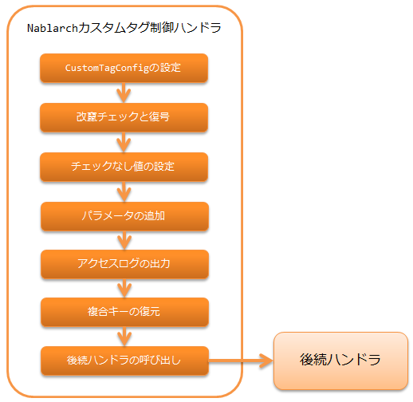

.. _nablarch_tag_handler:

Nablarch自定义标签控制handler
==================================================

.. contents:: 目录
  :depth: 3
  :local:

执行Nablarch :ref:`tag` 所需请求处理的handler。

本handler执行以下处理。

* 为使自定义标签的默认值可在JSP中引用，
  将 :java:extdoc:`CustomTagConfig<nablarch.common.web.tag.CustomTagConfig>` 设置到请求作用域。
* 执行对应 :ref:`hidden加密<tag-hidden_encryption>` 的篡改检查和解密处理。
* 为 :ref:`指定复选框未选中时的值<tag-checkbox_off_value>` ，在请求中设置未选中时对应的值。
* 为 :ref:`每个按钮或链接添加参数<tag-submit_change_parameter>` ，在请求中添加参数。
* 输出 :ref:`http_access_log` 的请求参数。
* 为 :ref:`能够处理复合键<tag-composite_key>` ，还原复合键。

.. tip::
 GET请求时，自定义标签不输出hidden参数。
 不输出hidden参数的原因请参考 :ref:`tag-using_get` 。

 配合自定义标签，本handler在GET请求时也不执行与hidden参数相关的处理，
 仅执行复合键的还原处理。

处理流程如下。

handler类名
--------------------------------------------------
* :java:extdoc:`nablarch.common.web.handler.NablarchTagHandler`

模块列表
---------------------------------------------------------------------
.. code-block:: xml

  <dependency>
    <groupId>com.nablarch.framework</groupId>
    <artifactId>nablarch-fw-web-tag</artifactId>
  </dependency>

约束
------------------------------
配置在 :ref:`multipart_handler` 之后
  本handler需要访问 :ref:`tag` 所需请求处理中的请求参数。

:ref:`hidden加密<tag-hidden_encryption>` 使用时，配置在 :ref:`thread_context_handler` 之后
  为判断是否为hidden加密对象请求，需要从线程上下文获取请求ID。

设置解密失败（篡改错误、会话失效错误）时的错误页面
------------------------------------------------------------------------------------
:ref:`hidden加密<tag-hidden_encryption>` 的解密处理可能在以下两种情况失败。
篡改判定标准请参考 :ref:`解密处理<tag-hidden_encryption_decryption>` 。

* 加密数据被篡改时（篡改错误）
* 无法从会话获取解密所用密钥时（会话失效错误）

分别可在 :java:extdoc:`NablarchTagHandler<nablarch.common.web.handler.NablarchTagHandler>` 的设置中
指定错误发生时的错误页面和状态码。

.. code-block:: xml

  <component name="nablarchTagHandler"
             class="nablarch.common.web.handler.NablarchTagHandler">
    <!--
      篡改错误发生时的设置
    -->
    <property name="path" value="/TAMPERING-DETECTED.jsp" />
    <property name="statusCode" value="400" />
    <!--
      会话失效错误发生时的设置
      省略时使用篡改错误发生时的设置。
    -->
    <property name="sessionExpirePath" value="/SESSION-EXPIRED.jsp" />
    <property name="sessionExpireStatusCode" value="400" />

  </component>
