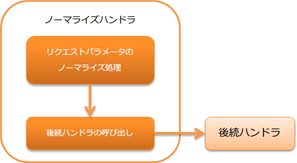

.. _normalize_handler:

规范化handler
==================================================
.. contents:: 目录
  :depth: 3
  :local:

对客户端发送的请求参数进行规范化的handler。

本handler执行以下处理。

* 请求参数的规范化处理

处理流程如下。

  
handler类名
--------------------------------------------------
* :java:extdoc:`nablarch.fw.web.handler.NormalizationHandler`

模块列表
--------------------------------------------------
.. code-block:: xml

  <dependency>
    <groupId>com.nablarch.framework</groupId>
    <artifactId>nablarch-fw-web</artifactId>
  </dependency>

约束
------------------------------
配置在 :ref:`multipart_handler` 之后
  本handler需要访问请求参数。
  因此，需要配置在 :ref:`multipart_handler` 之后。

标准提供的规范化处理
--------------------------------------------------
标准提供以下规范化处理。

* 去除请求参数前后空白字符的规范化器( :java:extdoc:`TrimNormalizer <nablarch.fw.web.handler.normalizer.TrimNormalizer>` ) [#whitespace]_

添加规范化处理
--------------------------------------------------
本handler在默认动作下，启用去除请求参数前后空白字符 [#whitespace]_ 的规范化器。

如果项目需求需要添加规范化处理，请创建 :java:extdoc:`Normalizer <nablarch.fw.web.handler.normalizer.Normalizer>` 的实现类并设置到本handler。

以下显示示例。

规范化器实现示例
  .. code-block:: java

    public class SampleNormalizer implements Normalizer {

        @Override
        public boolean canNormalize(final String key) {
          // 当参数键值包含num时，对该参数进行规范化
          return key.contains("num");
        }

        @Override
        public String[] normalize(final String[] value) {
          // 去除参数中的逗号(,)
          final String[] result = new String[value.length];
          for (int i = 0; i < value.length; i++) {
              result[i] = value[i].replace(",", "");
          }
          return result;
        }
    }

在组件配置文件中定义
  如以下设置示例所示，设置要应用的规范化器。
  设置多个规范化器时，将从上往下依次执行规范化处理。
  因此，如果规范化处理有顺序要求，请注意设置顺序。

  .. code-block:: xml

    <component class="nablarch.fw.web.handler.NormalizationHandler">
      <property name="normalizers">
        <list>
          <component class="sample.SampleNormalizer" />
          <component class="nablarch.fw.web.handler.normalizer.TrimNormalizer" />
        </list>
      </property>
    </component>

.. tip::
  如果不设置规范化器，仅按以下方式设置handler，将自动应用默认提供的前后空白字符去除规范化器。

  .. code-block:: xml

    <component class="nablarch.fw.web.handler.NormalizationHandler" />

.. [#whitespace] 空白字符定义请参考 :java:extdoc:`Character#isWhitespace <java.lang.Character.isWhitespace(int)>`
